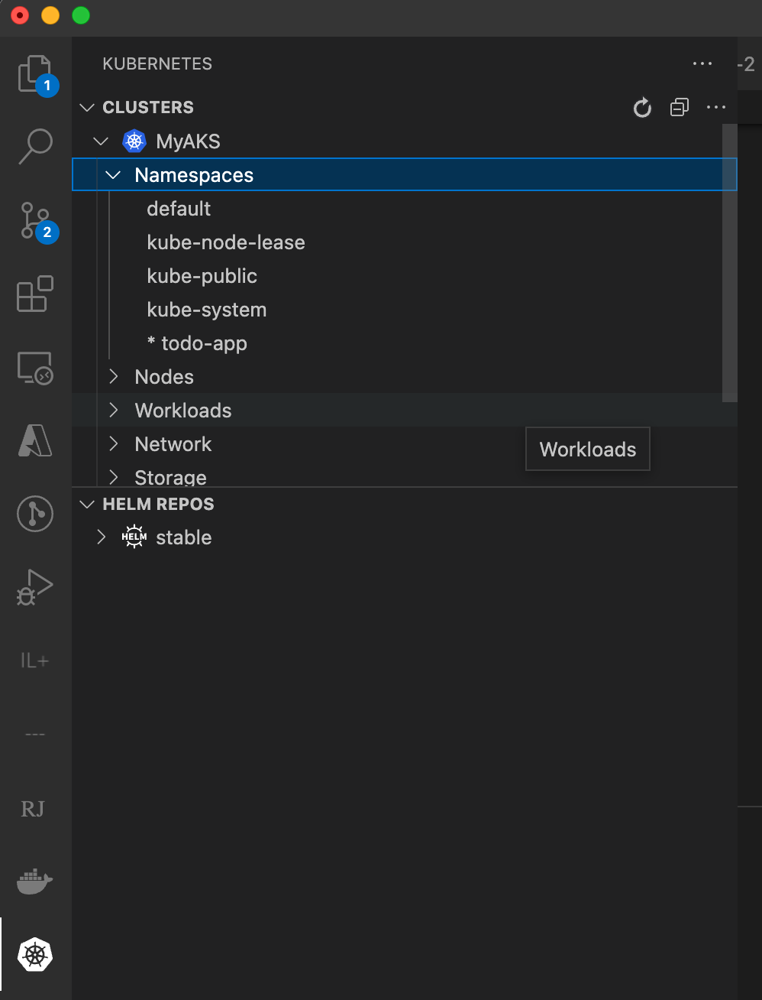
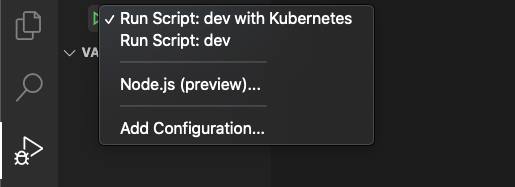
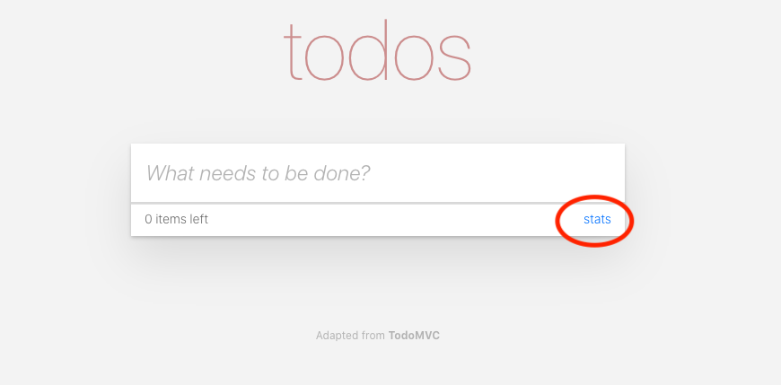

# Use Bridge to Kubernetes with AKS

In this tutorial, you use a specific AKS sample microservices web app to learn how to use Bridge to Kubernetes to debug locally in a single pod that's part of an Azure Kubernetes Service (AKS) cluster.

## Before you begin

This guide uses the Todo App sample application to demonstrate connecting your development computer to a Kubernetes cluster running in AKS. If you already have your own application running on a Kubernetes cluster, see [Develop with Kubernetes](bridge-to-kubernetes-vs-code.md). If you are using another cluster, such as MiniKube running locally, see [Use Bridge to Kubernetes with a sample](bridge-to-kubernetes-sample.md).

### Prerequisites

* An Azure subscription. If you don't have an Azure subscription, you can create a [free account](https://azure.microsoft.com/free).
* [Azure CLI installed][azure-cli].
* [Visual Studio Code][vs-code] running on macOS, Windows 10, or Linux.
* The [Bridge to Kubernetes][btk-vs-code] extension installed in Visual Studio Code.

## Create a Kubernetes cluster

Create an AKS cluster in a [supported region][supported-regions]. The following commands create a resource group called `MyResourceGroup` and an AKS cluster called `MyAKS`.

```azurecli-interactive
az group create \
    --name MyResourceGroup \
        --location eastus
az aks create \
    --resource-group MyResourceGroup \
    --name MyAKS \
    --location eastus \
    --node-count 3 \
    --generate-ssh-keys
```

## Install the sample application

Download the code and install dependencies

```azurecli-interactive
git clone https://github.com/Azure/Bridge-To-Kubernetes
cd Bridge-To-Kubernetes/samples/todo-app
npm install stats-api\
```

## Connect to your cluster and deploy the app

On your development computer, download and configure the Kubernetes CLI to connect to your Kubernetes cluster using [`az aks get-credentials`][az-aks-get-credentials].

```azurecli
az aks get-credentials --resource-group MyResourceGroup --name MyAKS
kubectl create namespace todo-app
kubectl config set-context --current --namespace=todo-app
kubectl apply -f deployment.yaml --namespace todo-app
```

## Try out the app

On the same terminal you were using earlier, run the following command and copy the IP for front end service under the External IP column.

```azurecli
kubectl get services
```

To try out the app, open the url:
`{your external IP from above command goes here}.nip.io`

## Debug stats-api service

On the same terminal you were using earlier, type the following command to open stats-api in VS Code.

```azurecli
code ./stats-api
```

First, place a breakpoint on line 17 of `server.js`.

Then, make sure the `todo-app` namespace in the `MyAKS` cluster is set as default (if it has * next to it). If it is not set as default, right-click the **todo-app** node, and choose **Use Namespace**.



Next, configure bridge: open the Command Palette (**CTRL**+**SHIFT**+**P** or **Cmd**+**Shift**+**P** on a Mac) and type Bridge to Kubernetes. Select the **Bridge to Kubernetes: Configure** option.


You're prompted to configure the service you want to replace, the port to forward from your development computer, and the launch task to use.

Choose the `stats-api` service.


> [!IMPORTANT]
> You can only redirect services that have a single pod.

After you select your service, you're prompted to enter the TCP port for your local application. For this example, enter 3001.


Choose **Run Script: dev** as the launch task.


You have the option of running isolated or not isolated. If you run isolated, only your requests are routed to your local process; other developers can use the cluster without being affected. If you don't run isolated, all traffic is redirected to your local process. For more information on this option, see [Using routing capabilities for developing in isolation](overview-bridge-to-kubernetes.md#using-routing-capabilities-for-developing-in-isolation). For this example, we proceed with non-isolated. If you chose isolation, task.json has the prefix you should use to route request to your machine.


> [!NOTE]
> On subsequent launches, you will just click the debug icon without going through this set up and being prompted for the service name, port, launch task, or whether to run isolated. These values are saved in `.vscode/tasks.json`. To change these settings later, open the Command Palette (**CTRL**+**SHIFT**+**P** or **Cmd**+**Shift**+**P** on a Mac), and run the command **Bridge to Kubernetes: Configure**.

The Bridge to Kubernetes debugging profile has been successfully configured.

To start debugging, select the Debug icon on the left and select **Run Script: dev with Kubernetes**. Click the start button next to **Run Script: dev with Kubernetes**.



> [!NOTE]
> You will be prompted to allow the EndpointManager to run elevated and modify your hosts file.

Your development computer is connected when the VS Code status bar turns orange and the Kubernetes extension shows you're connected. Once your development computer is connected, traffic starts redirecting to your development computer for the stats-api you're replacing.


Navigate to the frontend entry point of your application via the external IP you found earlier, `{your external IP from get services command}.nip.io`. Note that if you selected isolation mode, you need to use `{your prefix - can be found in task.json}.{your external IP from get services command}.nip.io`.

Make a request to the stats-api by choosing the **stats** link.



Notice the traffic that initially started in your cluster was redirected to your locally running version (outside of the cluster) where the breakpoint was triggered.

Press play and let the request continue complete transparently.

## Clean up

When you stop the debugger, all changes to the cluster are reverted. Note, if you were running with isolation on, the routing manager pod will be left there to expedite the start of the debugger the next time around.

You can leave your AKS cluster on for future debugging or you can delete it with following command.

```azurecli-interactive
az aks delete --name MyAKS --resource-group MyResourceGroup
```

## Next steps

Learn more about Bridge to Kubernetes at [How Bridge to Kubernetes works][btk-how-it-works].

[azure-kubernetes-service]: /azure/aks/kubernetes-walkthrough
[azds-cli]: /azure/dev-spaces/how-to/install-dev-spaces#install-the-client-side-tools
[azds-tmp-dir]: /azure/dev-spaces/troubleshooting#before-you-begin
[btk-vs-code]: https://marketplace.visualstudio.com/items?itemName=mindaro.mindaro
[azure-cli]: /cli/azure/install-azure-cli?view=azure-cli-latest&preserve-view=true
[azure-cloud-shell]: /azure/cloud-shell/overview
[az-aks-get-credentials]: /cli/azure/aks?view=azure-cli-latest&preserve-view=true#az-aks-get-credentials
[az-aks-vs-code]: https://marketplace.visualstudio.com/items?itemName=ms-kubernetes-tools.vscode-aks-tools
[preview-terms]: https://azure.microsoft.com/support/legal/preview-supplemental-terms/
[supported-regions]: https://azure.microsoft.com/global-infrastructure/services/?products=kubernetes-service
[troubleshooting]: /azure/dev-spaces/troubleshooting#fail-to-restore-original-configuration-of-deployment-on-cluster
[vs-code]: https://code.visualstudio.com/download
[kubernetesLocalProcessConfig-yaml]: configure-bridge-to-kubernetes.md
[btk-how-it-works]: overview-bridge-to-kubernetes.md
[btk-overview-routing]: overview-bridge-to-kubernetes.md#using-routing-capabilities-for-developing-in-isolation
