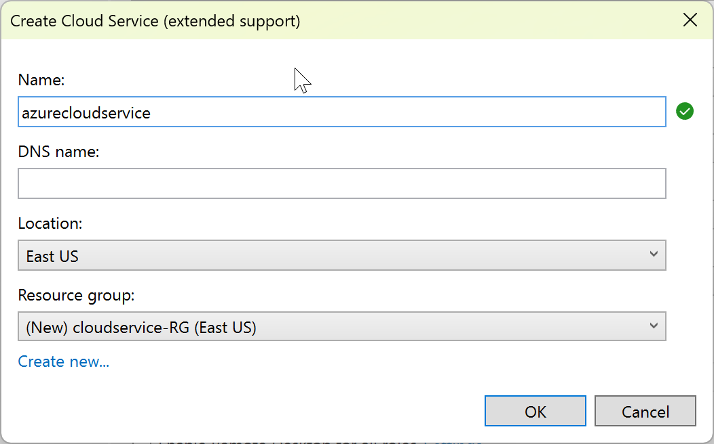
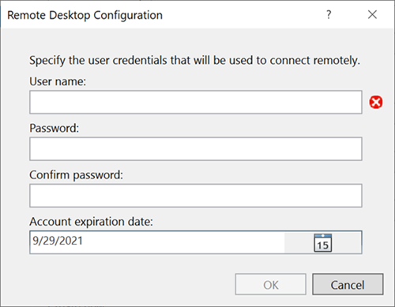
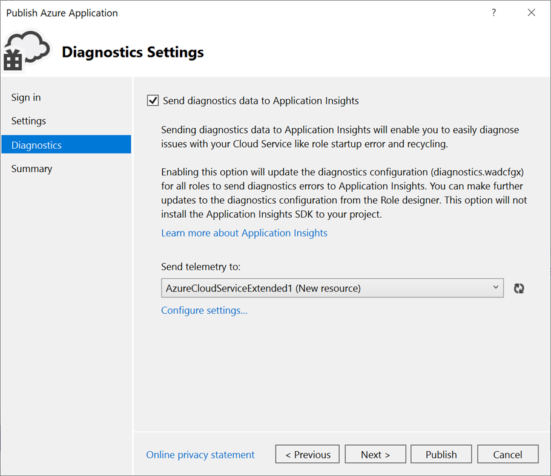
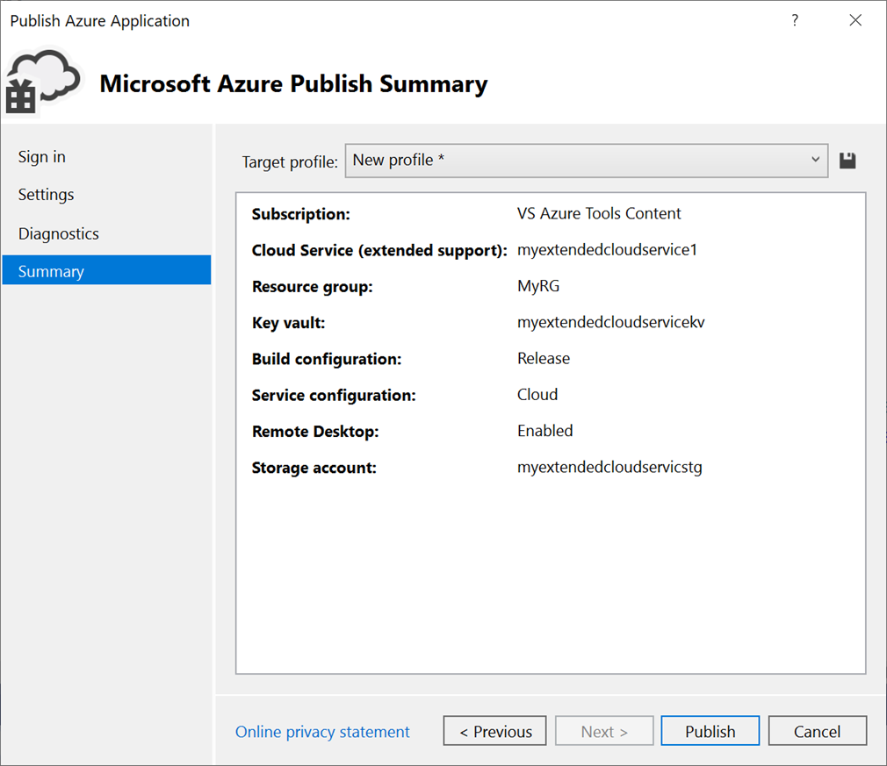

# Publish a Cloud Services (classic) project to Cloud Services (extended support) by using Visual Studio

Azure Cloud Services (extended support) helps simplify and modernize the way you maintain and manage your Azure resources. Starting with [Visual Studio 2019 version 16.9](https://visualstudio.microsoft.com/vs/), you can work with cloud services in Azure by using Azure Resource Manager templates (ARM templates) in Cloud Services (extended support).

This article shows you how to publish an existing instance of Azure Cloud Services (classic) to Azure Cloud Services (extended support). For more information about this Azure service, see the [Cloud Services (extended support) documentation](/azure/cloud-services-extended-support/overview).

[!INCLUDE [Cloud Services](./includes/cloud-services-legacy.md)]

## Publish to Cloud Services (extended support)

When you publish your existing Azure Cloud Services (classic) project to Azure Cloud Services (extended support), you still retain the capability to publish to an instance of Cloud Services (classic).

In Visual Studio 2019 version 16.9 and later, Cloud Services (classic) projects have a special version of the **Publish** command: **Publish (extended support)**. This command appears on the shortcut menu in Solution Explorer in Visual Studio.

There are some differences when you publish to Cloud Services (extended support). For example, you don't select whether to publish to **Staging** or to **Production**, because these deployment slots aren't part of the extended support publishing model. Instead, with Cloud Services (extended support), you can set up multiple deployments, and you can swap deployments in the Azure portal. Although it's possible to use this setting in Visual Studio version 16.9, the swap feature isn't available until a later release of Cloud Services (extended support).

Before you publish an instance of Cloud Services (classic) to Cloud Services (extended support), check whether the Azure Storage accounts that your project uses are V1 or V2 accounts. The classic storage account types fail with an error message during deployment.

Also be sure to check the storage account that Azure Diagnostics uses. To check the Diagnostics storage account, see [Set up diagnostics for Azure Cloud Services and virtual machines](vs-azure-tools-diagnostics-for-cloud-services-and-virtual-machines.md). If your service uses a classic storage account, you can upgrade it. For more information, see [Upgrade to a general-purpose V2 storage account](/azure/storage/common/storage-account-upgrade?tabs=azure-portal). For general information on types of storage accounts, see [Storage account overview](/azure/storage/common/storage-account-overview).

:::moniker range="vs-2022"
> [!NOTE]
> If you target .NET 4.8 with Visual Studio 2022, be sure to open the *ServiceConfiguration.Cloud.cscfg* file and check the value of the `osFamily` attribute on the `ServiceConfiguration` element when you publish your Cloud Services (extended support) deployment. For a .NET 4.8 project, use the value `osFamily="7"`.
:::moniker-end

### Publish a Cloud Services (classic) project to Cloud Services (extended support)

1. In your Azure Cloud Services (classic) project, right-click the project node and select **Publish (extended support)**.

   

   The Publish Azure Application wizard opens.

   

1. For **Account**, select an account, or select **Add an account** in the account dropdown list.

1. For **Choose your subscription**, select a subscription to use for your deployment.

1. Select **Next** to move to the **Settings** pane.

   

1. On **Common Settings**, in the dropdown list, either select an existing instance of Cloud Services (extended support) or select **Create new**, and then create a new instance. The datacenter displays in parentheses for each instance of Cloud Services (extended support). We recommend that the datacenter location for Cloud Services (extended support) be the same as the datacenter location of your storage account.

   If you choose to create a new service, the **Create Cloud Service (extended support)** dialog appears. Specify the name, location, and resource group to use for your Cloud Services (extended support) deployment.

   

1. For **Build configuration**, select either **Debug** or **Release**.

1. For **Service configuration**, select either **Cloud** or **Local**.

1. For **Storage account**, select the storage account to use for this deployment, or select **Create new** to create a storage account. The region appears in parentheses for each storage account. We recommend that the datacenter location for the storage account be the same as the datacenter location for the cloud service (as set on **Common Settings**).

   The Azure Storage account stores the package for the application deployment.

1. For **Key vault**, specify the key vault that contains the secrets for your Cloud Services (extended support) deployment. A key vault is enabled if remote desktop is enabled or if certificates are added to the configuration.

1. For **Enable Remote Desktop for all roles**, select this option if you want to be able to remotely connect to the service. Then, enter sign-in credentials for the remote desktop.

   

1. Select **Next** to move to the **Diagnostics Settings** pane.

   

   You can use Azure Diagnostics to troubleshoot an instance of Cloud Services (extended support). For information about using Diagnostics, see [Set up diagnostics for Azure Cloud Services and virtual machines](./vs-azure-tools-diagnostics-for-cloud-services-and-virtual-machines.md). For information about Application Insights, see [What is Application Insights?](/azure/application-insights/app-insights-overview).

1. Select **Next** to move to the **Summary** pane.

   

1. For **Target profile**, you can choose to create a publishing profile from the settings you selected. For example, you might create one profile for a test environment and another profile for production. To save this profile, select the **Save** icon. The wizard creates the profile and saves it in the Visual Studio project. To modify the profile name, open the **Target profile** list, and then select **Manage**.

   > [!NOTE]
   > The publishing profile appears in Solution Explorer in Visual Studio, and the profile settings are written to a file that has an *.azurePubxml* extension. Settings are saved as attributes of XML tags.

1. Verify the settings that you selected for your project deployment, and then select **Publish**.

   You can monitor the process status in the activity log output window in Visual Studio. Select the **Open in portal** link to view the activity log in the Azure portal.

Congratulations! You published your Cloud Services (extended support) project to Azure. To publish again by using the same settings, you can reuse the publishing profile, or repeat the steps described here to create a new publishing profile. The ARM template and parameters that are used for the deployment are saved in the *bin/\<configuration\>/Publish* folder.

## Clean up Azure resources

Clean up Azure resources that you don't use for an actual deployment. In the [Azure portal](https://portal.azure.com), select **Resource groups**. Find and open the resource group that you used to create an instance of Cloud Services (extended support), and then select **Delete resource group**.

## Related content

- Set up continuous integration (CI) by using the **Configure** button on the **Publish** pane. For more information, see the [Azure Pipelines documentation](/azure/devops/pipelines/?view=azure-devops&preserve-view=true).
- Review [frequently asked questions](/azure/cloud-services-extended-support/faq) for Cloud Services (extended support).
