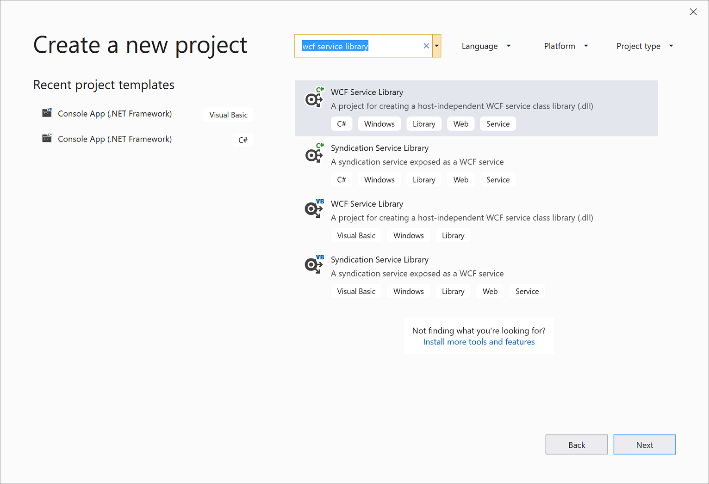
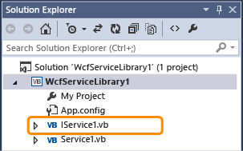
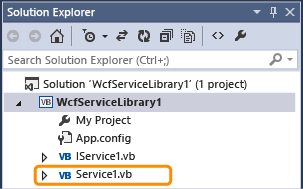
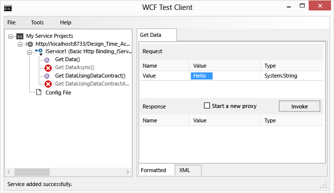
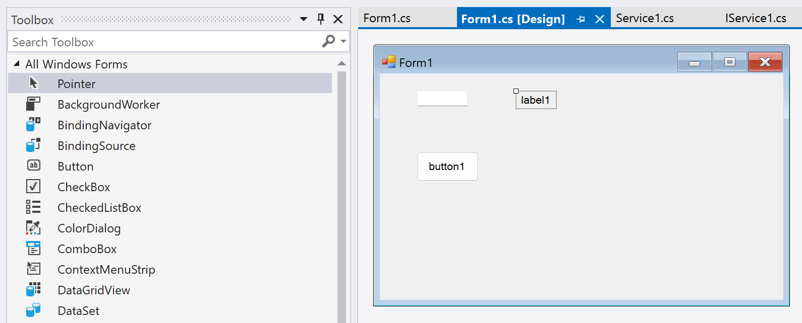

# Walkthrough: Create a simple WCF service in .NET Framework Windows Forms

This walkthrough demonstrates how to create a simple Windows Communication Foundation (WCF) service, test it, and then access it from a .NET Framework Windows Forms application.

[!INCLUDE[note_settings_general](../data-tools/includes/note_settings_general_md.md)]

## Prerequisites

The WCF tools are not installed with the .NET workload; use the Visual Studio Installer to modify your installation. In the installer, choose **Windows Communication Foundation** under Individual Components. See [Modify Visual Studio](../install/modify-visual-studio.md).

## Create a service

1. Open Visual Studio.

2. On the start window, choose **Create a new project**.

3. Type **wcf service library** in the search box on the **Create a new project** page. Select either the C# or Visual Basic template for **WCF Service Library**, and then click **Next**.

   

   > [!TIP]
   > If you don't see any templates, you may need to install the **Windows Communication Foundation** component of Visual Studio. Choose **Install more tools and features** to open Visual Studio Installer. Choose the **Individual components** tab, scroll down to **Development activities**, and then select **Windows Communication Foundation**. Click **Modify**.

4. On the **Configure your new project** page, click **Create**.

   > [!NOTE]
   > This creates a working service that can be tested and accessed. The following two steps demonstrate how you might modify the default method to use a different data type. In a real application, you would also add your own functions to the service.

5. In **Solution Explorer**, double-click **IService1.vb** or **IService1.cs**.

   

   Find the following line:

   ### [C#](#tab/csharp)
   :::code language="csharp" source="../snippets/csharp/VS_Snippets_VBCSharp/wcfwalkthrough/cs/iservice1_2.cs" id="Snippet4":::

   ### [VB](#tab/vb)
   :::code language="vb" source="../snippets/visualbasic/VS_Snippets_VBCSharp/wcfwalkthrough/vb/iservice1_2.vb" id="Snippet4":::
   ---

   Change the type for the `value` parameter to string:

   ### [C#](#tab/csharp)
   :::code language="csharp" source="../snippets/csharp/VS_Snippets_VBCSharp/wcfwalkthrough/cs/iservice1.cs" id="Snippet1":::

   ### [VB](#tab/vb)
   :::code language="vb" source="../snippets/visualbasic/VS_Snippets_VBCSharp/wcfwalkthrough/vb/iservice1.vb" id="Snippet1":::
   ---

   In the above code, note the `OperationContract` attribute. This attribute is required for any method exposed by the service.

6. In **Solution Explorer**, double-click **Service1.vb** or **Service1.cs**.

   

   Find the following line:

   ### [C#](#tab/csharp)
   :::code language="csharp" source="../snippets/csharp/VS_Snippets_VBCSharp/wcfwalkthrough/cs/service1_2.cs" id="Snippet5":::

   ### [VB](#tab/vb)
   :::code language="vb" source="../snippets/visualbasic/VS_Snippets_VBCSharp/wcfwalkthrough/vb/service1_2.vb" id="Snippet5":::
   ---

   Change the type for the `value` parameter to string:

   ### [C#](#tab/csharp)
   :::code language="csharp" source="../snippets/csharp/VS_Snippets_VBCSharp/wcfwalkthrough/cs/service1.cs" id="Snippet2":::

   ### [VB](#tab/vb)
   :::code language="vb" source="../snippets/visualbasic/VS_Snippets_VBCSharp/wcfwalkthrough/vb/service1.vb" id="Snippet2":::
   ---

## Test the service

1. Press **F5** to run the service. A **WCF Test Client** form appears and loads the service.

2. In the **WCF Test Client** form, double-click the **GetData()** method under **IService1**. The **GetData** tab appears.

     

3. In the **Request** box, select the **Value** field and type `Hello`.

     

4. Click the **Invoke** button. If a **Security Warning** dialog box appears, click **OK**. The result displays in the **Response** box.

     

5. On the **File** menu, click **Exit** to close the test form.

## Access the Service

### Reference the WCF service

1. On the **File** menu, point to **Add > New Project**. Choose **Windows Forms App (.NET Framework)** project.

1. Right-click on the project node, and click **Add > Service Reference**. The **Add Service Reference** dialog box appears.

1. In the **Add Service Reference** dialog box, click **Discover**.

     

     **Service1** displays in the **Services** pane.

1. Click **OK** to add the service reference.

### Build a client application

1. In **Solution Explorer**, double-click **Form1.vb** or **Form1.cs** to open the Windows Forms Designer if it is not already open.

1. Open the **Toolbox** by clicking on **View** > **Toolbox** (or **Ctrl**+**Alt**+**X** on the keyboard).

1. From the **Toolbox**, drag a `TextBox` control, a `Label` control, and a `Button` control onto the form.

     

1. Double-click the `Button`, and add the following code in the `Click` event handler:

     ### [C#](#tab/csharp)
     :::code language="csharp" source="../snippets/csharp/VS_Snippets_VBCSharp/wcfwalkthrough/cs/form1.cs" id="Snippet3":::

     ### [VB](#tab/vb)
     :::code language="vb" source="../snippets/visualbasic/VS_Snippets_VBCSharp/wcfwalkthrough/vb/form1.vb" id="Snippet3":::
     ---

1. In **Solution Explorer**, right-click the project node (for example, **WindowsFormsApp1**), and click **Set as StartUp Project**.

1. Press **F5** to run the project. Enter some text and click the button. The label displays "You entered:" and shows the text that you entered.

     

## Related content

- [Windows Communication Foundation Services and WCF Data Services in Visual Studio](../data-tools/windows-communication-foundation-services-and-wcf-data-services-in-visual-studio.md)
