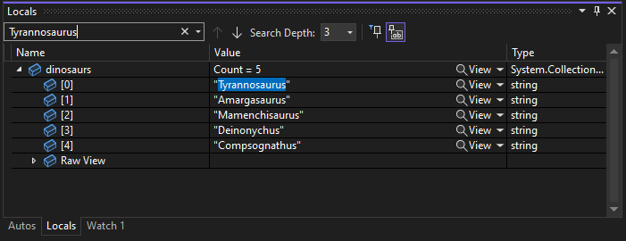
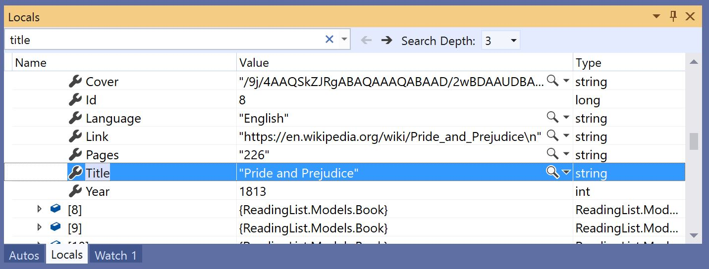
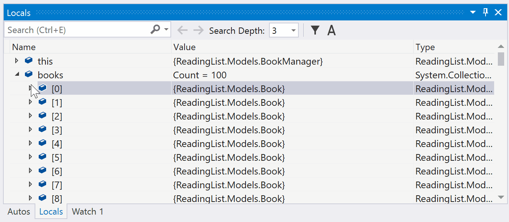
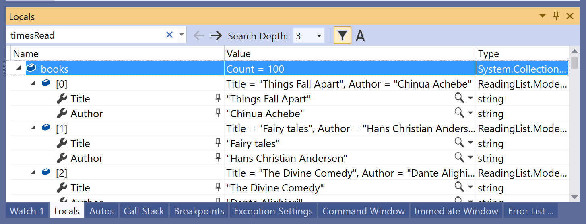
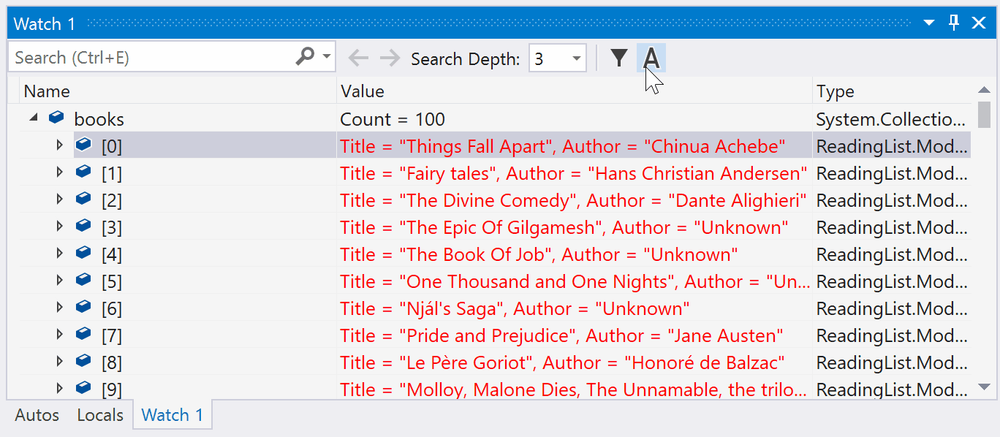

# Inspect variables in the Autos and Locals windows

The **Autos** and **Locals** windows show variable values while you are debugging. The windows are only available during a debugging session. The **Autos** window shows variables used around the current statement where the debugger is paused. The **Locals** window shows variables defined in the local scope, which is usually the current function or method.

> [!NOTE]
> If this is the first time that you've tried to debug code, you might want to read [Debugging for absolute beginners](../debugger/debugging-absolute-beginners.md) and [Debugging techniques and tools](../debugger/write-better-code-with-visual-studio.md) before going through this article.

The **Autos** window is available for C#, Visual Basic, C++, and Python code, but not for JavaScript or F#.

To open the **Autos** window, while debugging, select **Debug** > **Windows** > **Autos**, or press **Ctrl**+**Alt**+**V** > **A**.

To open the **Locals** window, while debugging, select **Debug** > **Windows** > **Locals**, or press **Alt**+**4**.

## Use the Autos and Locals windows

Arrays and objects show in the **Autos** and **Locals** windows as tree controls. Select the arrow to the left of a variable name to expand the view to show fields and properties. Here is an example of a <xref:System.IO.FileStream?displayProperty=fullName> object in the **Locals** window:

::: moniker range=">= vs-2022"

::: moniker-end
::: moniker range="vs-2019"

::: moniker-end

A red value in the **Locals** or **Autos** window means the value has changed since the last evaluation. The change could be from a previous debugging session, or because you have changed the value in the window.

The default numeric format in debugger windows is decimal. To change it to hexadecimal, right-click in the **Locals** or **Autos** window and select **Hexadecimal Display**. This change affects all debugger windows.

## Edit variable values in the Autos or Locals window

To edit the values of most variables in the **Autos** or **Locals** windows, double-click the value and enter the new value.

You can enter an expression for a value, for example `a + b`. The debugger accepts most valid language expressions.

In native C++ code, you might have to qualify the context of a variable name. For more information, see [Context operator (C++)](../debugger/context-operator-cpp.md).

>[!CAUTION]
> Make sure you understand the consequences before you change values and expressions. Some possible issues are:
>
>- Evaluating some expressions can change the value of a variable or otherwise affect the state of your program. For example, evaluating `var1 = ++var2` changes the value of both `var1` and `var2`. These expressions are said to have [side effects](https://en.wikipedia.org/wiki/Side_effect_\(computer_science\)). Side effects can cause unexpected results if you are not aware of them.
>
>- Editing floating-point values can result in minor inaccuracies because of decimal-to-binary conversion of fractional components. Even a seemingly harmless edit can result in changes to some of the bits in the floating-point variable.

## Search in the Autos or Locals window

You can search for keywords in the Name, Value, and Type columns of the **Autos** or **Locals** window using the search bar above each window. Hit ENTER or select one of the arrows to execute a search. To cancel an ongoing search, select the "x" icon in the search bar.

Use the left and right arrows (Shift+F3 and F3, respectively) to navigate between found matches.

::: moniker range=">= vs-2022"

::: moniker-end
::: moniker range="vs-2019"

::: moniker-end

To make your search more or less thorough, use the **Search Deeper** dropdown list at the top of the **Autos** or **Locals** window to select how many levels deep you want to search into nested objects.

## Pin properties in the Autos or Locals window

> [!NOTE]
> This feature is supported for .NET Core 3.0 or higher.

You can quickly inspect objects by their properties in the Autos and Locals windows with the **Pinnable Properties** tool. To use this tool, hover over a property and select the pin icon that appears or right-click and select the **Pin Member as Favorite** option in the resulting context menu. This bubbles up that property to the top of the object's property list, and the property name and value are displayed in the **Value** column. To unpin a property, select the pin icon again or select the **Unpin Member as Favorite** option in the context menu.



You can also toggle property names and filter out non-pinned properties when viewing the object's property list in the Autos or Locals windows. You can access each option by selecting the buttons in the toolbar above the Autos or Locals windows.





## Change the context for the Autos or Locals window

You can use the **Debug Location** toolbar to select a desired function, thread, or process, which changes the context for the **Autos** and **Locals** windows.

To enable the **Debug Location** toolbar, click in an empty part of the toolbar area and select **Debug Location** from the dropdown list, or select **View** > **Toolbars** > **Debug Location**.

Set a breakpoint and start debugging. When the breakpoint is hit, execution pauses and you can see the location in the **Debug Location** toolbar.

::: moniker range=">= vs-2022"

::: moniker-end
::: moniker range="vs-2019"

::: moniker-end

::: moniker range=">= vs-2022"
## Get AI assistance

If you have [Copilot](../ide/visual-studio-github-copilot-extension.md), you can get AI assistance while you're looking at variables in the Autos or Locals windows, or in data tips. Right-click on a variable and use the **Ask Copilot**  button. In this scenario, Copilot already knows the context for your question, so you don't need to provide context yourself in chat. For more information, see [Debug with Copilot](../debugger/debug-with-copilot.md).
::: moniker-end

## <a name="bkmk_whatvariables"></a> Variables in the Autos window (C#, C++, Visual Basic, Python)

Different code languages display different variables in the **Autos** window.

- In C# and Visual Basic, the **Autos** window displays any variable used on the current or preceding line. For example, in C# or Visual Basic code, declare the following four variables:

   ```csharp
       public static void Main()
       {
          int a, b, c, d;
          a = 1;
          b = 2;
          c = 3;
          d = 4;
       }
   ```

   Set a breakpoint on the line `c = 3;`, and start the debugger. When execution pauses, the **Autos** window will display:

   ::: moniker range=">= vs-2022"
   
   ::: moniker-end
   ::: moniker range="vs-2019"
   
   ::: moniker-end

   The value of `c` is 0, because the line `c = 3` has not yet been executed.

- In C++, the **Autos** window displays the variables used in at least three lines before the current line where execution is paused. For example, in C++ code, declare six variables:

   ```cpp
       void main() {
           int a, b, c, d, e, f;
           a = 1;
           b = 2;
           c = 3;
           d = 4;
           e = 5;
           f = 6;
       }
   ```

    Set a breakpoint on the line `e = 5;` and run the debugger. When execution stops, the **Autos** window will display:

    ::: moniker range=">= vs-2022"
    
    ::: moniker-end
    ::: moniker range="vs-2019"
    
    ::: moniker-end

    The variable `e` is uninitialized, because the line `e = 5` has not yet been executed.

## <a name="bkmk_returnValue"></a> View return values of method calls

In .NET and C++ code, you can examine return values in the **Autos** window when you step over or out of a method call. Viewing method call return values can be useful when they are not stored in local variables. A method could be used as a parameter, or as the return value of another method.

For example, the following C# code adds the return values of two functions:

```csharp
static void Main(string[] args)
{
    int a, b, c, d;
    a = 1;
    b = 2;
    c = 3;
    d = 4;
    int x = sumVars(a, b) + subtractVars(c, d);
}

private static int sumVars(int i, int j)
{
    return i + j;
}

private static int subtractVars(int i, int j)
{
    return j - i;
}
```

To see the return values of the `sumVars()` and `subtractVars()` method calls in the Autos window:

1. Set a breakpoint on the `int x = sumVars(a, b) + subtractVars(c, d);` line.

1. Start debugging, and when execution pauses at the breakpoint, select **Step Over** or press **F10**. You should see the following return values in the **Autos** window:

   ::: moniker range=">= vs-2022"
   
   ::: moniker-end
   ::: moniker range="vs-2019"
   
   ::: moniker-end

## Related content

- [What is debugging?](../debugger/what-is-debugging.md)
- [Debugging techniques and tools](../debugger/write-better-code-with-visual-studio.md)
- [First look at debugging](../debugger/debugger-feature-tour.md)
- [Debugger windows](../debugger/debugger-windows.md)
