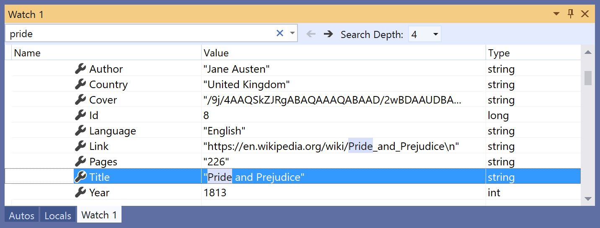
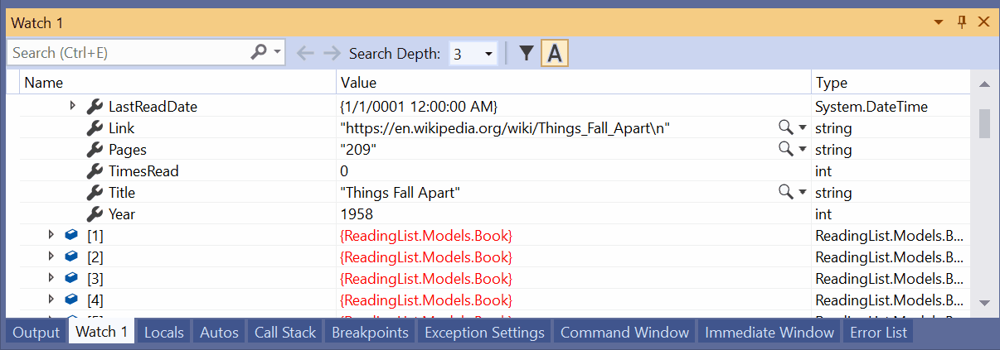
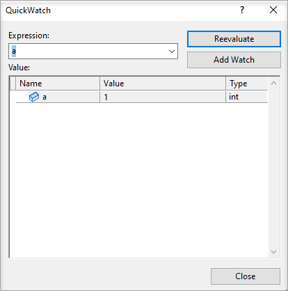
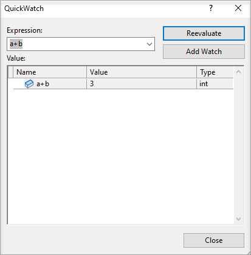

# Watch variables with Watch windows and QuickWatch

While you're debugging, you can use **Watch** windows and **QuickWatch** to watch variables and expressions. The windows are only available during a debugging session.

**Watch** windows can display several variables at a time while debugging. The **QuickWatch** dialog displays a single variable at a time, and must be closed before debugging can continue. For more information on using QuickWatch, see [Observe a single variable or expression with QuickWatch](#observe-a-single-variable-or-expression-with-quickwatch).

> [!NOTE]
> If this is the first time that you've tried to debug code, you may want to read [Debugging for absolute beginners](../debugger/debugging-absolute-beginners.md) and [Debugging techniques and tools](../debugger/write-better-code-with-visual-studio.md) before going through this article.

## Observe variables with a Watch window

You can open more than one **Watch** window, and observe more than one variable in a **Watch** window.

For example, to set a watch on the values of `a`, `b`, and `c` in the following code:

```C++
int main()
{
    int a, b, c;
    a = 1;
    b = 2;
    c = 0;

    for (int i = 0; i < 10; i++)
    {
        a++;
        b *= 2;
        c = a + b;
    }

    return 0;
}

```

1. Set a breakpoint on the `c = a + b;` line by clicking in the left margin, selecting **Debug** > **Toggle Breakpoint**, or pressing **F9**.

1. Start debugging by selecting the green **Start** arrow or **Debug** > **Start Debugging**, or press **F5**. Execution pauses at the breakpoint.

1. Open a **Watch** window by selecting **Debug** > **Windows** > **Watch** > **Watch 1**, or pressing **Ctrl**+**Alt**+**W** > **1**.

   You can open additional **Watch** windows by selecting windows **2**, **3**, or **4**.

1. In the **Watch** window, select an empty row, and type variable `a`. Do the same for `b` and `c`.

   ::: moniker range="<=vs-2019"

   

   ::: moniker-end

   ::: moniker range=">=vs-2022"

   

   ::: moniker-end

1. Continue debugging by selecting **Debug** > **Step Into** or pressing **F11** as needed to advance. The variable values in the **Watch** window change as you iterate through the `for` loop.

>[!NOTE]
>For C++ only,
>- You may need to qualify the context of a variable name, or an expression that uses a variable name. The context is the function, source file, or module where a variable is located. If you have to qualify the context, use the [context operator (C++)](../debugger/context-operator-cpp.md) syntax in the **Name** in the **Watch** window.
>
>- You can add register names and variable names using **$\<register&nbsp;name>** or **@\<register&nbsp;name>** to the **Name** in the **Watch** window. For more information, see [Pseudovariables](../debugger/pseudovariables.md).

## Use expressions in a Watch window

You can observe any valid expression recognized by the debugger in a **Watch** window.

For example, for the code in the preceding section, you can get the average of the three values by entering `(a + b + c) / 3` in the **Watch** window:

::: moniker range="<=vs-2019"


::: moniker-end

::: moniker range=">=vs-2022"


::: moniker-end

The rules for evaluating expressions in the **Watch** window are generally the same as the rules for evaluating expressions in the code language. If an expression has a syntax error, expect the same compiler error as in the code editor. For example, a typo in the preceding expression produces this error in the **Watch** window:

::: moniker range="<=vs-2019"


::: moniker-end

::: moniker range=">=vs-2022"


::: moniker-end

A circle with two wavy lines icon may appear in the **Watch** window. This icon means the debugger doesn't evaluate the expression because of a potential cross-thread dependency. Evaluating the code requires other threads in your app to run temporarily, but since you are in break mode, all threads in your app are usually stopped. Allowing other threads to run temporarily can have unexpected effects on the state of your app, and the debugger may ignore events such as breakpoints and exceptions on those threads.

::: moniker range=">= vs-2019" 

## Search in the Watch window

You can search for keywords in the Name, Value, and Type columns of the **Watch** window using the search bar above each window. Hit ENTER or select one of the arrows to execute a search. To cancel an ongoing search, select the "x" icon in the search bar.

Use the left and right arrows (Shift+F3 and F3, respectively) to navigate between found matches.



To make your search more or less thorough, use the **Search Deeper** dropdown at the top of the **Watch** window to select how many levels deep you want to search into nested objects. 

## Pin properties in the Watch window

>[!NOTE]
> This feature is supported in .NET Core 3.0 or higher.

You can quickly inspect objects by their properties in the Watch window with the **Pinnable Properties** tool.  To use this tool, hover over a property and select the pin icon that appears or right-click and select the **Pin Member as Favorite** option in the resulting context menu.  This bubbles up that property to the top of the object’s property list, and the property name and value is displayed in the **Value** column.  To unpin a property, select the pin icon again or select the **Unpin Member as Favorite** option in the context menu.



You can also toggle property names and filter out non-pinned properties when viewing the object’s property list in the Watch window.  You can access both options by selecting the buttons in the toolbar above the watch window.

::: moniker-end

### <a name="bkmk_refreshWatch"></a> Refresh watch values

A refresh icon (circular arrow) might appear in the **Watch** window when an expression is evaluated. The refresh icon indicates an error or a value that is out of date.

To refresh the value, select the refresh icon, or press the spacebar. The debugger tries to reevaluate the expression. However, you may not want or be able to reevaluate the expression, depending on why the value wasn't evaluated.

Hover over the refresh icon or see the **Value** column for the reason the expression wasn't evaluated. Reasons include:

- An error occurred as the expression was being evaluated, as in the previous example. A timeout might occur, or a variable might be out of scope.

- The expression has a function call that could trigger a side effect in the app. See [Expression side effects](#bkmk_sideEffects).

- Automatic evaluation of properties and implicit function calls is disabled.

If the refresh icon appears because automatic evaluation of properties and implicit function calls is disabled, you can enable it by selecting **Enable property evaluation and other implicit function calls** in **Tools** > **Options** > **Debugging** > **General**.

To demonstrate using the refresh icon:

1. In **Tools** > **Options** > **Debugging** > **General**, clear the **Enable property evaluation and other implicit function calls** check box.

1. Enter the following code, and in the **Watch** window, set a watch on the `list.Count` property.

   ```csharp
   static void Main(string[] args)
   {
       List<string> list = new List<string>();
       list.Add("hello");
       list.Add("goodbye");
   }
   ```

1. Start debugging. The **Watch** window shows something like the following message:

   ::: moniker range="<=vs-2019"

   

   ::: moniker-end

   ::: moniker range=">=vs-2022"

   

   ::: moniker-end

1. To refresh the value, select the refresh icon, or press the spacebar. The debugger reevaluates the expression.

### <a name="bkmk_sideEffects"></a> Expression side effects

Evaluating some expressions can change the value of a variable, or otherwise affect the state of your app. For example, evaluating the following expression changes the value of `var1`:

```csharp
var1 = var2
```

This code can cause a [side effect](https://en.wikipedia.org/wiki/Side_effect_\(computer_science\)). Side effects can make debugging more difficult by changing the way your app operates.

An expression with side effects is evaluated only once, when you first enter it. After that, the expression appears grayed out in the **Watch** window, and further evaluations are disabled. The tooltip or **Value** column explains that the expression causes a side effect. You can force reevaluation by selecting the refresh icon that appears next to the value.

One way to prevent the side effects designation is to turn off automatic function evaluation. In **Tools** > **Options** > **Debugging** > **General**, deselect **Enable property evaluation and other implicit function calls**.

For C# only, when evaluation of properties or implicit function calls is turned off, you can force evaluation by adding the **ac** format modifier to a variable **Name** in the **Watch** window. See [Format specifiers in C#](../debugger/format-specifiers-in-csharp.md).

## <a name="bkmk_objectIds"></a> Use Object IDs in the Watch window (C# and Visual Basic)

Sometimes you want to observe the behavior of a specific object. For example, you might want to track an object referred to by a local variable after that variable has gone out of scope. In C# and Visual Basic, you can create Object IDs for specific instances of reference types, and use them in the **Watch** window and in breakpoint conditions. The Object ID is generated by the common language runtime (CLR) debugging services and associated with the object.

> [!NOTE]
> Object IDs create weak references that don't prevent the object from being garbage collected. They are valid only for the current debugging session.

In the following code, the `MakePerson()` method creates a `Person` using a local variable:

```csharp
class Person
{
    public Person(string name)
    {
        Name = name;
    }
    public string Name { get; set; }
}

public class Program
{
    static List<Person> _people = new List<Person>();
    public static void Main(string[] args)
    {
        MakePerson();
        DoSomething();
    }

    private static void MakePerson()
    {
        var p = new Person("Bob");
        _people.Add(p);
    }

    private static void DoSomething()
    {
        // more processing
         Console.WriteLine("done");
    }
}
```

To find out the name of the `Person` in the `DoSomething()` method, you can add a reference to the `Person` Object ID in the **Watch** window.

1. Set a breakpoint in the code after the `Person` object has been created.

1. Start debugging.

1. When execution pauses at the breakpoint, open the **Locals** window by choosing **Debug** > **Windows** > **Locals**.

1. In the **Locals** window, right-click the `Person` variable and select **Make Object ID**.

   You should see a dollar sign (**$**) plus a number in the **Locals** window, which is the Object ID.

1. Add the object ID to the **Watch** window by right-clicking the Object ID and selecting **Add Watch**.

1. Set another breakpoint in the `DoSomething()` method.

1. Continue debugging. When execution pauses in the `DoSomething()` method, the **Watch** window displays the `Person` object.

   > [!NOTE]
   > If you want to see the object's properties, such as `Person.Name`, you must enable property evaluation by selecting **Tools** > **Options** > **Debugging** > **General** > **Enable property evaluation and other implicit function calls**.

## Dynamic View and the Watch window

Some scripting languages (for example, JavaScript or Python) use dynamic or [duck](https://en.wikipedia.org/wiki/Duck_typing) typing, and .NET version 4.0 and later supports objects that are difficult to observe in the normal debugging windows.

The **Watch** window displays these objects as dynamic objects, which are created from types that implement the <xref:System.Dynamic.IDynamicMetaObjectProvider> interface. Dynamic object nodes show the dynamic members of the dynamic objects, but don't allow editing of the member values.

To refresh **Dynamic View** values, select the [refresh icon](#bkmk_refreshWatch) next to the dynamic object node.

To display only the **Dynamic View** for an object, add a **dynamic** format specifier after the dynamic object name in the **Watch** window:

- For C#: `ObjectName, dynamic`
- For Visual Basic: `$dynamic, ObjectName`

>[!NOTE]
>- The C# debugger doesn't automatically reevaluate the values in the **Dynamic View** when you step to the next line of code.
>- The Visual Basic debugger automatically refreshes expressions added through the **Dynamic View**.
>- Evaluating the members of a **Dynamic View** can have [side effects](https://en.wikipedia.org/wiki/Side_effect_\(computer_science\)).

**To insert a new watch variable that casts an object to a dynamic object:**

1. Right-click any child of a **Dynamic View**.
1. Choose **Add Watch**. The `object.name` becomes `((dynamic) object).name` and appears in a new **Watch** window.

The debugger also adds a **Dynamic View** child node of the object to the **Autos** window. To open the **Autos** window, during debugging, select **Debug** > **Windows** > **Autos**.

**Dynamic View** also enhances debugging for COM objects. When the debugger gets to a COM object wrapped in **System.__ComObject**, it adds a **Dynamic View** node for the object.

## Observe a single variable or expression with QuickWatch

You can use **QuickWatch** to observe a single variable.

For example, for the following code:

```csharp
static void Main(string[] args)
{
    int a, b;
    a = 1;
    b = 2;
    for (int i = 0; i < 10; i++)
    {
        a = a + b;
    }
}
```

To observe the `a` variable,

1. Set a breakpoint on the `a = a + b;` line.

1. Start debugging. Execution pauses at the breakpoint.

1. Select the variable `a` in the code.

1. Select **Debug** > **QuickWatch**, press **Shift**+**F9**, or right-click and select **QuickWatch**.

   The **QuickWatch** dialog appears. The `a` variable is in the **Expression** box with a **Value** of **1**.

   ::: moniker range="<=vs-2019"

   

   ::: moniker-end

   ::: moniker range=">=vs-2022"

   

   ::: moniker-end

1. To evaluate an expression using the variable, type an expression such as `a + b` in the **Expression** box, and select **Reevaluate**.

   ::: moniker range="<=vs-2019"

   

   ::: moniker-end

   ::: moniker range=">=vs-2022"

   

   ::: moniker-end

1. To add the variable or expression from **QuickWatch** to the **Watch** window, select **Add Watch**.

1. Select **Close** to close the **QuickWatch** window. (**QuickWatch** is a modal dialog, so you can't continue debugging as long as it is open.)

1. Continue debugging. You can observe the variable in the **Watch** window.

## Related content
- [What is debugging?](../debugger/what-is-debugging.md)
- [Debugging techniques and tools](../debugger/write-better-code-with-visual-studio.md)
- [First look at debugging](../debugger/debugger-feature-tour.md)
- [Debugger windows](../debugger/debugger-windows.md)
