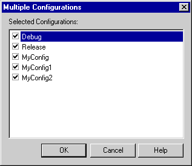
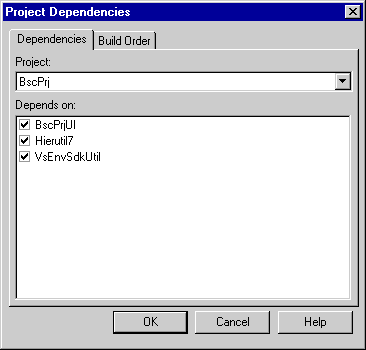

# Project Configuration for Building

The list of solution configurations for a given solution is managed by the Solution Configurations dialog box.

 A user can create additional solution configurations, each with its own unique name. When the user creates a new solution configuration, the IDE defaults to the corresponding configuration name in the projects, or Debug if no corresponding name exists. The user can change the selection to meet specific requirements if necessary. The only exception to this behavior is when the project supports a configuration that matches the name of the new solution configuration. For example, assume a solution contains Project1 and Project2. Project1 has project configurations Debug, Retail, and MyConfig1. Project2 has project configurations Debug, Retail, and MyConfig2.

 If the user creates a new solution configuration named MyConfig2, Project1 binds its Debug configuration to the solution configuration by default. Project2 also binds its MyConfig2 configuration to the solution configuration by default.

> [!NOTE]
> Binding is case-insensitive.

 When the user selects the **Multiple Selection** item in the configuration drop-down list, the environment displays a dialog box that provides the list of available configurations.

 
Multiple configurations

 Within this dialog box, the user can select one or multiple configurations. Once selected, the property values displayed on the property pages dialog box reflect the intersection of values for the selected configurations.

 See [Solution Configuration](../../extensibility/internals/solution-configuration.md) for information relating to adding and renaming configurations for solutions and projects.

 Project dependencies and build order are solution configuration independent: that is, you can only set up one dependency tree for all of the projects in the solution. Right-clicking the solution or project and selecting either the **Project Dependencies** or **Project Build Order** option opens the **Project Dependencies** dialog box. It can also be opened from the **Project** menu.

 
Project dependencies

 Project dependencies determine the order in which projects build. Use the Build Order tab on the dialog box to view the exact order in which projects within a solution will build, and use the Dependencies tab to modify the build order.

> [!NOTE]
> Projects in the list that have their check boxes selected but appear dimmed have been added by the environment due to explicit dependencies specified by the <xref:Microsoft.VisualStudio.Shell.Interop.IVsBuildDependency> or the <xref:Microsoft.VisualStudio.Shell.Interop.IVsDeployDependency> interfaces, and cannot be changed. For example, adding a project reference from a Visual Basic project to another project automatically adds a build dependency that can only be removed by deleting the reference. Projects whose check boxes are clear and appear dimmed cannot be selected because doing so would create a dependency loop (for example, Project1 would be dependent upon Project2, and Project2 would be dependent upon Project1), which would stall the build.

 Visual Studio build processes include the typical compile and link operations that are invoked with a single Build command. Two other build processes can also be supported: a clean operation to delete all output items from a previous build, and an up-to-date check to determine if an output item in a configuration has changed.

- <xref:Microsoft.VisualStudio.Shell.Interop.IVsProjectCfg2> objects return a corresponding <xref:Microsoft.VisualStudio.Shell.Interop.IVsBuildableProjectCfg> (returned from <xref:Microsoft.VisualStudio.Shell.Interop.IVsProjectCfg2.get_CfgType%2A>) to manage their build processes. To report the status of a build operation while it is occurring, configurations make calls to <xref:Microsoft.VisualStudio.Shell.Interop.IVsBuildStatusCallback>, an interface implemented by the environment and any other object interested in build status events.

 Once built, configuration settings can be used to determine whether or not they can be run under the control of the debugger. Configurations implement <xref:Microsoft.VisualStudio.Shell.Interop.IVsDebuggableProjectCfg> to support debugging.

 After implementing the project dependencies, you can programmatically manipulate the dependencies through the automation model. You call <xref:EnvDTE.SolutionBuild.BuildDependencies%2A> in the automation model. There are no available VSIP API-level interfaces that allow the direct manipulation of the solution build manager configurations and their properties.

 In addition, you can provide a grid in the project dependencies window. For more information, see [Properties Display Grid](../../extensibility/internals/properties-display-grid.md).

## See also
- [Managing Configuration Options](../../extensibility/internals/managing-configuration-options.md)
- [Project Configuration for Managing Deployment](../../extensibility/internals/project-configuration-for-managing-deployment.md)
- [Project Configuration for Output](../../extensibility/internals/project-configuration-for-output.md)
