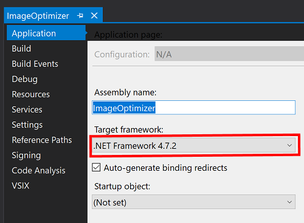
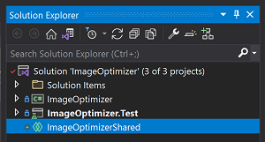
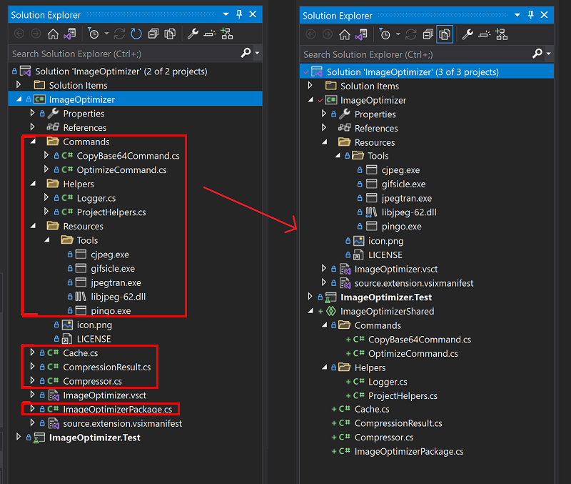
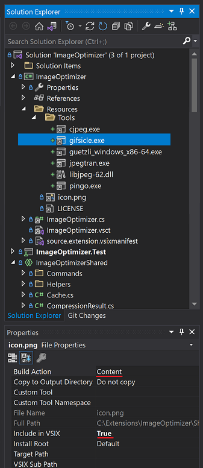
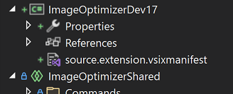
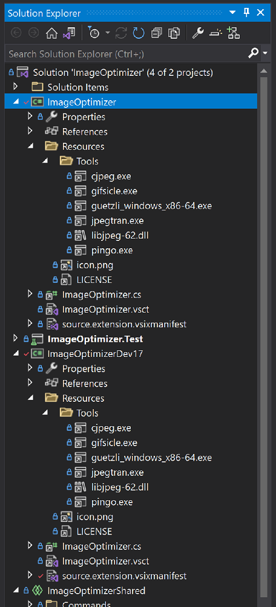

# ImageOptimizer - Update a Visual Studio extension step by step

This guide will show all the steps required for adding Visual Studio 2022 support while maintaining Visual Studio 2019 support using the Image Optimizer extension as a case study.  
This is meant to be a thorough guide with git commit links to each step, but you are free to see the finalized PR here: 
[`https://github.com/madskristensen/ImageOptimizer/pull/46`](https://github.com/madskristensen/ImageOptimizer/pull/46).

We also have [additional samples](#other-samples) at the end of this guide.

## Step 1 - Modernize the project

See [Modernize the project](update-visual-studio-extension.md#modernize-your-vsix-project).

[git commit e052465](https://github.com/madskristensen/ImageOptimizer/pull/46/commits/e052465f30e6bed37e6d76eac016047095e8e18b)

First we bump the VSIX and unit test project to .NET 4.7.2 under the properties page of the projects:

   

Image Optimizer referenced some old custom 14.* and 15.* packages, instead we'll install the [`Microsoft.VisualStudio.Sdk` NuGet package](https://www.nuget.org/packages/microsoft.visualstudio.sdk) which consolidates all our required references.

```Diff
-  <ItemGroup>
-    <PackageReference Include="Madskristensen.VisualStudio.SDK">
-      <Version>14.0.0-beta4</Version>
-    </PackageReference>
-    <PackageReference Include="Microsoft.VSSDK.BuildTools">
-      <Version>15.8.3247</Version>
-      <IncludeAssets>runtime; build; native; contentfiles; analyzers</IncludeAssets>
-      <PrivateAssets>all</PrivateAssets>
-    </PackageReference>
-  </ItemGroup>

+  <ItemGroup>
+    <PackageReference Include="Microsoft.VisualStudio.SDK">
+      <Version>16.9.31025.194</Version>
+    </PackageReference>
+  </ItemGroup>
```

Building the project succeeds and we get a few threading warnings. We fix these warnings by clicking `ctrl` and `.` and using intellisense to add the missing thread switching lines.

## Step 2 - Refactor source code into a shared project

See [Shared projects](update-visual-studio-extension.md#use-shared-projects-for-multi-targeting).

Supporting Visual Studio 2022 requires adding a new shared project that will contain the extension's source code which will be shared between the Visual Studio 2019 and Visual Studio 2022 VSIX projects.

1. Add a new shared project to your solution

   [git commit abf249d](https://github.com/madskristensen/ImageOptimizer/pull/46/commits/abf249d5a4bed9010652f3f3fc4753c7c771c892)

   

1. Add a reference to the shared project to your VSIX project.

   [git commit e8e941e](https://github.com/madskristensen/ImageOptimizer/pull/46/commits/e8e941e5a5482cc15f5b9e7e4f1727f5cab5b12c)

   :::image type="content" source="media/update-visual-studio-extension/add-shared-project-reference.png" alt-text="Add shared project reference" lightbox="media/update-visual-studio-extension/add-shared-project-reference.png":::

1. Move your source code files (cs, xaml, resx) to the new shared project **except** for the following:
    - `source.extension.vsixmanifest`
    - Extension metadata files (icons, licenses, release notes, etc.)
    - VSCT files
    - Linked files
    - External tools or libraries that need to be included in the VSIX

   [git commit f31f051](https://github.com/madskristensen/ImageOptimizer/pull/46/commits/f31f0515305623988f2c355ed3bf5952fc8f1d9e)

   

1. Now move all the metadata, VSCT files, linked files, and external tools/libraries to a shared location and add them back as linked items to the VSIX project. **Do not** remove `source.extension.vsixmanifest`.

   [git commit 73ba920 - Moving files](https://github.com/madskristensen/ImageOptimizer/pull/46/commits/73ba920b7db0bdb7c4d66aa9bc932c268efd49cb)

   [git commit d5e36b2 - Adding external tools/libraries](https://github.com/madskristensen/ImageOptimizer/pull/46/commits/d5e36b2d047290d38ffc977511510bc03e257f13)

   1. For this project we need to move the extension icon, VSCT file, and external tools to our new folder `ImageOptimizer\Resources`. Copy them to the shared folder and remove them from the VSIX project.
   1. Added them back as linked items and if items  are already linked items can stay as they are (license for example).
   1. Validate that the Build Action and other properties are set correctly in the added linked files by selecting each one and checking the properties tool window. For our project we had to set the following:
       - Set `icon.png` Build Action to `Content` and marked Include in VSIX to `true`
       - Set `ImageOptimizer.vsct` Build Action to `VSCTComplile` and Include in VSIX to `false`
       - Set all the Build Action of the files under `Resources\Tools` to `Content` and marked Include in VSIX to `true`

           

       - Additionally, `ImageOptimizer.cs` is a dependency of `ImageOptimizer.vsct`, for this we have to manually add this dependency to the csproj file:

          ```diff  
          - <Content Include="..\SharedFiles\ImageOptimizer.vsct">
          -   <Link>ImageOptimizer.vsct</Link>
          - </Content>
          - <Compile Include="..\SharedFiles\ImageOptimizer.cs">
          -   <Link>ImageOptimizer.cs</Link>
          - </Compile>

          + <VSCTCompile Include="..\SharedFiles\ImageOptimizer.vsct">
          +   <ResourceName>Menus.ctmenu</ResourceName>
          +   <Generator>VsctGenerator</Generator>
          +   <LastGenOutput>..\SharedFiles\ImageOptimizer.cs</LastGenOutput>
          + </VSCTCompile>
          + <Compile Include="..\SharedFiles\ImageOptimizer.cs">
          +   <AutoGen>True</AutoGen>
          +   <DesignTime>True</DesignTime>
          +   <DependentUpon>..\SharedFiles\ImageOptimizer.vsct</DependentUpon>
          + </Compile>
          ```

       - If the properties tool window prevents you from setting a specific Build Action, you can manually modify the csproj as done above and set the Build Action as needed.

1. Build your project to validate your changes and fix any error/issues. Check the [Frequently Asked Questions](update-visual-studio-extension.md#q--a) section for common issues.

## Step 3 - Add a Visual Studio 2022 VSIX project

See [Add Visual Studio 2022 target](update-visual-studio-extension.md#add-a-visual-studio-2022-target).

1. Add a new VSIX project to your solution.
1. Remove any additional source code in the new project except for `source.extension.vsixmanifest.`

   

1. Add a reference to your shared project.

   [git commit dd49cb2](https://github.com/madskristensen/ImageOptimizer/pull/46/commits/dd49cb227b52c46206bf4be5c25790ac0377568d)

   :::image type="content" source="media/update-visual-studio-extension/add-shared-project-reference.png" alt-text="Add reference to shared project" lightbox="media/update-visual-studio-extension/add-shared-project-reference.png":::

1. Add the linked files from your Visual Studio 2019 VSIX project and validate that their "Build Action" and "Include in VSIX" properties match. Also copy over your `source.extension.vsixmanifest` file, we'll be modifying it later to support Visual Studio 2022.

   [git commit 98c43ee](https://github.com/madskristensen/ImageOptimizer/pull/46/commits/98c43ee6fbe912c38a1275542c44c65e11d7dbd9)

   

1. An attempted build shows that we are missing a reference to `System.Windows.Forms`. Simply add it to our Visual Studio 2022 project and rebuild.

   [git commit de71ccd](https://github.com/madskristensen/ImageOptimizer/pull/46/commits/de71ccd9baff703aa6679392ad41a2cfe7bd7d72)

   ```Diff
   + <Reference Include="System.Windows.Forms" />
   ```

1. Upgrade `Microsoft.VisualStudio.SDK` and `Microsoft.VSSDK.BuildTools` package references to the Visual Studio 2022 versions.

   [git commit d581fc3](https://github.com/madskristensen/ImageOptimizer/pull/46/commits/d581fc3c954974124dc7e31e5ecc85f78f7828ab)

   > [!NOTE]
   > These are the latest versions available when this guide was created. It's recommended you get the latest versions available.
   >
   > ```diff
   > -<PackageReference Include="Microsoft.VisualStudio.SDK" Version="16.0.206" />
   > +<PackageReference Include="Microsoft.VisualStudio.SDK" Version="17.0.0-preview-1-31216-1036" />
   > -<PackageReference Include="Microsoft.VSSDK.BuildTools" Version="16.10.32" />
   > +<PackageReference Include="Microsoft.VSSDK.BuildTools" Version="17.0.63-Visual Studio 2022-g3f11f5ab" />
   > ```

1. Edit your `source.extension.vsixmanifest` file to reflect targeting Visual Studio 2022.

   [git commit 9d393c7](https://github.com/madskristensen/ImageOptimizer/pull/46/commits/9d393c708c04ac4af48d1eb9ce3da4470db5d5cc)
   1. Set the `<InstallationTarget>` tag to reflect Visual Studio 2022 and indicate an amd64 payload:

      ```xml
      <InstallationTarget Id="Microsoft.VisualStudio.Community" Version="[17.0,18.0)">
          <ProductArchitecture>amd64</ProductArchitecture>
      </InstallationTarget>
      ```

   1. Modify the Prerequisite to only include Visual Studio 2022 and above:

      ```Diff
      - <Prerequisite Id="Microsoft.VisualStudio.Component.CoreEditor" Version="[15.0,)" DisplayName="Visual Studio core editor" />
      + <Prerequisite Id="Microsoft.VisualStudio.Component.CoreEditor" Version="[17.0,)" DisplayName="Visual Studio core editor" />
      ```

And we're done!

With this, building now produces both Visual Studio 2019 and Visual Studio 2022 VSIXes.

## Other samples

- [ProPower Tools](https://github.com/microsoft/VS-PPT/pull/244)
  - PeekF1
    - Allows peeking into a web browser with help information about the selected class/object.
  - FixMixedTabs
    - Scans your documents and replaces tabs with spaces or vice versa

## Next steps

Prepare to update your extension by reading this [start-to-finish guide](update-visual-studio-extension.md).
