# Tutorial: Extend C# console app and debug in Visual Studio (part 2 of 2)

In part 2 of this tutorial series, you dive a little deeper into the Visual Studio build and debug features you need for daily development. These features include managing multiple projects, debugging, and referencing third-party packages. You run the C# console app you created in [Part 1 of this tutorial](tutorial-console.md), and explore some features of the Visual Studio integrated development environment (IDE). This tutorial is part 2 of a two-part tutorial series.

In this tutorial, you complete the following tasks:

> [!div class="checklist"]
> * Add a second project.
> * Reference libraries and add packages.
> * Debug your code.
> * Inspect your completed code.

## Prerequisites

To work through this article, you can use either of these calculator apps:

- The [calculator console app from part 1 of this tutorial](tutorial-console.md).
- The C# calculator app in the [vs-tutorial-samples repo](https://github.com/MicrosoftDocs/vs-tutorial-samples). To get started, [open the app from the repo](../tutorial-open-project-from-repo.md).

## Add another project

Real-world code involves projects working together in a solution. You can add a class library project to your calculator app that provides some calculator functions.

In Visual Studio, you use the menu command **File** > **Add** > **New Project** to add a new project. You can also right-click on the solution in **Solution Explorer** to add a project from the context menu.

::: moniker range="vs-2019"
1. In **Solution Explorer**, right-click the solution node and choose **Add** > **New Project**.

1. In the **Add a new project** window, type *class library* in the Search box. Choose the C# **Class library** project template, and then select **Next**.

   

1. On the **Configure your new project** screen, type the project name *CalculatorLibrary*, and then select **Next**.
   
1. Choose .NET 3.1 when asked. Visual Studio creates the new project and adds it to the solution.

   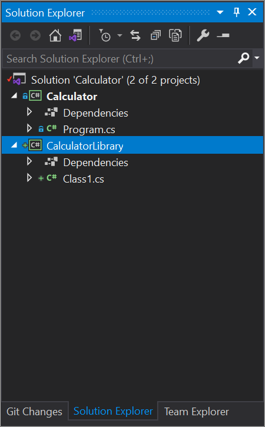

1. Rename the *Class1.cs* file to *CalculatorLibrary.cs*. To rename the file, you can right-click the name in **Solution Explorer** and choose **Rename**, select the name and press **F2**, or select the name and select again to type.

   A message might ask whether you want to rename references to `Class1` in the file. It doesn't matter how you answer, because you'll replace the code in a future step.

1. Now add a project reference, so the first project can use APIs that the new class library exposes. Right-click the **Dependencies** node in the **Calculator** project and choose **Add Project Reference**.

   

   The **Reference Manager** dialog box appears. In this dialog box, you can add references to other projects, assemblies, and COM DLLs that your projects need.

1. In the **Reference Manager** dialog box, select the checkbox for the **CalculatorLibrary** project, and then select **OK**.

   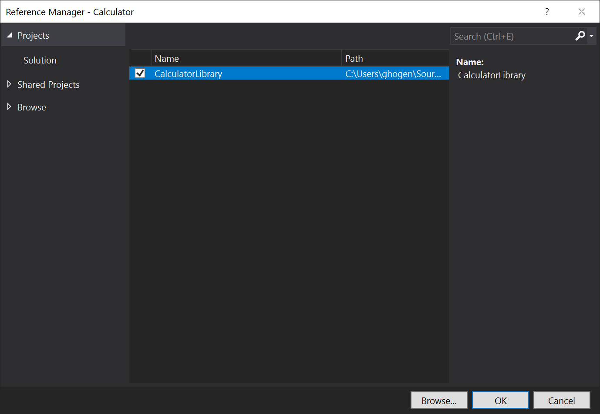

   The project reference appears under a **Projects** node in **Solution Explorer**.

   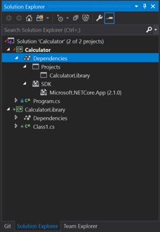

1. In *Program.cs*, select the `Calculator` class and all its code, and press **Ctrl**+**X** to cut it. Then, in *CalculatorLibrary.cs*, paste the code into the `CalculatorLibrary` namespace.
   
   Also add `public` before the Calculator class to expose it outside the library.

   *CalculatorLibrary.cs* should now resemble the following code:

   ```csharp
   // CalculatorLibrary.cs
   using System;

    namespace CalculatorLibrary
    {
        public class Calculator
        {
            public static double DoOperation(double num1, double num2, string op)
            {
                double result = double.NaN; // Default value is "not-a-number" if an operation, such as division, could result in an error.

                // Use a switch statement to do the math.
                switch (op)
                {
                    case "a":
                        result = num1 + num2;
                        break;
                    case "s":
                        result = num1 - num2;
                        break;
                    case "m":
                        result = num1 * num2;
                        break;
                    case "d":
                        // Ask the user to enter a non-zero divisor.
                        if (num2 != 0)
                        {
                            result = num1 / num2;
                        }
                        break;
                    // Return text for an incorrect option entry.
                    default:
                        break;
                }
                return result;
            }
        }
    }
   ```

1. *Program.cs* also has a reference, but an error says the `Calculator.DoOperation` call doesn't resolve. The error is because `CalculatorLibrary` is in a different namespace. For a fully qualified reference, you could add the `CalculatorLibrary` namespace to the `Calculator.DoOperation` call in *Program.cs*:

   ```csharp
   // Program.cs
   result = CalculatorLibrary.Calculator.DoOperation(cleanNum1, cleanNum2, op);
   ```

   Or, you could try adding a `using` directive to the beginning of the *Program.cs* file:

   ```csharp
   // Program.cs
   using CalculatorLibrary;
   ```

   Adding the `using` directive should let you remove the `CalculatorLibrary` namespace from the call site, but now there's an ambiguity. Is `Calculator` the class in `CalculatorLibrary`, or is `Calculator` the namespace?
   
   To resolve the ambiguity, rename the namespace from `Calculator` to `CalculatorProgram` in *Program.cs*.

   ```csharp
   // Program.cs
   namespace CalculatorProgram
   ```

::: moniker-end
::: moniker range=">=vs-2022"
1. In **Solution Explorer**, right-click the solution node and choose **Add** > **New Project**.

1. In the **Add a new project** window, type *class library* in the Search box. Choose the C# **Class library** project template, and then select **Next**.

   

1. On the **Configure your new project** screen, type the project name *CalculatorLibrary*, and then select **Next**.
   
1. On the **Additional information** screen, **.NET 8.0** is selected. Select **Create**.
   
   Visual Studio creates the new project and adds it to the solution.
   
   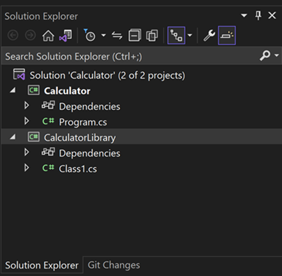

1. Rename the *Class1.cs* file to *CalculatorLibrary.cs*. To rename the file, you can right-click the name in **Solution Explorer** and choose **Rename**, select the name and press **F2**, or select the name and select again to type.

   A message might ask whether you want to rename all references to `Class1` in the file. It doesn't matter how you answer, because you'll replace the code in a future step.

1. Now add a project reference, so the first project can use APIs that the new class library exposes. Right-click the **Dependencies** node in the **Calculator** project and choose **Add Project Reference**.

   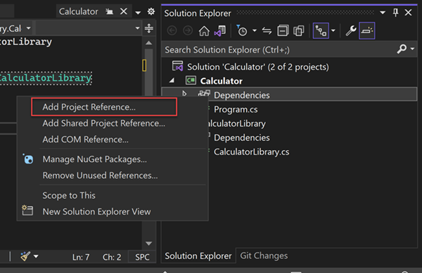

   The **Reference Manager** dialog box appears. In this dialog box, you can add references to other projects, assemblies, and COM DLLs that your projects need.

1. In the **Reference Manager** dialog box, select the checkbox for the **CalculatorLibrary** project, and then select **OK**.

   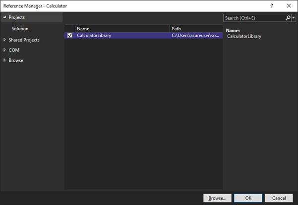

   The project reference appears under a **Projects** node in **Solution Explorer**.

   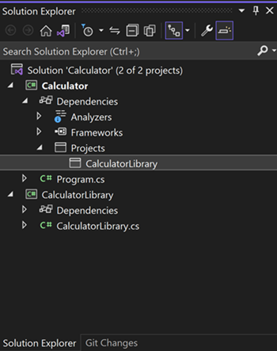

1. In *Program.cs*, select the `Calculator` class and all its code, and press **Ctrl**+**X** to cut it. Then, in *CalculatorLibrary.cs*, paste the code into the `CalculatorLibrary` namespace.
   
   Also add `public` before the Calculator class to expose it outside the library.

   *CalculatorLibrary.cs* should now resemble the following code:

   ```csharp
    // CalculatorLibrary.cs
    namespace CalculatorLibrary
    {
        public class Calculator
        {
            public static double DoOperation(double num1, double num2, string op)
            {
                double result = double.NaN; // Default value is "not-a-number" if an operation, such as division, could result in an error.

                // Use a switch statement to do the math.
                switch (op)
                {
                    case "a":
                        result = num1 + num2;
                        break;
                    case "s":
                        result = num1 - num2;
                        break;
                    case "m":
                        result = num1 * num2;
                        break;
                    case "d":
                        // Ask the user to enter a non-zero divisor.
                        if (num2 != 0)
                        {
                            result = num1 / num2;
                        }
                        break;
                    // Return text for an incorrect option entry.
                    default:
                        break;
                }
                return result;
            }
        }
    }
   ```

1. *Program.cs* also has a reference, but an error says the `Calculator.DoOperation` call doesn't resolve. The error is because `CalculatorLibrary` is in a different namespace. For a fully qualified reference, you could add the `CalculatorLibrary` namespace to the `Calculator.DoOperation` call in *Program.cs*:

   ```csharp
   // Program.cs
   result = CalculatorLibrary.Calculator.DoOperation(cleanNum1, cleanNum2, op);
   ```

   Or, you could try adding a `using` directive to the beginning of the *Program.cs* file:

   ```csharp
   // Program.cs
   using CalculatorLibrary;
   ```

   Adding the `using` directive should let you remove the `CalculatorLibrary` namespace from the call site, but now there's an ambiguity. Is `Calculator` the class in `CalculatorLibrary`, or is `Calculator` the namespace?
   
   To resolve the ambiguity, rename the namespace from `Calculator` to `CalculatorProgram` in *Program.cs*.

   ```csharp
   // Program.cs
   namespace CalculatorProgram
   ```
::: moniker-end

## Reference .NET libraries: Write to a log

::: moniker range="vs-2019"
You can use the .NET [Trace](xref:System.Diagnostics.Trace) class to add a log of all operations, and write it to a text file. The `Trace` class is also useful for basic print debugging techniques. The `Trace` class is in `System.Diagnostics`, and uses `System.IO` classes like `StreamWriter`.

1. Start by adding the `using` directives at the top of *CalculatorLibrary.cs*:

   ```csharp
   // CalculatorLibrary.cs
   using System.IO;
   using System.Diagnostics;
   ```

1. This usage of the `Trace` class must hold onto a reference for the class, which it associates with a filestream. That requirement means the calculator works better as an object, so add a constructor at the beginning of the `Calculator` class in *CalculatorLibrary.cs*.

   Also remove the `static` keyword to change the static `DoOperation` method into a member method.

   ```csharp
   // CalculatorLibrary.cs
   public Calculator()
      {
          StreamWriter logFile = File.CreateText("calculator.log");
          Trace.Listeners.Add(new TextWriterTraceListener(logFile));
          Trace.AutoFlush = true;
          Trace.WriteLine("Starting Calculator Log");
          Trace.WriteLine(String.Format("Started {0}", System.DateTime.Now.ToString()));
      }

   public double DoOperation(double num1, double num2, string op)
      {
   ```

1. Add log output to each calculation. `DoOperation` should now look like the following code:

   ```csharp
   // CalculatorLibrary.cs
   public double DoOperation(double num1, double num2, string op)
   {
        double result = double.NaN; // Default value is "not-a-number" if an operation, such as division, could result in an error.

        // Use a switch statement to do the math.
        switch (op)
        {
            case "a":
                result = num1 + num2;
                Trace.WriteLine(String.Format("{0} + {1} = {2}", num1, num2, result));
                break;
            case "s":
                result = num1 - num2;
                Trace.WriteLine(String.Format("{0} - {1} = {2}", num1, num2, result));
                break;
            case "m":
                result = num1 * num2;
                Trace.WriteLine(String.Format("{0} * {1} = {2}", num1, num2, result));
                break;
            case "d":
                // Ask the user to enter a non-zero divisor.
                if (num2 != 0)
                {
                    result = num1 / num2;
                    Trace.WriteLine(String.Format("{0} / {1} = {2}", num1, num2, result));
                }
                    break;
            // Return text for an incorrect option entry.
            default:
                break;
        }
        return result;
    }
   ```

1. Back in *Program.cs*, a red squiggly underline now flags the static call. To fix the error, create a `calculator` variable by adding the following code line just before the `while (!endApp)` loop:

   ```csharp
   // Program.cs
   Calculator calculator = new Calculator();
   ```

   Also modify the `DoOperation` call site to reference the object named `calculator` in lowercase. The code is now a member invocation, rather than a call to a static method.

   ```csharp
   // Program.cs
   result = calculator.DoOperation(cleanNum1, cleanNum2, op);
   ```

1. Run the app again. When you're done, right-click the **Calculator** project node and choose **Open Folder in File Explorer**.

1. In File Explorer, navigate to the output folder under *bin/Debug/net8.0* (or whatever .NET version you're using), and open the *calculator.log* file. The output should look something like this:

    ```output
    Starting Calculator Log
    Started 7/9/2020 1:58:19 PM
    1 + 2 = 3
    3 * 3 = 9
    ```

At this point, *CalculatorLibrary.cs* should resemble this code:

```csharp
// CalculatorLibrary.cs
using System;
using System.IO;
using System.Diagnostics;

namespace CalculatorLibrary
{
    public class Calculator
    {

        public Calculator()
        {
            StreamWriter logFile = File.CreateText("calculator.log");
            Trace.Listeners.Add(new TextWriterTraceListener(logFile));
            Trace.AutoFlush = true;
            Trace.WriteLine("Starting Calculator Log");
            Trace.WriteLine(String.Format("Started {0}", System.DateTime.Now.ToString()));
        }

        public double DoOperation(double num1, double num2, string op)
        {
            double result = double.NaN; // Default value is "not-a-number" if an operation, such as division, could result in an error.

            // Use a switch statement to do the math.
            switch (op)
            {
                case "a":
                    result = num1 + num2;
                    Trace.WriteLine(String.Format("{0} + {1} = {2}", num1, num2, result));
                    break;
                case "s":
                    result = num1 - num2;
                    Trace.WriteLine(String.Format("{0} - {1} = {2}", num1, num2, result));
                    break;
                case "m":
                    result = num1 * num2;
                    Trace.WriteLine(String.Format("{0} * {1} = {2}", num1, num2, result));
                    break;
                case "d":
                    // Ask the user to enter a non-zero divisor.
                    if (num2 != 0)
                    {
                        result = num1 / num2;
                        Trace.WriteLine(String.Format("{0} / {1} = {2}", num1, num2, result));
                    }
                    break;
                // Return text for an incorrect option entry.
                default:
                    break;
            }
            return result;
        }
    }
}
```

*Program.cs* should look like the following code:

```csharp
// Program.cs
using System;
using CalculatorLibrary;

namespace CalculatorProgram
{
   
    class Program
    {
        static void Main(string[] args)
        {
            bool endApp = false;
            // Display title as the C# console calculator app.
            Console.WriteLine("Console Calculator in C#\r");
            Console.WriteLine("------------------------\n");

            Calculator calculator = new Calculator();
            while (!endApp)
            {
                // Declare variables and set to empty.
                string numInput1 = "";
                string numInput2 = "";
                double result = 0;

                // Ask the user to type the first number.
                Console.Write("Type a number, and then press Enter: ");
                numInput1 = Console.ReadLine();

                double cleanNum1 = 0;
                while (!double.TryParse(numInput1, out cleanNum1))
                {
                    Console.Write("This is not valid input. Please enter an integer value: ");
                    numInput1 = Console.ReadLine();
                }

                // Ask the user to type the second number.
                Console.Write("Type another number, and then press Enter: ");
                numInput2 = Console.ReadLine();

                double cleanNum2 = 0;
                while (!double.TryParse(numInput2, out cleanNum2))
                {
                    Console.Write("This is not valid input. Please enter an integer value: ");
                    numInput2 = Console.ReadLine();
                }

                // Ask the user to choose an operator.
                Console.WriteLine("Choose an operator from the following list:");
                Console.WriteLine("\ta - Add");
                Console.WriteLine("\ts - Subtract");
                Console.WriteLine("\tm - Multiply");
                Console.WriteLine("\td - Divide");
                Console.Write("Your option? ");

                string op = Console.ReadLine();

                try
                {
                    result = calculator.DoOperation(cleanNum1, cleanNum2, op); 
                    if (double.IsNaN(result))
                    {
                        Console.WriteLine("This operation will result in a mathematical error.\n");
                    }
                    else Console.WriteLine("Your result: {0:0.##}\n", result);
                }
                catch (Exception e)
                {
                    Console.WriteLine("Oh no! An exception occurred trying to do the math.\n - Details: " + e.Message);
                }

                Console.WriteLine("------------------------\n");

                // Wait for the user to respond before closing.
                Console.Write("Press 'n' and Enter to close the app, or press any other key and Enter to continue: ");
                if (Console.ReadLine() == "n") endApp = true;

                Console.WriteLine("\n"); // Friendly linespacing.
            }
            return;
        }
    }
}
```
::: moniker-end

::: moniker range=">=vs-2022"
You can use the .NET [Trace](xref:System.Diagnostics.Trace) class to add a log of all operations, and write it to a text file. The `Trace` class is also useful for basic print debugging techniques. The `Trace` class is in `System.Diagnostics`, and uses `System.IO` classes like `StreamWriter`.

1. Start by adding the `using` directives at the top of *CalculatorLibrary.cs*:

   ```csharp
   // CalculatorLibrary.cs
   using System.Diagnostics;
   ```

1. This usage of the `Trace` class must hold onto a reference for the class, which it associates with a filestream. That requirement means the calculator works better as an object, so add a constructor at the beginning of the `Calculator` class in *CalculatorLibrary.cs*.

   Also remove the `static` keyword to change the static `DoOperation` method into a member method.

   ```csharp
   // CalculatorLibrary.cs
   public Calculator()
      {
          StreamWriter logFile = File.CreateText("calculator.log");
          Trace.Listeners.Add(new TextWriterTraceListener(logFile));
          Trace.AutoFlush = true;
          Trace.WriteLine("Starting Calculator Log");
          Trace.WriteLine(String.Format("Started {0}", System.DateTime.Now.ToString()));
      }

   public double DoOperation(double num1, double num2, string op)
      {
   ```

1. Add log output to each calculation. `DoOperation` should now look like the following code:

   ```csharp
   // CalculatorLibrary.cs
   public double DoOperation(double num1, double num2, string op)
   {
        double result = double.NaN; // Default value is "not-a-number" if an operation, such as division, could result in an error.

        // Use a switch statement to do the math.
        switch (op)
        {
            case "a":
                result = num1 + num2;
                Trace.WriteLine(String.Format("{0} + {1} = {2}", num1, num2, result));
                break;
            case "s":
                result = num1 - num2;
                Trace.WriteLine(String.Format("{0} - {1} = {2}", num1, num2, result));
                break;
            case "m":
                result = num1 * num2;
                Trace.WriteLine(String.Format("{0} * {1} = {2}", num1, num2, result));
                break;
            case "d":
                // Ask the user to enter a non-zero divisor.
                if (num2 != 0)
                {
                    result = num1 / num2;
                    Trace.WriteLine(String.Format("{0} / {1} = {2}", num1, num2, result));
                }
                    break;
            // Return text for an incorrect option entry.
            default:
                break;
        }
        return result;
    }
   ```

1. Back in *Program.cs*, a red squiggly underline now flags the static call. To fix the error, create a `calculator` variable by adding the following code line just before the `while (!endApp)` loop:

   ```csharp
   // Program.cs
   Calculator calculator = new Calculator();
   ```

   Also modify the `DoOperation` call site to reference the object named `calculator` in lowercase. The code is now a member invocation, rather than a call to a static method.

   ```csharp
   // Program.cs
   result = calculator.DoOperation(cleanNum1, cleanNum2, op);
   ```

1. Run the app again. When you're done, right-click the **Calculator** project node and choose **Open Folder in File Explorer**.

1. In File Explorer, navigate to the output folder under *bin/Debug/*, and open the *calculator.log* file. The output should look something like this:

    ```output
    Starting Calculator Log
    Started 7/9/2020 1:58:19 PM
    1 + 2 = 3
    3 * 3 = 9
    ```

At this point, *CalculatorLibrary.cs* should resemble this code:

```csharp
// CalculatorLibrary.cs
using System.Diagnostics;

namespace CalculatorLibrary
{
    public class Calculator
    {

        public Calculator()
        {
            StreamWriter logFile = File.CreateText("calculator.log");
            Trace.Listeners.Add(new TextWriterTraceListener(logFile));
            Trace.AutoFlush = true;
            Trace.WriteLine("Starting Calculator Log");
            Trace.WriteLine(String.Format("Started {0}", System.DateTime.Now.ToString()));
        }

        public double DoOperation(double num1, double num2, string op)
        {
            double result = double.NaN; // Default value is "not-a-number" if an operation, such as division, could result in an error.

            // Use a switch statement to do the math.
            switch (op)
            {
                case "a":
                    result = num1 + num2;
                    Trace.WriteLine(String.Format("{0} + {1} = {2}", num1, num2, result));
                    break;
                case "s":
                    result = num1 - num2;
                    Trace.WriteLine(String.Format("{0} - {1} = {2}", num1, num2, result));
                    break;
                case "m":
                    result = num1 * num2;
                    Trace.WriteLine(String.Format("{0} * {1} = {2}", num1, num2, result));
                    break;
                case "d":
                    // Ask the user to enter a non-zero divisor.
                    if (num2 != 0)
                    {
                        result = num1 / num2;
                        Trace.WriteLine(String.Format("{0} / {1} = {2}", num1, num2, result));
                    }
                    break;
                // Return text for an incorrect option entry.
                default:
                    break;
            }
            return result;
        }
    }
}
```

*Program.cs* should look like the following code:

```csharp
// Program.cs
using CalculatorLibrary;

namespace CalculatorProgram
{
   
    class Program
    {
        static void Main(string[] args)
        {
            bool endApp = false;
            // Display title as the C# console calculator app.
            Console.WriteLine("Console Calculator in C#\r");
            Console.WriteLine("------------------------\n");

            Calculator calculator = new Calculator();
            while (!endApp)
            {
                // Declare variables and set to empty.
                // Use Nullable types (with ?) to match type of System.Console.ReadLine
                string? numInput1 = "";
                string? numInput2 = "";
                double result = 0;

                // Ask the user to type the first number.
                Console.Write("Type a number, and then press Enter: ");
                numInput1 = Console.ReadLine();

                double cleanNum1 = 0;
                while (!double.TryParse(numInput1, out cleanNum1))
                {
                    Console.Write("This is not valid input. Please enter an integer value: ");
                    numInput1 = Console.ReadLine();
                }

                // Ask the user to type the second number.
                Console.Write("Type another number, and then press Enter: ");
                numInput2 = Console.ReadLine();

                double cleanNum2 = 0;
                while (!double.TryParse(numInput2, out cleanNum2))
                {
                    Console.Write("This is not valid input. Please enter an integer value: ");
                    numInput2 = Console.ReadLine();
                }

                // Ask the user to choose an operator.
                Console.WriteLine("Choose an operator from the following list:");
                Console.WriteLine("\ta - Add");
                Console.WriteLine("\ts - Subtract");
                Console.WriteLine("\tm - Multiply");
                Console.WriteLine("\td - Divide");
                Console.Write("Your option? ");

                string? op = Console.ReadLine();

                // Validate input is not null, and matches the pattern
                if (op == null || ! Regex.IsMatch(op, "[a|s|m|d]"))
                {
                   Console.WriteLine("Error: Unrecognized input.");
                }
                else
                { 
                   try
                   {
                       result = calculator.DoOperation(cleanNum1, cleanNum2, op); 
                       if (double.IsNaN(result))
                       {
                           Console.WriteLine("This operation will result in a mathematical error.\n");
                       }
                       else Console.WriteLine("Your result: {0:0.##}\n", result);
                   }
                   catch (Exception e)
                   {
                       Console.WriteLine("Oh no! An exception occurred trying to do the math.\n - Details: " + e.Message);
                   }
                }
                Console.WriteLine("------------------------\n");

                // Wait for the user to respond before closing.
                Console.Write("Press 'n' and Enter to close the app, or press any other key and Enter to continue: ");
                if (Console.ReadLine() == "n") endApp = true;

                Console.WriteLine("\n"); // Friendly linespacing.
            }
            return;
        }
    }
}
```

::: moniker-end

## Add a NuGet Package: Write to a JSON file

To output operations in JSON, a popular and portable format for storing object data, you can reference the *Newtonsoft.Json* NuGet package. NuGet packages are the primary distribution method for .NET class libraries.

1. In **Solution Explorer**, right-click the **Dependencies** node for the **CalculatorLibrary** project, and choose **Manage NuGet Packages**.

   ::: moniker range="vs-2019"
   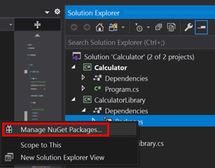
   ::: moniker-end
   ::: moniker range=">=vs-2022"
   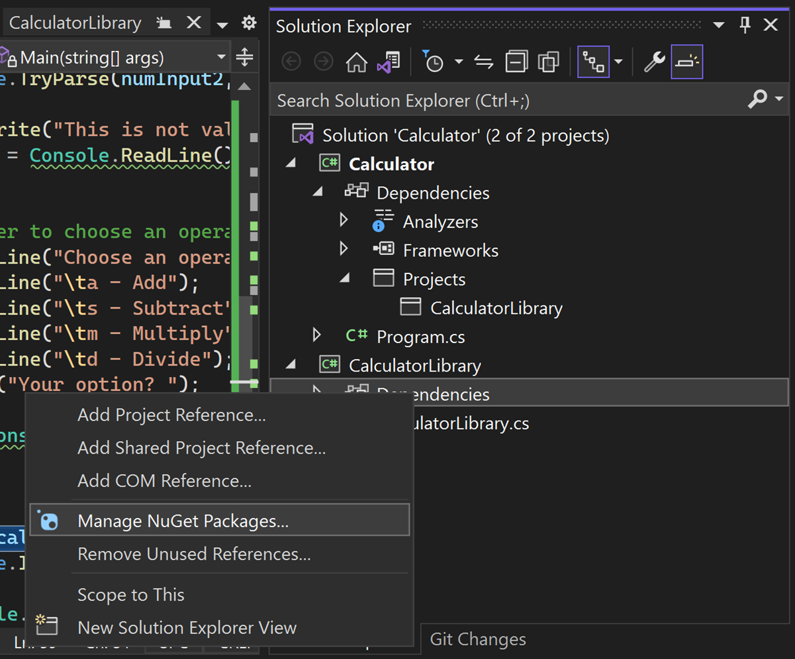
   ::: moniker-end

   The NuGet Package Manager opens.

   ::: moniker range="vs-2019"
   
   ::: moniker-end

1. Search for and select the *Newtonsoft.Json* package, and select **Install**.

   ::: moniker range="vs-2019"
   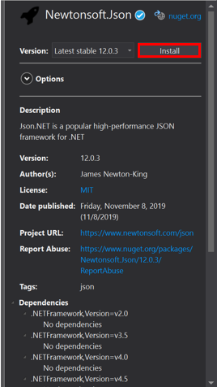
   
   Visual Studio downloads the package and adds it to the project. A new entry appears in the References node in **Solution Explorer**.
   ::: moniker-end

   ::: moniker range=">=vs-2022"
   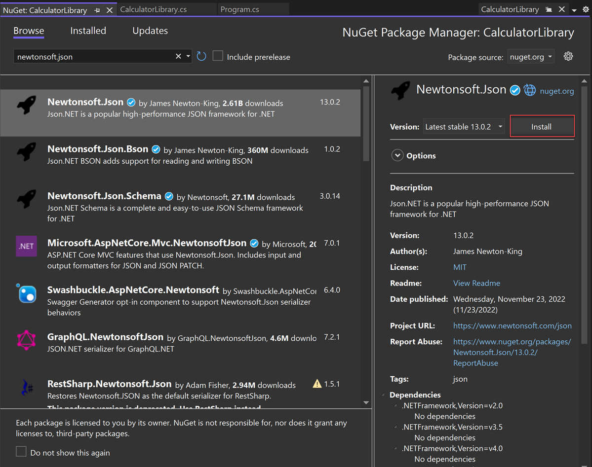

   If you're prompted whether to accept changes, select **OK**.
   
   Visual Studio downloads the package and adds it to the project. A new entry appears in a **Packages** node in **Solution Explorer**.
   ::: moniker-end

   Add a `using` directive for `Newtonsoft.Json` at the beginning of *CalculatorLibrary.cs*.

   ```csharp
   // CalculatorLibrary.cs
   using Newtonsoft.Json;
   ```
   
1. Create the `JsonWriter` member object, and replace the `Calculator` constructor with the following code:

   ```csharp
        // CalculatorLibrary.cs
        JsonWriter writer;

        public Calculator()
        {
            StreamWriter logFile = File.CreateText("calculatorlog.json");
            logFile.AutoFlush = true;
            writer = new JsonTextWriter(logFile);
            writer.Formatting = Formatting.Indented;
            writer.WriteStartObject();
            writer.WritePropertyName("Operations");
            writer.WriteStartArray();
        }
   ```

1. Modify the `DoOperation` method to add the JSON `writer` code:

   ```csharp
        // CalculatorLibrary.cs
        public double DoOperation(double num1, double num2, string op)
        {
            double result = double.NaN; // Default value is "not-a-number" if an operation, such as division, could result in an error.
            writer.WriteStartObject();
            writer.WritePropertyName("Operand1");
            writer.WriteValue(num1);
            writer.WritePropertyName("Operand2");
            writer.WriteValue(num2);
            writer.WritePropertyName("Operation");
            // Use a switch statement to do the math.
            switch (op)
            {
                case "a":
                    result = num1 + num2;
                    writer.WriteValue("Add");
                    break;
                case "s":
                    result = num1 - num2;
                    writer.WriteValue("Subtract");
                    break;
                case "m":
                    result = num1 * num2;
                    writer.WriteValue("Multiply");
                    break;
                case "d":
                    // Ask the user to enter a non-zero divisor.
                    if (num2 != 0)
                    {
                        result = num1 / num2;
                    }
                    writer.WriteValue("Divide");
                    break;
                // Return text for an incorrect option entry.
                default:
                    break;
            }
            writer.WritePropertyName("Result");
            writer.WriteValue(result);
            writer.WriteEndObject();

            return result;
        }
   ```

1. Add a method to finish the JSON syntax once the user is done entering operation data.

   ```csharp
    // CalculatorLibrary.cs
    public void Finish()
    {
        writer.WriteEndArray();
        writer.WriteEndObject();
        writer.Close();
    }
   ```

1. At the end of *Program.cs*, before the `return;`, add a call to `Finish`:

   ```csharp
        // Program.cs
            // Add call to close the JSON writer before return
            calculator.Finish();
            return;
        }
   ```

1. Build and run the app, and after you're done entering a few operations, close the app by entering the *n* command.
   
1. Open the *calculatorlog.json* file in File Explorer. You should see something like the following content:

   ```json
   {
    "Operations": [
        {
        "Operand1": 2.0,
        "Operand2": 3.0,
        "Operation": "Add",
        "Result": 5.0
        },
        {
        "Operand1": 3.0,
        "Operand2": 4.0,
        "Operation": "Multiply",
        "Result": 12.0
        }
    ]
   }
   ```

## Debug: Set and hit a breakpoint

The Visual Studio debugger is a powerful tool. The debugger can step through your code to find the exact point where there's a programming mistake. You can then understand what corrections you need to make, and make temporary changes so you can continue running your app.

1. In *Program.cs*, click in the gutter to the left of the following code line. You can also click in the line and select **F9**, or right-click the line and select **Breakpoint** > **Insert Breakpoint**.

   ```csharp
   // Program.cs
   result = calculator.DoOperation(cleanNum1, cleanNum2, op);
   ```

   The red dot that appears indicates a breakpoint. You can use breakpoints to pause your app and inspect code. You can set a breakpoint on any executable line of code.

   

1. Build and run the app. Enter the following values for the calculation:

   - For the first number, enter *8*.
   - For the second number, enter *0*.
   - For the operator, let's have some fun. Enter *d*.

   The app suspends where you created the breakpoint, which is indicated by the yellow pointer on the left and the highlighted code. The highlighted code hasn't yet executed.

   

   Now, with the app suspended, you can inspect your application state.

## Debug: View variables

1. In the highlighted code, hover over variables such as `cleanNum1` and `op`. The current values for these variables, `8` and `d` respectively, appear in DataTips.

   

   When debugging, checking to see whether variables hold the values you expect is often critical to fixing issues.

2. In the lower pane, look at the **Locals** window. If it's closed, select **Debug** > **Windows** > **Locals** to open it.

   The **Locals** window shows each variable that's currently in scope, along with its value and type.

   ::: moniker range="vs-2019"
   
   ::: moniker-end
   ::: moniker range=">=vs-2022"
   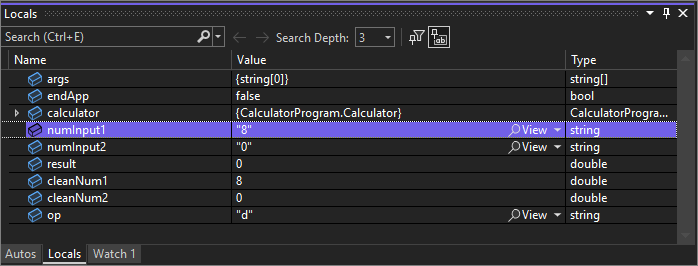
   ::: moniker-end

3. Look at the **Autos** window.

   The Autos window is similar to the **Locals** window, but shows the variables immediately preceding and following the current line of code where your app is paused.
   
   > [!NOTE] 
   > If you don't see the Autos window, select **Debug** > **Windows** > **Autos** to open it.

Next, execute code in the debugger one statement at a time, which is called *stepping*.

## Debug: Step through code

1. Press **F11**, or select **Debug** > **Step Into**.

   Using the Step Into command, the app executes the current statement and advances to the next executable statement, usually the next line of code. The yellow pointer on the left always indicates the current statement.

   

   You just stepped into the `DoOperation` method in the `Calculator` class.

1. To get a hierarchical look at your program flow, look at the **Call Stack** window. If it's closed, select **Debug** > **Windows** > **Call Stack** to open it.

   

   This view shows the current `Calculator.DoOperation` method, indicated by the yellow pointer. The second row shows the function that called the method, from the `Main` method in *Program.cs*.
   
   The **Call Stack** window shows the order in which methods and functions are getting called. This window also provides access to many debugger features, such as **Go to Source Code**, from its shortcut menu.

1. Press **F10**, or select **Debug** > **Step Over**, several times until the app pauses on the `switch` statement.

   ```csharp
   // CalculatorLibrary.cs
   switch (op)
   {
   ```

   The Step Over command is similar to the Step Into command, except that if the current statement calls a function, the debugger runs the code in the function, and doesn't suspend execution until the function returns. Step Over is faster than Step Into if you're not interested in a particular function.

1. Press **F10** one more time, so that the app pauses on the following line of code.

   ```csharp
   // CalculatorLibrary.cs
   if (num2 != 0)
   {
   ```

   This code checks for a divide-by-zero case. If the app continues, it throws a general exception (an error), but you might want to try something else, like viewing the actual returned value in the console. One option is to use a debugger feature called *edit-and-continue* to make changes to the code and then continue debugging. However, there's a different trick to temporarily modify the execution flow.

## Debug: Test a temporary change

1. Select the yellow pointer, currently paused on the `if (num2 != 0)` statement, and drag it to the following statement:

   ```csharp
   // CalculatorLibrary.cs
   result = num1 / num2;
   ```

   Dragging the pointer here causes the app to completely skip the `if` statement, so you can see what happens when you divide by zero.

1. Press **F10** to execute the line of code.

1. If you hover over the `result` variable, it shows a value of **Infinity**. In C#, Infinity is the result when you divide by zero.

1. Press **F5**, or select **Debug** > **Continue Debugging**.

   The infinity symbol appears in the console as the result of the math operation.

1. Close the app properly by entering the *n* command.

## Code complete

::: moniker range="vs-2019"

Here's the complete code for the *CalculatorLibrary.cs* file, after you complete all the steps:

```csharp
// CalculatorLibrary.cs
using System;
using System.IO;
using Newtonsoft.Json;

namespace CalculatorLibrary
{
    public class Calculator
    {

        JsonWriter writer;

        public Calculator()
        {
            StreamWriter logFile = File.CreateText("calculatorlog.json");
            logFile.AutoFlush = true;
            writer = new JsonTextWriter(logFile);
            writer.Formatting = Formatting.Indented;
            writer.WriteStartObject();
            writer.WritePropertyName("Operations");
            writer.WriteStartArray();
        }

        public double DoOperation(double num1, double num2, string op)
        {
            double result = double.NaN; // Default value is "not-a-number" if an operation, such as division, could result in an error.
            writer.WriteStartObject();
            writer.WritePropertyName("Operand1");
            writer.WriteValue(num1);
            writer.WritePropertyName("Operand2");
            writer.WriteValue(num2);
            writer.WritePropertyName("Operation");
            // Use a switch statement to do the math.
            switch (op)
            {
                case "a":
                    result = num1 + num2;
                    writer.WriteValue("Add");
                    break;
                case "s":
                    result = num1 - num2;
                    writer.WriteValue("Subtract");
                    break;
                case "m":
                    result = num1 * num2;
                    writer.WriteValue("Multiply");
                    break;
                case "d":
                    // Ask the user to enter a non-zero divisor.
                    if (num2 != 0)
                    {
                        result = num1 / num2;
                    }
                    writer.WriteValue("Divide");
                    break;
                // Return text for an incorrect option entry.
                default:
                    break;
            }
            writer.WritePropertyName("Result");
            writer.WriteValue(result);
            writer.WriteEndObject();

            return result;
        }

        public void Finish()
        {
            writer.WriteEndArray();
            writer.WriteEndObject();
            writer.Close();
        }
    }
}
```

And here's the code for *Program.cs*: 

```csharp
// Program.cs
using System;
using CalculatorLibrary;

namespace CalculatorProgram
{
   
    class Program
    {
        static void Main(string[] args)
        {
            bool endApp = false;
            // Display title as the C# console calculator app.
            Console.WriteLine("Console Calculator in C#\r");
            Console.WriteLine("------------------------\n");

            Calculator calculator = new Calculator();
            while (!endApp)
            {
                // Declare variables and set to empty.
                string numInput1 = "";
                string numInput2 = "";
                double result = 0;

                // Ask the user to type the first number.
                Console.Write("Type a number, and then press Enter: ");
                numInput1 = Console.ReadLine();

                double cleanNum1 = 0;
                while (!double.TryParse(numInput1, out cleanNum1))
                {
                    Console.Write("This is not valid input. Please enter an integer value: ");
                    numInput1 = Console.ReadLine();
                }

                // Ask the user to type the second number.
                Console.Write("Type another number, and then press Enter: ");
                numInput2 = Console.ReadLine();

                double cleanNum2 = 0;
                while (!double.TryParse(numInput2, out cleanNum2))
                {
                    Console.Write("This is not valid input. Please enter an integer value: ");
                    numInput2 = Console.ReadLine();
                }

                // Ask the user to choose an operator.
                Console.WriteLine("Choose an operator from the following list:");
                Console.WriteLine("\ta - Add");
                Console.WriteLine("\ts - Subtract");
                Console.WriteLine("\tm - Multiply");
                Console.WriteLine("\td - Divide");
                Console.Write("Your option? ");

                string op = Console.ReadLine();

                try
                {
                    result = calculator.DoOperation(cleanNum1, cleanNum2, op); 
                    if (double.IsNaN(result))
                    {
                        Console.WriteLine("This operation will result in a mathematical error.\n");
                    }
                    else Console.WriteLine("Your result: {0:0.##}\n", result);
                }
                catch (Exception e)
                {
                    Console.WriteLine("Oh no! An exception occurred trying to do the math.\n - Details: " + e.Message);
                }

                Console.WriteLine("------------------------\n");

                // Wait for the user to respond before closing.
                Console.Write("Press 'n' and Enter to close the app, or press any other key and Enter to continue: ");
                if (Console.ReadLine() == "n") endApp = true;

                Console.WriteLine("\n"); // Friendly linespacing.
            }
            calculator.Finish();
            return;
        }
    }
}
```

:::moniker-end

:::moniker range=">=vs-2022"

Here's the complete code for the *CalculatorLibrary.cs* file, after you complete all the steps:

```csharp
// CalculatorLibrary.cs
using Newtonsoft.Json;

namespace CalculatorLibrary
{
    public class Calculator
    {

        JsonWriter writer;

        public Calculator()
        {
            StreamWriter logFile = File.CreateText("calculatorlog.json");
            logFile.AutoFlush = true;
            writer = new JsonTextWriter(logFile);
            writer.Formatting = Formatting.Indented;
            writer.WriteStartObject();
            writer.WritePropertyName("Operations");
            writer.WriteStartArray();
        }

        public double DoOperation(double num1, double num2, string op)
        {
            double result = double.NaN; // Default value is "not-a-number" if an operation, such as division, could result in an error.
            writer.WriteStartObject();
            writer.WritePropertyName("Operand1");
            writer.WriteValue(num1);
            writer.WritePropertyName("Operand2");
            writer.WriteValue(num2);
            writer.WritePropertyName("Operation");
            // Use a switch statement to do the math.
            switch (op)
            {
                case "a":
                    result = num1 + num2;
                    writer.WriteValue("Add");
                    break;
                case "s":
                    result = num1 - num2;
                    writer.WriteValue("Subtract");
                    break;
                case "m":
                    result = num1 * num2;
                    writer.WriteValue("Multiply");
                    break;
                case "d":
                    // Ask the user to enter a non-zero divisor.
                    if (num2 != 0)
                    {
                        result = num1 / num2;
                    }
                    writer.WriteValue("Divide");
                    break;
                // Return text for an incorrect option entry.
                default:
                    break;
            }
            writer.WritePropertyName("Result");
            writer.WriteValue(result);
            writer.WriteEndObject();

            return result;
        }

        public void Finish()
        {
            writer.WriteEndArray();
            writer.WriteEndObject();
            writer.Close();
        }
    }
}
```

And here's the code for *Program.cs*: 

```csharp
// Program.cs
using CalculatorLibrary;

namespace CalculatorProgram
{
   
    class Program
    {
        static void Main(string[] args)
        {
            bool endApp = false;
            // Display title as the C# console calculator app.
            Console.WriteLine("Console Calculator in C#\r");
            Console.WriteLine("------------------------\n");

            Calculator calculator = new Calculator();
            while (!endApp)
            {
                // Declare variables and set to empty.
                // Use Nullable types (with ?) to match type of System.Console.ReadLine
                string? numInput1 = "";
                string? numInput2 = "";
                double result = 0;

                // Ask the user to type the first number.
                Console.Write("Type a number, and then press Enter: ");
                numInput1 = Console.ReadLine();

                double cleanNum1 = 0;
                while (!double.TryParse(numInput1, out cleanNum1))
                {
                    Console.Write("This is not valid input. Please enter an integer value: ");
                    numInput1 = Console.ReadLine();
                }

                // Ask the user to type the second number.
                Console.Write("Type another number, and then press Enter: ");
                numInput2 = Console.ReadLine();

                double cleanNum2 = 0;
                while (!double.TryParse(numInput2, out cleanNum2))
                {
                    Console.Write("This is not valid input. Please enter an integer value: ");
                    numInput2 = Console.ReadLine();
                }

                // Ask the user to choose an operator.
                Console.WriteLine("Choose an operator from the following list:");
                Console.WriteLine("\ta - Add");
                Console.WriteLine("\ts - Subtract");
                Console.WriteLine("\tm - Multiply");
                Console.WriteLine("\td - Divide");
                Console.Write("Your option? ");

                string? op = Console.ReadLine();

                // Validate input is not null, and matches the pattern
                if (op == null || ! Regex.IsMatch(op, "[a|s|m|d]"))
                {
                   Console.WriteLine("Error: Unrecognized input.");
                }
                else
                { 
                   try
                   {
                       result = calculator.DoOperation(cleanNum1, cleanNum2, op); 
                       if (double.IsNaN(result))
                       {
                           Console.WriteLine("This operation will result in a mathematical error.\n");
                       }
                       else Console.WriteLine("Your result: {0:0.##}\n", result);
                   }
                   catch (Exception e)
                   {
                       Console.WriteLine("Oh no! An exception occurred trying to do the math.\n - Details: " + e.Message);
                   }
                }
                Console.WriteLine("------------------------\n");

                // Wait for the user to respond before closing.
                Console.Write("Press 'n' and Enter to close the app, or press any other key and Enter to continue: ");
                if (Console.ReadLine() == "n") endApp = true;

                Console.WriteLine("\n"); // Friendly linespacing.
            }
            calculator.Finish();
            return;
        }
    }
}
```

:::moniker-end

## Next steps

Congratulations on completing this tutorial! To learn more, continue with the following content:

- [Continue with more C# tutorials](/dotnet/csharp/tutorials/)
- [Quickstart: Create an ASP.NET Core web app](../../ide/quickstart-aspnet-core.md)
- [Learn to debug C# code in Visual Studio](tutorial-debugger.md)
- [Walk through how to create and run unit tests](../../test/walkthrough-creating-and-running-unit-tests-for-managed-code.md)
- [Run a C# program](run-program.md)
- [Learn about C# IntelliSense](../../ide/visual-csharp-intellisense.md)
- [Continue with the Visual Studio IDE overview](visual-studio-ide.md)
- [Logging and tracing](/dotnet/core/diagnostics/logging-tracing)
