An *integrated development environment* (IDE) is a feature-rich program that supports many aspects of software development. The Visual Studio IDE is a creative launching pad that you can use to edit, debug, and build code, and then publish an app. Over and above the standard editor and debugger that most IDEs provide, Visual Studio includes compilers, code completion tools, graphical designers, and many more features to enhance the software development process.

::: moniker range="vs-2019"

:::image type="content" source="../media/vs-2019/ide-overview.png" alt-text="A screenshot of the Visual Studio 2019 IDE, which includes callouts that indicate where key features and functionality are located." lightbox="../media/vs-2019/ide-overview.png":::

::: moniker-end

::: moniker range=">=vs-2022"

[](../media/vs-2022/ide-overview.png#lightbox)

::: moniker-end

The preceding image shows Visual Studio with an open project that shows key windows and their functionality:

- In [Solution Explorer](../../ide/use-solution-explorer.md), at upper right, you can view, navigate, and manage your code files. **Solution Explorer** can help organize your code by grouping the files into [solutions and projects](../../ide/solutions-and-projects-in-visual-studio.md).

- The central [editor window](../../ide/writing-code-in-the-code-and-text-editor.md), where you'll probably spend most of your time, displays file contents. In the editor window, you can edit code or design a user interface such as a window with buttons and text boxes.

- In [Git Changes](../../version-control/git-with-visual-studio.md) at lower right, you can track work items and share code with others by using version control technologies like [Git](https://git-scm.com/) and [GitHub](https://github.com/).

## Editions

Visual Studio is available for Windows and Mac. [Visual Studio for Mac](/visualstudio/mac/) has many of the same features as Visual Studio for Windows, and is optimized for developing cross-platform and mobile apps. This article focuses on the Windows version of Visual Studio.

There are three editions of Visual Studio: Community, Professional, and Enterprise. See [Compare Visual Studio editions](https://visualstudio.microsoft.com/vs/compare/) to learn about which features are supported in each edition.

## Popular productivity features

Some popular features in Visual Studio that improve your productivity when developing software include:

- Squiggles and [Quick Actions](../../ide/quick-actions.md)

   Squiggles are wavy underlines that alert you to errors or potential problems in your code as you type. These visual clues help you fix problems immediately, without waiting to discover errors during build or runtime. If you hover over a squiggle, you see more information about the error. A lightbulb might also appear in the left margin showing *Quick Actions* you can take to fix the error.

   ::: moniker range="<=vs-2019"
   
   ::: moniker-end
   ::: moniker range=">=vs-2022"
   
   ::: moniker-end

::: moniker range="vs-2019"
- Code Cleanup

   With the click of a button, you can format your code and apply any code fixes suggested by your [code style settings](../../ide/reference/options-text-editor-csharp-formatting.md), [.editorconfig conventions](../../ide/create-portable-custom-editor-options.md), and [Roslyn analyzers](../../code-quality/roslyn-analyzers-overview.md). **Code Cleanup**, currently available for C# code only, helps you resolve issues in your code before it goes to code review.

   
   ::: moniker-end

::: moniker range=">=vs-2022"
- Code Cleanup

   With the click of a button, you can format your code and apply any code fixes suggested by your [code style settings](../../ide/reference/options-text-editor-csharp-formatting.md), [.editorconfig conventions](../../ide/create-portable-custom-editor-options.md), and [Roslyn analyzers](../../code-quality/roslyn-analyzers-overview.md). **Code Cleanup**, currently available for C# code only, helps you resolve issues in your code before it goes to code review.

   
   ::: moniker-end

- [Refactoring](../../ide/refactoring-in-visual-studio.md)

   Refactoring includes operations such as intelligent renaming of variables, extracting one or more lines of code into a new method, and changing the order of method parameters.

   ::: moniker range="<=vs-2019"
   
   ::: moniker-end
   ::: moniker range=">=vs-2022"
   
   ::: moniker-end

- [IntelliSense](../../ide/using-intellisense.md)

   IntelliSense is a set of features that display information about your code directly in the editor and, in some cases, write small bits of code for you. It's like having basic documentation inline in the editor, so you don't have to look up type information elsewhere.

   The following illustration shows how IntelliSense displays a member list for a type:

   ::: moniker range="<=vs-2019"
   
   ::: moniker-end
   ::: moniker range=">=vs-2022"
   
   ::: moniker-end

   IntelliSense features vary by language. For more information, see [C# IntelliSense](../../ide/visual-csharp-intellisense.md), [Visual C++ IntelliSense](../../ide/visual-cpp-intellisense.md), [JavaScript IntelliSense](../../ide/javascript-intellisense.md), and [Visual Basic IntelliSense](../../ide/visual-basic-specific-intellisense.md).

- [Visual Studio search](../../ide/visual-studio-search.md)

   Visual Studio menus, options, and properties can seem overwhelming at times. Visual Studio search, or **Ctrl**+**Q**, is a great way to rapidly find IDE features and code in one place.

   ::: moniker range="vs-2019"

   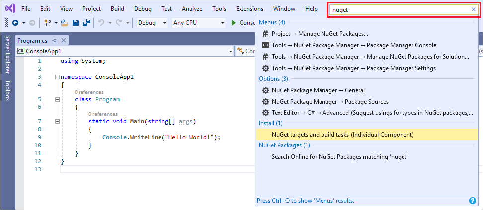

    For information and productivity tips, see [How to use Visual Studio search](../../ide/visual-studio-search.md).

   ::: moniker-end

   ::: moniker range=">=vs-2022"

   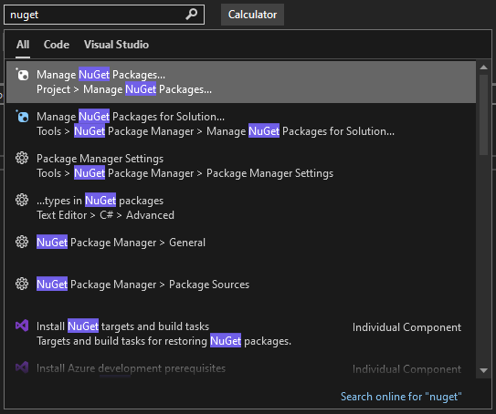

    For information and productivity tips, see [How to use Visual Studio search](../../ide/visual-studio-search.md).

   ::: moniker-end

- [Live Share](/visualstudio/liveshare/)

   Collaboratively edit and debug with others in real time, regardless of your app type or programming language. You can instantly and securely share your project. You can also share debugging sessions, terminal instances, `localhost` web apps, voice calls, and more.

- [Call Hierarchy](../../ide/reference/call-hierarchy.md)

   The **Call Hierarchy** window shows the methods that call a selected method. This information can be useful when you're thinking about changing or removing the method, or when you're trying to track down a bug.

   ::: moniker range="<=vs-2019"
   
   ::: moniker-end
   ::: moniker range=">=vs-2022"
   
   ::: moniker-end

- [CodeLens](../../ide/find-code-changes-and-other-history-with-codelens.md)

   CodeLens helps you find code references, code changes, linked bugs, work items, code reviews, and unit tests, without leaving the editor.

   ::: moniker range="<=vs-2019"
   
   ::: moniker-end
   ::: moniker range=">=vs-2022"
   
   ::: moniker-end

- [Go To Definition](../../ide/go-to-and-peek-definition.md)

   The **Go To Definition** feature takes you directly to the location of a function or type definition.

   ::: moniker range="<=vs-2019"
   
   ::: moniker-end
   ::: moniker range=">=vs-2022"
   
   ::: moniker-end

- [Peek Definition](../../ide/how-to-view-and-edit-code-by-using-peek-definition-alt-plus-f12.md)

   The **Peek Definition** window shows a method or type definition without opening a separate file.

   ::: moniker range="<=vs-2019"
   
   ::: moniker-end
   ::: moniker range=">=vs-2022"
   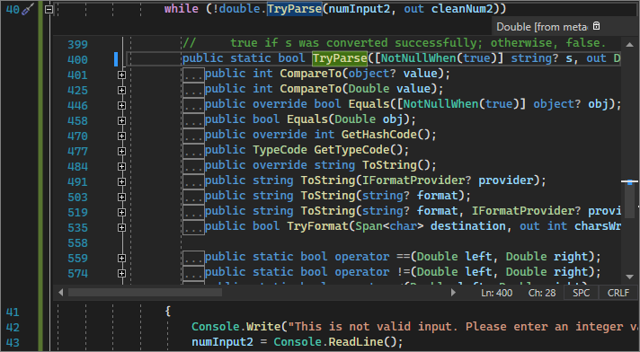
   ::: moniker-end

::: moniker range=">=vs-2022"

- [Hot Reload](../../debugger/hot-reload.md)

   Hot Reload enables you to edit your application's code files and apply the code changes immediately to the running application.

   :::image type="content" source="../media/vs-2022/overview-hot-reload.png" alt-text="Screenshot of Hot Reload in Visual Studio 2022.":::

::: moniker-end

## Install Visual Studio

In this section, you create a simple project to try out some of the things you can do with Visual Studio. You use [IntelliSense](../../ide/using-intellisense.md) as a coding aid, debug an app to see a variable value during app execution, and change the color theme.

::: moniker range="vs-2019"

To get started, [download Visual Studio](https://visualstudio.microsoft.com/downloads/?cid=learn-onpage-download-cta) and install it on your system. The modular installer enables you to choose and install *workloads*, which are groups of features needed for the programming languages or platforms you want. To follow the steps to [create a program](#create-a-program), be sure to select the **.NET Core cross-platform development** workload during installation.


::: moniker-end

::: moniker range=">=vs-2022"

To get started, [download Visual Studio](https://visualstudio.microsoft.com/downloads/?cid=learn-onpage-download-cta) and install it on your system. In the modular installer, you choose and install *workloads*, which are groups of features you need for the programming languages or platforms you want. To use the following steps to [create a program](#create-a-program), be sure to select the **.NET desktop development** workload during installation.

:::image type="content" source="../../ide/media/vs-2022/dot-net-development-workload.png" alt-text="Screenshot of the .NET desktop development workload selected in the Visual Studio Installer.":::

::: moniker-end

When you open Visual Studio for the first time, you can [sign in](../../ide/signing-in-to-visual-studio.md) by using your Microsoft account or your work or school account.

## Create a program

Dive in and create a simple program.

::: moniker range="vs-2019"

1. Open Visual Studio.

   The start window appears with options for cloning a repo, opening a recent project, or creating a new project.

1. Choose **Create a new project**.

    :::image type="content" source="../media/vs-2019/start-window-create-new-project.png" alt-text="Screenshot of the 'Create a new project' window in Visual Studio 2019.":::

   The **Create a new project** window opens and shows several project *templates*. A template contains the basic files and settings required for a given project type.

1. To find the template we want, type or enter **.net core console** in the search box. The list of available templates is automatically filtered based on the keywords you entered. You can further filter the template results by choosing **C#** from the **All language** drop-down list, **Windows** from the **All platforms** list, and **Console** from the **All project types** list.

    Select the **Console Application** template, and then click **Next**.

    :::image type="content" source="../media/vs-2019/create-new-project.png" alt-text="Screenshot of the 'Create a new project' window in Visual Studio 2019, where you select the template that you want.":::

1. In the **Configure your new project** window, enter **HelloWorld** in the **Project name** box, optionally change the directory location for your project files (the default locale is `C:\Users\<name>\source\repos`), and then click **Next**.

    :::image type="content" source="../media/vs-2019/configure-new-project.png" alt-text="Screenshot of the 'Configure your new project' window in Visual Studio 2019, where you enter the name of the project.":::

1. In the **Additional information** window, verify that **.NET Core 3.1** appears in the **Target Framework** drop-down menu, and then click **Create**.

    :::image type="content" source="../media/vs-2019/create-project-additional-info.png" alt-text="Screenshot of the 'Additional information' window in Visual Studio 2019, where you select the version of the .NET Core Framework that you want.":::

   Visual Studio creates the project. It's a simple "Hello World" application that calls the <xref:System.Console.WriteLine?displayProperty=nameWithType> method to display the literal string "Hello World!" in the console (program output) window.

   Shortly, you should see something like the following screen:

   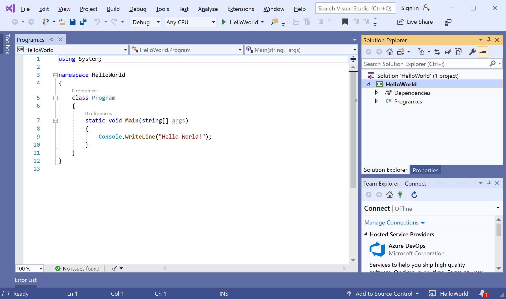

   The C# code for your application shows in the editor window, which takes up most of the space. Notice that the text is automatically colorized to indicate different parts of the code, such as keywords and types. In addition, small, vertical dashed lines in the code indicate which braces match one another, and line numbers help you locate code later. You can choose the small, boxed minus signs to collapse or expand blocks of code. This code outlining feature lets you hide code you don't need, helping to minimize onscreen clutter. The project files are listed on the right side in a window called **Solution Explorer**.

   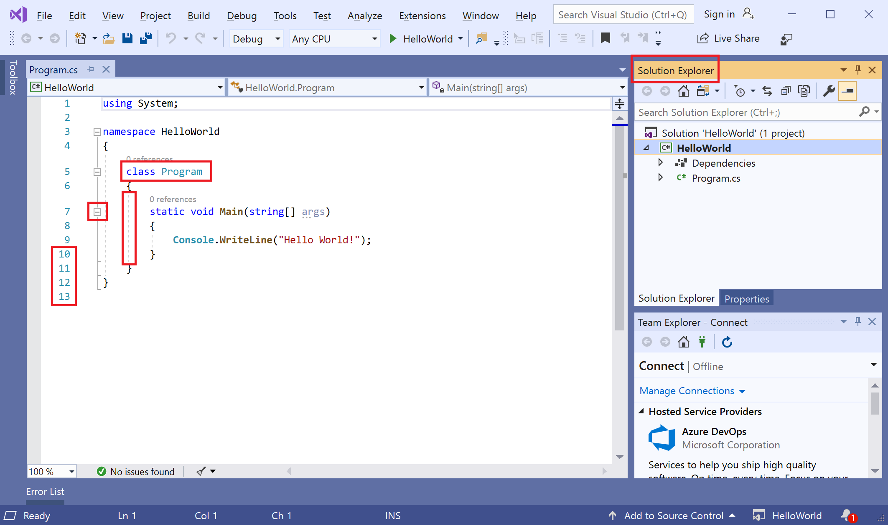

   There are other menus and tool windows available, but let's move on for now.

1. Now, start the app. You can do this by choosing **Start Without Debugging** from the **Debug** menu on the menu bar. You can also press **Ctrl**+**F5**.

   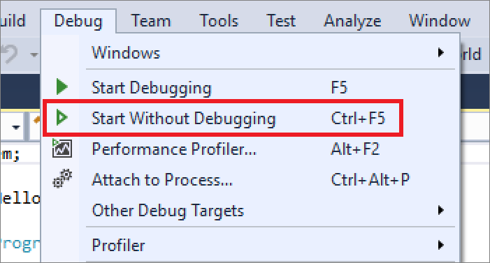

   Visual Studio builds the app, and a console window opens with the message **Hello World!**. You now have a running app!

   

1. To close the console window, press any key on your keyboard.

1. Let's add some more code to the app. Add the following C# code before the line that says `Console.WriteLine("Hello World!");`:

   ```csharp
   Console.WriteLine("\nWhat is your name?");
   var name = Console.ReadLine();
   ```

   This code displays **What is your name?** in the console window, and then waits until the user enters some text followed by the **Enter** key.

1. Change the line that says `Console.WriteLine("Hello World!");` to the following code:

   ```csharp
   Console.WriteLine($"\nHello {name}!");
   ```

1. Run the app again by selecting **Debug** > **Start Without Debugging** or by pressing **Ctrl**+**F5**.

   Visual Studio rebuilds the app, and a console window opens and prompts you for your name.

1. Enter your name in the console window and press **Enter**.

   :::image type="content" source="../media/vs-2019/overview-console-input.png" alt-text="Screenshot of the Debug Console window showing the prompt for a name, the input, and the output Hello Georgette!." lightbox="../media/vs-2019/overview-console-input.png" border="false":::

1. Press any key to close the console window and stop the running program.

::: moniker-end
::: moniker range=">=vs-2022"

1. Start Visual Studio. The start window appears with options for cloning a repo, opening a recent project, or creating a new project.

1. Choose **Create a new project**.

   

   The **Create a new project** window opens and shows several project *templates*. A template contains the basic files and settings required for a given project type.

1. To find a template, you can type or enter keywords in the search box. The list of available templates filters based on the keywords you enter. You can further filter the template results by choosing **C#** from the **All languages** dropdown list, **Windows** from the **All platforms** list, and **Console** from the **All project types** list.

    Select the **Console Application** template, and then select **Next**.

   

1. In the **Configure your new project** window, enter **HelloWorld** in the **Project name** box. Optionally, change the project directory location from the default location of *C:\\Users\\\<name>\\source\\repos*, and then select **Next**.

   

1. In the **Additional information** window, verify that **.NET 8.0** appears in the **Target Framework** drop-down menu, and then select **Create**.

   :::image type="content" source="../media/vs-2022/create-project-additional-info.png" alt-text="Screenshot of the Additional information dialog showing .NET 8.0 selected as the target framework for the new project in Visual Studio." lightbox="../media/vs-2022/create-project-additional-info.png" border="false":::

   Visual Studio creates the project. The program is a simple "Hello World" application that calls the <xref:System.Console.WriteLine?displayProperty=nameWithType> method to display the string **Hello, World!** in a console window.

   The project files appear on the right side of the Visual Studio IDE, in a window called the **Solution Explorer**. In the **Solution Explorer** window, select the **Program.cs** file. The C# code for your app opens in the central editor window, which takes up most of the space.

   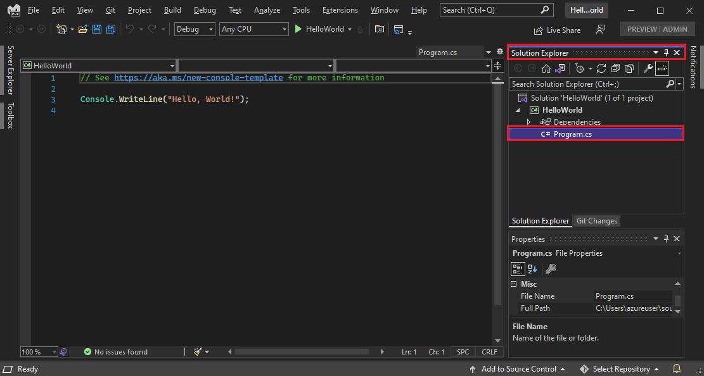

   The code is automatically colorized to indicate different parts, such as keywords and types. Line numbers help you locate code.

   Small, vertical dashed lines in the code indicate which braces match one another. You can also choose small, boxed minus or plus signs to collapse or expand blocks of code. This code outlining feature lets you hide code you don't need to see, helping to minimize onscreen clutter.

   

   Many other menus and tool windows are available.

1. Start the app by choosing **Debug** > **Start Without Debugging** from the Visual Studio top menu. You can also press **Ctrl**+**F5**.

   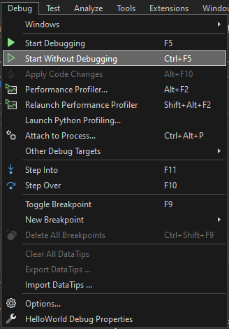

   Visual Studio builds the app, and a console window opens with the message **Hello, World!**. You now have a running app!

   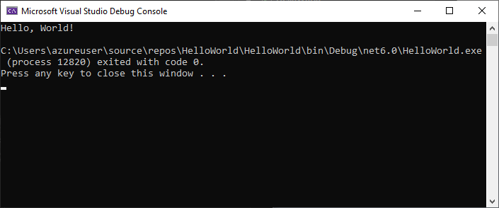

1. To close the console window, press any key.

1. Let's add some more code to the app. Add the following C# code before the line that says `Console.WriteLine("Hello World!");`:

   ```csharp
   Console.WriteLine("\nWhat is your name?");
   var name = Console.ReadLine();
   ```

   This code displays **What is your name?** in the console window, and then waits until the user enters some text.

1. Change the line that says `Console.WriteLine("Hello World!");` to the following line:

   ```csharp
   Console.WriteLine($"\nHello {name}!");
   ```

1. Run the app again by selecting **Debug** > **Start Without Debugging** or pressing **Ctrl**+**F5**.

   Visual Studio rebuilds the app, and a console window opens and prompts you for your name.

1. Type your name in the console window and press **Enter**.

   :::image type="content" source="../media/vs-2022/overview-console-input.png" alt-text="Screenshot of the Debug Console window showing the prompt for a name, the input, and the output Hello Georgette!." lightbox="../media/vs-2022/overview-console-input.png" border="false":::

1. Press any key to close the console window and stop the running program.

::: moniker-end

## Use refactoring and IntelliSense

Let's look at a couple of the ways that [refactoring](../../ide/refactoring-in-visual-studio.md) and [IntelliSense](../../ide/using-intellisense.md) can help you code more efficiently.

First, rename the `name` variable:

1. Double-click the `name` variable, and type the new name for the variable, *username*.

   A box appears around the variable, and a light bulb appears in the margin.

1. Select the light bulb icon to show the available [Quick Actions](../../ide/quick-actions.md). Select **Rename 'name' to 'username'**.

   ::: moniker range="vs-2019"
   
   ::: moniker-end
   ::: moniker range=">=vs-2022"
   
   ::: moniker-end

   The variable is renamed across the project, which in our case is only two places.

1. Now take a look at IntelliSense. Below the line that says `Console.WriteLine($"\nHello {username}!");`, type `DateTime now = DateTime.`.

   A box displays the members of the <xref:System.DateTime> class. The description of the currently selected member also displays in a separate box.

   ::: moniker range="<=vs-2019"
   
   ::: moniker-end
   ::: moniker range=">=vs-2022"
   
   ::: moniker-end

1. Select the member named **Now**, which is a property of the class, by double-clicking it or pressing **Tab**. Complete the line of code by adding a semicolon to the end of the line: `DateTime now = DateTime.Now;`.

1. Below that line, enter the following lines of code:

   ```csharp
   int dayOfYear = now.DayOfYear;

   Console.Write("Day of year: ");
   Console.WriteLine(dayOfYear);
   ```

   > [!TIP]
   > <xref:System.Console.Write%2A?displayProperty=nameWithType> is different from <xref:System.Console.WriteLine%2A?displayProperty=nameWithType> in that it doesn't add a line terminator after it prints. That means that the next piece of text that's sent to the output will print on the same line. You can hover over each of these methods in your code to see their descriptions.

1. Next, use refactoring again to make the code a little more concise. Select the variable `now` in the line `DateTime now = DateTime.Now;`. A screwdriver icon appears in the margin on that line.

1. Select the screwdriver icon to see available suggestions from Visual Studio. This case shows the [Inline temporary variable](../../ide/reference/inline-temporary-variable.md) refactoring to remove a line of code without changing the overall code behavior.

   ::: moniker range="<=vs-2019"
   
   ::: moniker-end
   ::: moniker range=">=vs-2022"
   
   ::: moniker-end

1. Select **Inline temporary variable** to refactor the code.

1. Run the program again by pressing **Ctrl**+**F5**. The output looks something like this:

   ::: moniker range="<=vs-2019"
   :::image type="content" source="../media/vs-2019/overview-console-final.png" alt-text="Screenshot of the Debug Console window showing the prompt for a name, the input, and the output 'Hello Georgette! Day of year: 43'." lightbox="../media/vs-2019/overview-console-final.png" border="false":::
   ::: moniker-end
   ::: moniker range=">=vs-2022"
   :::image type="content" source="../media/vs-2022/overview-console-final.png" alt-text="Screenshot of the Debug Console window showing the prompt for a name, the input, and the output 'Hello Georgette! Day of year: 244'." lightbox="../media/vs-2022/overview-console-final.png" border="false":::
   ::: moniker-end

## Debug code

When you write code, you should run it and test it for bugs. Visual Studio's debugging system lets you step through code one statement at a time and inspect variables as you go. You can set *breakpoints* that stop execution of the code at a particular line, and observe how the variable value changes as the code runs.

Set a breakpoint to see the value of the `username` variable while the program is running.

1. Set a breakpoint on the line of code that says `Console.WriteLine($"\nHello {username}!");` by clicking in the far-left margin, or gutter, next to the line. You can also select the line of code and then press **F9**.

   A red circle appears in the gutter, and the line is highlighted.

   ::: moniker range="<=vs-2019"
   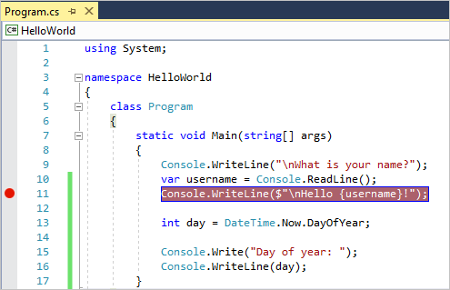
   ::: moniker-end
   ::: moniker range=">=vs-2022"
   
   ::: moniker-end

1. Start debugging by selecting **Debug** > **Start Debugging** or pressing **F5**.

1. When the console window appears and asks for your name, enter your name.

   The focus returns to the Visual Studio code editor, and the line of code with the breakpoint is highlighted in yellow. The yellow highlight means that this line of code will execute next. The breakpoint makes the app pause execution at this line.

1. Hover your mouse over the `username` variable to see its value. You can also right-click on `username` and select **Add Watch** to add the variable to the **Watch** window, where you can also see its value.

   ::: moniker range="<=vs-2019"
   
   ::: moniker-end
   ::: moniker range=">=vs-2022"
   
   ::: moniker-end

1. Press **F5** again to finish running the app.

::: moniker range=">=vs-2022"

Once the app is running, you can apply code changes to the running app by clicking the Hot Reload button.

:::image type="content" source="../media/vs-2022/overview-hot-reload.png" alt-text="Screenshot of Hot Reload in Visual Studio 2022.":::

::: moniker-end

For more information about debugging in Visual Studio, see the [Debugger feature tour](../../debugger/debugger-feature-tour.md).

## Customize Visual Studio

You can personalize the Visual Studio user interface, including changing the default color theme. To change the color theme:

::: moniker range="vs-2019"

1. On the menu bar, choose **Tools** > **Options** to open the **Options** dialog.

1. On the **Environment** > **General** options page, change the **Color theme** selection to **Dark**, and then choose **OK**.

   The color theme for the entire IDE changes to **Dark**.

   
::: moniker-end

::: moniker range=">=vs-2022"

1. On the menu bar, choose **Tools** > **Options** to open the **Options** dialog.

1. On the **Environment** > **General** options page, change the **Color Theme** selection to **Blue** or **Light**, and then select **OK**.

   The color theme for the entire IDE changes accordingly. The following screenshot shows the Blue theme:

   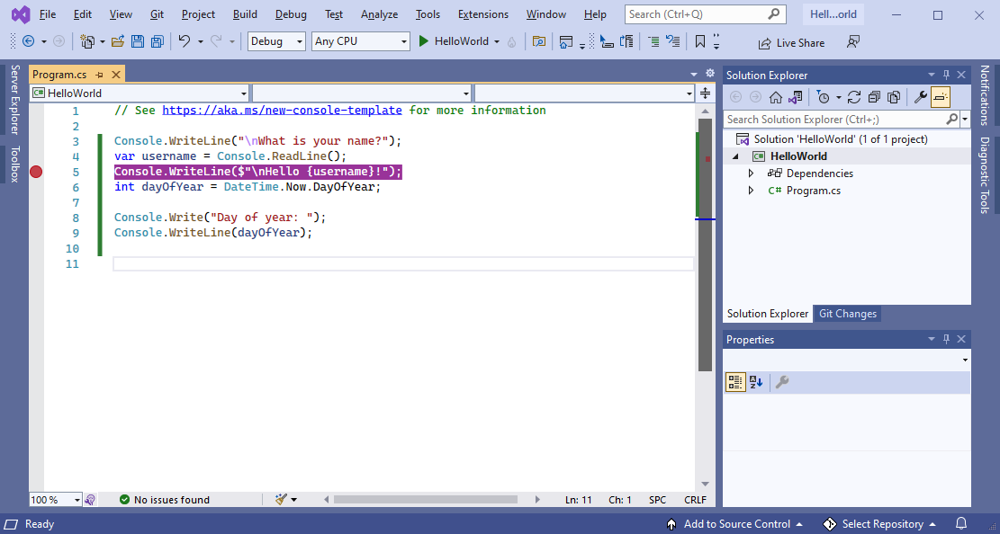

::: moniker-end

To learn about other ways you can personalize the IDE, see [Personalize Visual Studio](../../ide/personalizing-the-visual-studio-ide.md).
