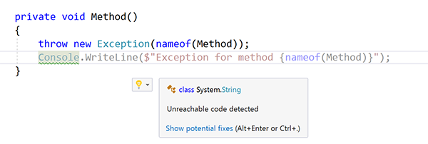

# Remove unreachable code refactoring

This refactoring applies to:

- C#

- Visual Basic

**What:** Removes code that will never be executed.

**When:** Your program has no path to a code snippet, making that code snippet unnecessary.

**Why:** Improve readability and maintainability by removing code that is superfluous and will never be executed.

## How-to

1. Place your cursor anywhere in the faded out code that is unreachable:



1. Next, do one of the following:

   - **Keyboard**
      - Press **Ctrl**+**.** to trigger the **Quick Actions and Refactorings** menu and select **Remove unreachable code** from the Preview window popup.
   - **Mouse**
      - Right-click the code, select the **Quick Actions and Refactorings** menu and select **Remove unreachable code** from the Preview window popup.

1. When you're happy with the change, press **Enter** or click the fix in the menu and the changes will be committed.

Example:

```csharp
// Before
private void Method()
{
    throw new Exception(nameof(Method));
    Console.WriteLine($"Exception for method {nameof(Method)}");
}

// Remove unreachable code

// After
private void Method()
{
    throw new Exception(nameof(Method));
}
```

## See also

- [Refactoring](../refactoring-in-visual-studio.md)
- [Preview Changes](../../ide/preview-changes.md)
