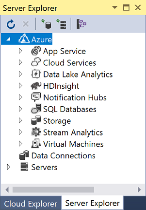

# Access multiple accounts associated with the Visual Studio sign-in account

In this article, you learn how to access multiple user accounts in Visual Studio.  After you sign in to Visual Studio with a Microsoft or an organizational account, you can see the resources accessible from your accounts in places such as the **Add Connected Service** dialog, **Server Explorer**, and **Team Explorer**.

Azure, Application Insights, Azure DevOps, and Microsoft 365 services all support the streamlined sign-in experience.

::: moniker range="<=vs-2019"

## Access your Azure account in Server Explorer

Access your Azure account as follows:

1. To open Server Explorer, choose **View** > **Server Explorer** (or, if you're using the "General" [environment settings](../ide/personalizing-the-visual-studio-ide.md), press **Ctrl**+**Alt**+**S**).

1. Expand the **Azure** node and notice that it contains the resources available in the Azure account associated with the account you used to sign in to Visual Studio. It looks similar to the following image:

   

The first time you use Visual Studio on any specific device, the dialog only shows the subscriptions registered under the account that you signed in with. You can access resources for any of your other accounts directly from **Server Explorer** as follows:

1. Right-click the **Azure** node.

1. Choose **Manage and Filter Subscriptions**, and then add your accounts from the account picker control. You can then choose another account, if desired, by selecting the down arrow and choosing from the list of accounts. 
   After choosing the account, you can customize which subscriptions under that account to display in **Server Explorer**.

   

The next time you open **Server Explorer**, the resources for that subscription are displayed.

::: moniker-end

## Access your Azure account via Add Connected Service dialog

1. Open an existing project, or create a new project.

1. Choose the project node in **Solution Explorer**, and then right-click and select **Add** > **Connected Service**.

   The **Connected Services** window appears and shows you the list of services in the Azure account associated with your Visual Studio personalization account. You don't have to sign in separately to Azure. However, you do need to sign in to the other accounts the first time you attempt to access their resources from a different machine.

## Access Microsoft Entra ID in a Web project

Microsoft Entra ID enables support for end-user single sign-in in ASP.NET MVC web apps or AD authentication in web API services. Domain authentication is different from individual user account authentication. Users that have access to your Active Directory domain can use their existing Microsoft Entra accounts to connect to your web applications. Microsoft 365 apps can also use domain authentication.

::: moniker range="vs-2019"

To see this scenario in action, create a new **ASP.NET Core Web App** project. On the **Additional information** page, choose **.NET Core 3.1 (Long-term support)** from the **Target Framework** drop-down, and then choose an authentication type from the **Authentication Type** drop-down.

::: moniker-end

::: moniker range=">=vs-2022"

To see this scenario in action:
1. Create a new **ASP.NET Core Web App** project.
2. On the **Additional information** page, choose **.NET 8.0** from the **Target Framework** drop-down.
3. Choose an authentication type from the **Authentication Type** drop-down.

## Identity: Proxy support for Microsoft Entra backed accounts

Visual Studio can now detect when users are behind a proxy and proactively prompt for proxy credentials when adding  Microsoft accounts (MSA) or work or school accounts (WSA) to Visual Studio. 

Proxy credentials are stored in the Windows Credential Manager and are used as needed to complete identity related operations.

> [!NOTE]
> If the proxy server starts or changes after opening Visual Studio, the **Account Settings** dialog will show a warning, but you'll need to restart Visual Studio to get the proxy credentials prompt.

::: moniker-end
