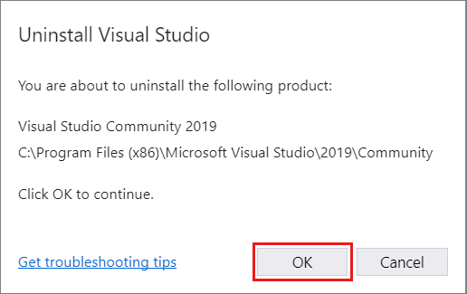
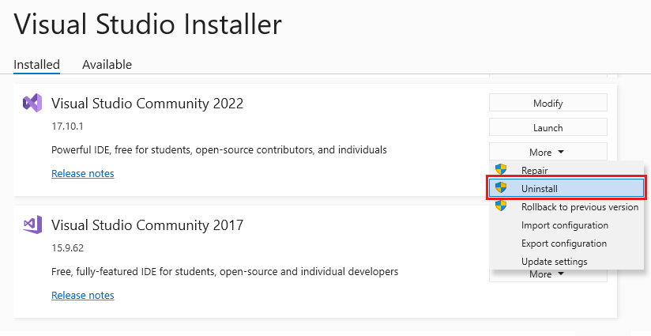
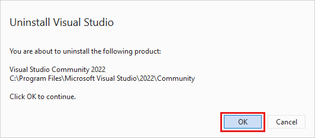

# Uninstall or remove Visual Studio 

This page walks you through uninstalling Visual Studio, our integrated suite of productivity tools for developers.

> [!TIP]
> If you're having trouble with your instance of Visual Studio, try [the **Repair**  Visual Studio](../install/repair-visual-studio.md) tool. 
>
> To change the location for some of your Visual Studio files, it's possible to do so without uninstalling your current instance as described in [Select the installation locations](../install/change-installation-locations.md).

::: moniker range="vs-2019"

1. Find the **Visual Studio Installer** on your computer.

     In the Windows Start menu, you can search for "installer".

     

     > [!NOTE]
     > You can also find the Visual Studio Installer in the following location:
     >
     > `C:\Program Files (x86)\Microsoft Visual Studio\Installer\setup.exe`

    You might have to update the installer before continuing. If so, follow the prompts.

1. In the installer, look for the edition of Visual Studio that you installed. Next, choose **More**, and then choose **Uninstall**.

     

1. Click **OK** to confirm your choice.

     

If you change your mind later and want to reinstall Visual Studio 2019, start the Visual Studio Installer again, choose the **Available** tab,  choose the edition of Visual Studio that you want to install, and then select **Install**.

## Uninstall Visual Studio

To remove all installations of Visual Studio 2019, and the Visual Studio Installer from your machine, uninstall it from Installed apps.

1. In Windows 10 or later, type **Add or remove programs** in the "Type here to search" box.
1. Find **Visual Studio 2019**.
1. Choose **Uninstall**.
1. Then, find **Microsoft Visual Studio Installer**.
1. Choose **Uninstall**.

::: moniker-end

::: moniker range=">=vs-2022"

1. Find the **Visual Studio Installer** on your computer.

     In the Windows Start menu, you can search for "installer".

     

     > [!NOTE]
     > You can also find the Visual Studio Installer in the following location:
     >
     > `C:\Program Files (x86)\Microsoft Visual Studio\Installer\setup.exe`

    You might have to update the installer before continuing. If so, follow the prompts.

1. In the installer, look for the edition of Visual Studio that you installed. Next, choose **More**, and then choose **Uninstall**.

     

1. Click **OK** to confirm your choice.

     

If you change your mind later and want to reinstall 2022, start the Visual Studio Installer again, choose the **Available** tab,  choose the edition of Visual Studio that you want to install, and then select **Install**.

## Uninstall Visual Studio

To remove all installations of Visual Studio 2022, and the Visual Studio Installer from your machine, uninstall it from Installed apps.

1. In Windows 10 or later, type **Add or remove programs** in the "Type here to search" box.
1. Find **Visual Studio 2022**.
1. Choose **Uninstall**.
1. Then, find **Microsoft Visual Studio Installer**.
1. Choose **Uninstall**.

::: moniker-end

<a name="remove"></a>

## Remove all with InstallCleanup.exe

> [!WARNING]
> Use the InstallCleanup tool **only as a last resort** if repair or uninstall fail. This tool might uninstall features from other Visual Studio installations or other products, which then might also need to be repaired or reinstalled.

If you experience **a catastrophic error and can't repair or uninstall Visual Studio**, you can run the `InstallCleanup.exe` tool to remove installation files and product information for all installed instances of Visual Studio 2017, Visual Studio 2019, or Visual Studio 2022.

Here's how to run the `InstallCleanup.exe` tool:

1. Close the Visual Studio Installer.
1. Open an administrator command prompt. To open an administrator command prompt, follow these steps:
   * Type **cmd** in the "Type here to search" box.
   * Right-click **Command Prompt**, and then choose **Run as administrator**.
1. Enter the full path of the `InstallCleanup.exe` tool and add the command-line switch you prefer. By default, the path of the tool is as follows. The double quotes enclose a command containing spaces:

   > [!NOTE]
   > If you can't find `InstallCleanup.exe` under the Visual Studio Installer directory, which is always located at `%ProgramFiles(x86)%\Microsoft Visual Studio`, here's what to do next. Follow the instructions to [install Visual Studio](install-visual-studio.md). Then, when the workload selection screen is displayed, close the window and follow the steps on this page again.

   | Switch | Behavior |
   |-----------------|--------------------|
   |  `-i [version]`   | Default if no other switch is passed. It removes only the main installation directory and product information. Use this switch if you intend to reinstall the same version of Visual Studio. If a `[version]` value is specified, only products with a version that start with this string value will be removed.    For example, use the switch *-i 17* with `InstallCleanup.exe` to remove all products of version 17. |
   |   `-f`           | Removes the main installation directory, product information, and most other features installed outside the installation directory, that might also be shared with other Visual Studio installations or other products. Use this switch if you intend to remove Visual Studio without reinstalling it later.|

   ```shell
   "C:\Program Files (x86)\Microsoft Visual Studio\Installer\InstallCleanup.exe"
   ```

[!INCLUDE[install_get_support_md](includes/install_get_support_md.md)]

## Related content

* [Modify Visual Studio](modify-visual-studio.md)
* [Update Visual Studio](update-visual-studio.md)
* [Install Visual Studio](install-visual-studio.md)
