# Update Visual Studio

This topic discusses how to update a client installation of Visual Studio on Windows. For Visual Studio for Mac, see [Update Visual Studio for Mac](/visualstudio/mac/update).

Visual Studio must first be [installed on the machine](../install/install-visual-studio.md) before you can update it. 

If you are an IT Administrator and want to configure your organization's clients to update from a network layout, refer to the [Visual Studio Administrators Guide](https://aka.ms/vs/admin/guide), particularly the section on [manage and update a network installation](../install/update-a-network-installation-of-visual-studio.md).

## Before you update

By default, in order to install, update, or modify Visual Studio, the account performing the update must have administrative permissions on the machine and also must have permissions to the source where the product updates are located (either the internet or an internal location). If you are logged in as a typical user and try to perform one of these commands, then you'll get a User Account Control notice prompting you for admin credentials. Starting in August 2023, an admin can delegate control of updates to standard users by configuring the [`AllowStandardUserControl` policy](https://aka.ms/vs/setup/policies). For more information, see [User Permissions and Visual Studio](../ide/user-permissions-and-visual-studio.md).

Visual Studio must be closed before performing an update. We highly recommend saving your work before performing an update.

::: moniker range="vs-2019"

We encourage you to update to the most [recent release](/visualstudio/releases/2019/release-notes/) of Visual Studio 2019 so that you always get the latest features, security fixes, and improvements. And if you'd like to try out our newest version, consider downloading and installing [Visual Studio 2022](https://visualstudio.microsoft.com/downloads/?cid=learn-onpage-download-cta).

There are several different ways to update an installation of Visual Studio. You can update through the Visual Studio Installer, you can check for updates or use the Notification hub in the IDE, you can configure Visual Studio to update on close, you can update by running a [specific version of the bootstrapper](/visualstudio/releases/2019/history), you can update Visual Studio programmatically, or you can be part of an organization that uses Administrator updates. Here's how to update Visual&nbsp;Studio&nbsp;2019 using these various methods.

## Use the Visual Studio Installer

Visual Studio setup features and bug fixes are typically implemented in the installer. The installer is now shipping in the most current release of all currently supported Visual Studio products. This means that in general (unless otherwise specified), all new setup functionality is automatically available and works seamlessly in older versions of the product.  

1. Find the **Visual Studio Installer** on your computer. 

   In the Windows Start menu, you can search for "installer".

   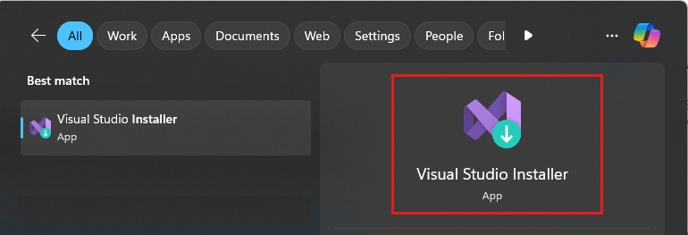

   You might have to update the installer before continuing. If so, follow the prompts. 
   
1. In the installer, look for the instance of Visual Studio that you want to update.

   For example, if you previously installed Visual&nbsp;Studio Community&nbsp;2019 and there's an update for it, then an **Update available** message appears in the installer.

     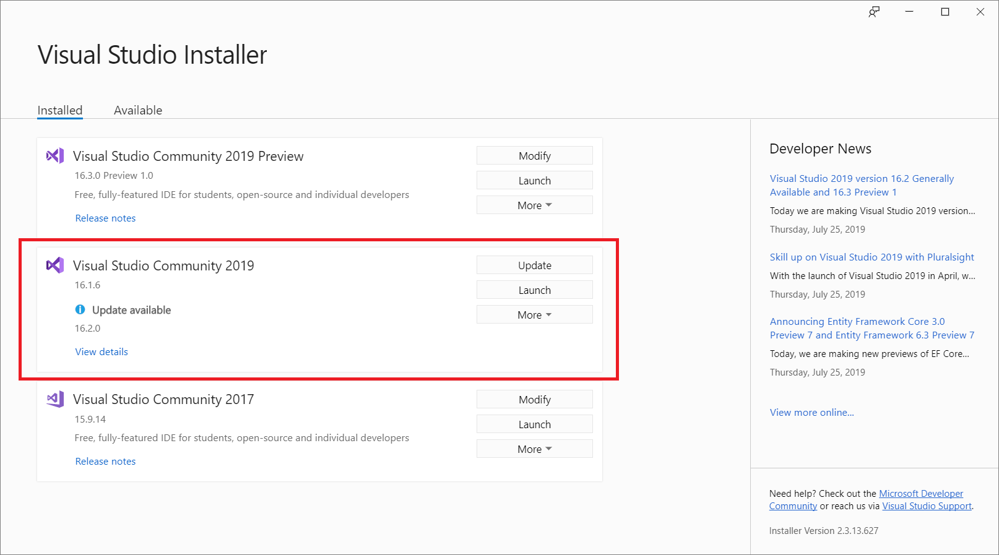

1. Choose **Update** to install the updates.

    

1. After the update is complete, you might be asked to restart your computer. If so, do so, and then start Visual Studio as you typically would.

   If you aren't asked to restart your computer, choose **Launch** to start Visual Studio from the installer.

    

## Use the message box in the IDE

1.  When you open Visual Studio, the IDE checks to see if an update is available. In certain situations, a **Visual Studio 2019 update** message will briefly appear. If you want to update now, then choose **View details**. If you want to defer the update until when you close Visual Studio, choose **Update on close**.
   
    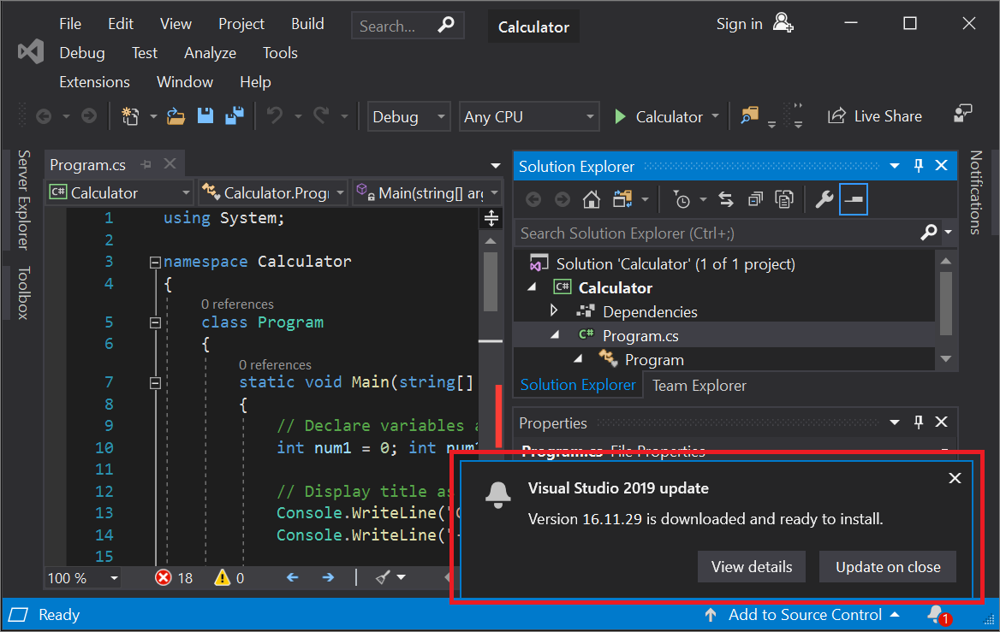

1. If you chose **View details**, then in the subsequent dialog box, choose **Update** to update now.

     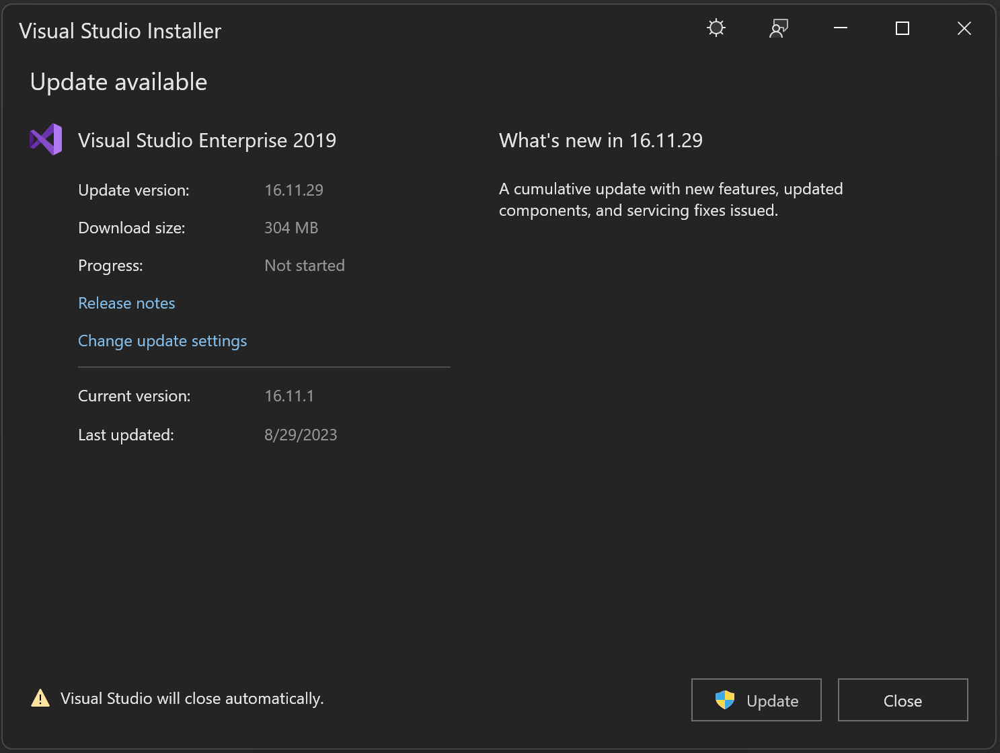

## Use the Notifications hub in the IDE

1. Choose the notification icon from the lower-right corner of the Visual Studio IDE to open the **Notifications** hub.

   

1. In the **Notifications hub**, choose the update that you want to install. If you want to update now, choose **View details** and then in the subsequent dialog box, choose **Update**. If you want to defer the update until when you close Visual Studio, choose **Update on close**. 

     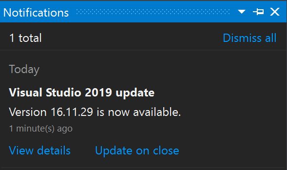

>[!NOTE]
>The **Update on close** command that is found in both the update notification message box or in the **Notification** hub is not a permanent setting; it applies only to the current update. It is a way to defer the update to when you voluntarily close Visual Studio. In Visual Studio 2019, the **Update on close** deferral must be chosen each time you acknowledge or dismiss the notification that the update is available. 

## Manually check for updates in the IDE

1. You can check to see if an update is available by choosing **Help** from the menu bar, and then choosing **Check for Updates**.  You can also use the search box by pressing **Ctrl**+**Q**, typing "check for updates", and then choosing the search result that matches. In the subsequent **Update available** dialog box, choose **Update**.

     

## Run a specific bootstrapper to update the product to a specific version
If you're an Enterprise or Professional customer, you can update your instance of Visual Studio 2019 to any specific version that has been released, as long as it's a higher version than what is currently installed. To update your instance of Visual Studio 2019 via this method, [navigate to the Visual Studio 2019 release history page](/visualstudio/releases/2019/history), download the bootstrapper that corresponds to the desired update version into your product installation directory, and then double click on it to initiate the update.  

## Customize update settings

There are several different settings that can be customized to control the update behavior. A few of these settings are native to Visual Studio 2019 and deal with how and when the product bits are downloaded and installed. Other settings, such as the ability to configure the source of the updates, require the presence of the newer Visual Studio 2022 installer.

### Installation and download behaviors

1. On the menu bar, choose **Tools** > **Options**.

1. Expand **Environment**, and then choose **Product Updates**.

    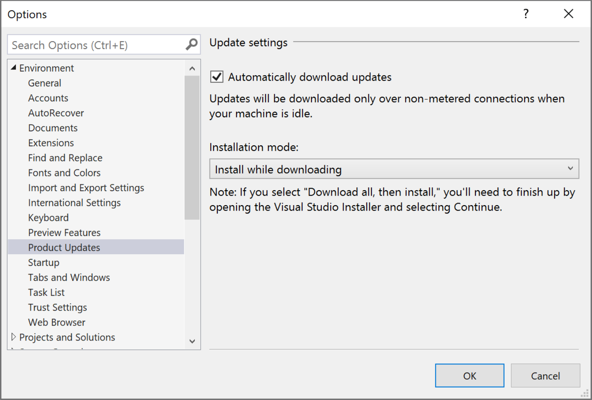

1. Observe the configuration options that are available to set in this dialog. You can choose the **Automatically download updates** setting, which allows updates to download while your machine is idle. There are also two installation modes to choose from: **Install while downloading**, and **Download all, then install**.   Choose the installation mode and the automatic download setting you want for your Visual Studio updates.

### Configure source location of updates
If you're in an enterprise environment, then it's possible to configure the location that your client instances look for updates. This is useful in situations where your client installed from a network layout, but you later want the clients to get updates from a different network layout. The ability to configure update locations requires the presence of the newer Visual Studio 2022 installer, which can be obtained by [acquiring the latest installer on the client machine](#use-the-latest-and-greatest-installer), or by an administrator [pushing the latest installer out through a network layout](create-a-network-installation-of-visual-studio.md#ensure-your-layout-is-using-the-latest-installer). For more information about how to use this feature, refer to the [Visual Studio 2022 documentation on configuring source location of updates](/visualstudio/install/update-visual-studio?view=vs-2022&preserve-view=true#configure-source-location-of-updates-1).  

::: moniker-end

::: moniker range=">=vs-2022"

We encourage you to update to the most [recent release](/visualstudio/releases/2022/release-notes) of Visual Studio 2022 so that you always get the latest features, security fixes, and improvements.

There are many different ways to update an installation of Visual Studio. You can update through the Visual Studio Installer, you can check for updates or use the notification hub in the IDE, you configure Visual Studio to update upon close, you can update by running a [specific version of the bootstrapper](/visualstudio/releases/2022/release-history), you can update Visual Studio programmatically, or you can be part of an organization that uses Administrator updates. Here's how to update Visual&nbsp;Studio&nbsp;2022 using these various methods.

## Use the Visual Studio Installer

1. Find the **Visual Studio Installer** on your computer.

   In the Windows Start menu, search for "installer", and then select **Visual Studio Installer** from the results.

   

   If you're prompted to update the Visual Studio Installer before continuing, do so by following the prompts.
   
>[!NOTE]
>Visual Studio setup features and bug fixes are typically implemented in the installer. The installer is now shipping in the most current release of all currently supported Visual Studio products. This means that in general (unless otherwise specified), all new setup functionality is automatically available and works seamlessly in older versions of the product.

1. In the Visual Studio Installer, look for the installation of Visual Studio that you want to update. 

   For example, if you previously installed Visual Studio Community 2022 and there's an update for it, then an **Update available** message appears in the Visual Studio Installer.

     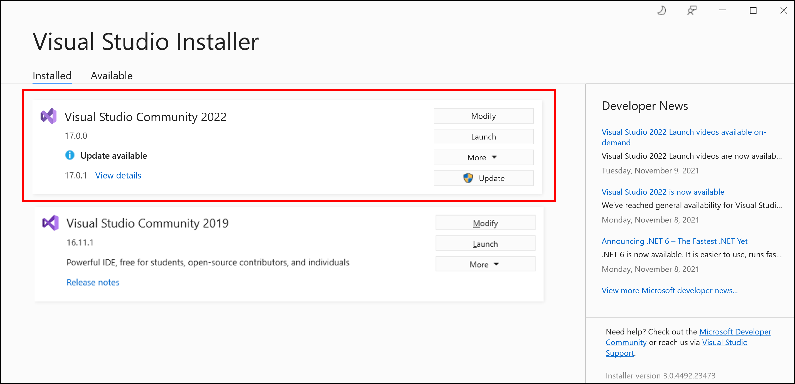

1. Choose **Update** to install the update.

    

1. After the update is complete, the Visual Studio Installer might prompt you to restart your computer. If so, do so, and then start Visual Studio as you typically would.

    If you aren't asked to restart your computer, choose **Launch** to start Visual Studio from the Visual Studio Installer.

    

## Use the message box in the IDE

1. When you open Visual Studio, the IDE checks to see if an update is available.  In certain situations, a **Visual Studio 2022 update** message will briefly appear. If you want to update now, then choose **View details**.  If you want to defer the update until when you close Visual Studio, choose **Update on Close**.

    

1. If you chose **View details**, then in the subsequent **Update available** dialog box, choose **Update** to update now. 

     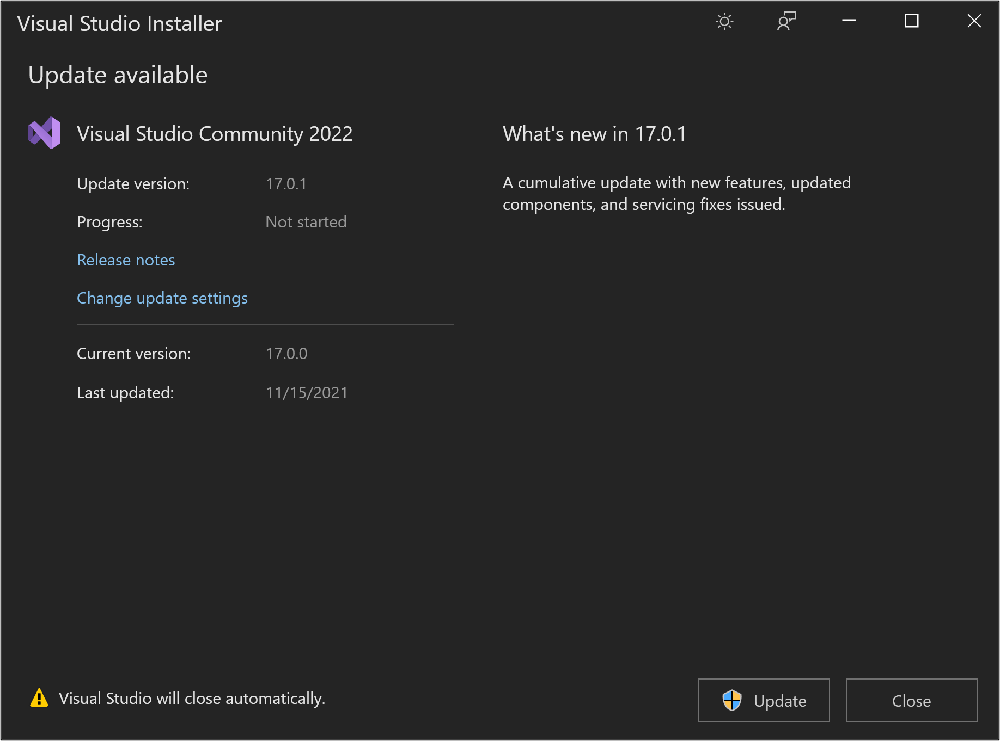

## Use the Notifications hub in the IDE

1. Choose the notification icon from the lower-right corner of the Visual Studio IDE to open the **Notifications hub**.

   

1. In the **Notifications hub**, choose the update that you want to install. If you want to update now, then choose **View details**. If you want to defer the update until when you close Visual Studio, choose **Update on Close**.

     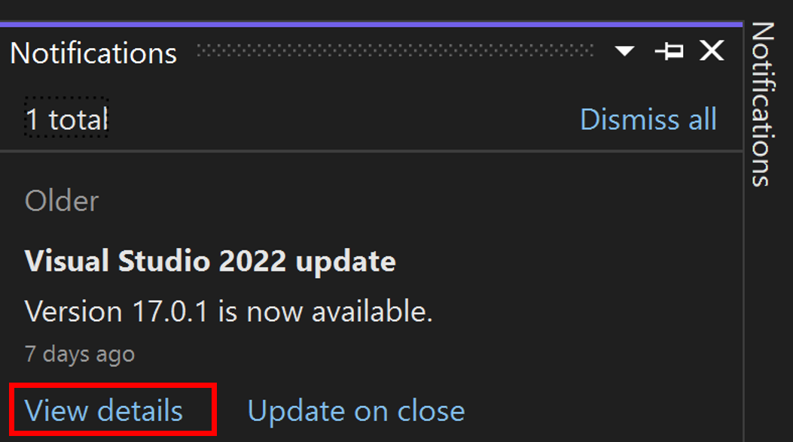

1. If you chose **View details**, then in the subsequent **Update available** dialog box, choose **Update**.

>[!NOTE]
>The **Update on Close** command that is found in both the update notification message box or in the **Notification** hub is not a permanent setting; it applies only to the current update. It is a way to defer the update to when you voluntarily close Visual Studio. To learn how to configure this setting permanently, see the [Customize update settings](#always-update-on-close-and-other-download-behaviors) section. 

## Manually check for updates in the IDE

1. You can check to see if an update is available by choosing **Help** from the menu bar, and then choosing **Check for Updates**.  You can also use the search box by pressing **Ctrl**+**Q**, typing **check for updates**, and then choosing the search result that matches. In the subsequent **Update available** dialog box, choose **Update**.

     

## Run a specific bootstrapper to update the product to a specific version
If you're an Enterprise or Professional customer, you can update your instance of Visual Studio 2022 to any specific version that has been released, as long as it's a higher version than what is currently installed. To update your instance of Visual Studio 2022 via this method, [navigate to the Visual Studio 2022 release history page](/visualstudio/releases/2022/release-history), download the bootstrapper that corresponds to the desired update version into your product installation directory, and then double-click on it to initiate the update.

## Customize update settings

There are several different settings that can be customized to control the update behavior, such as how and when the product bits are downloaded and installed, or where the update source location is.  

### Always Update on Close and other download behaviors

1. On the menu bar, choose **Tools** > **Options**. Expand **Environment**, and then choose **Product Updates**. Observe the configuration options that are available to set in this dialog.

    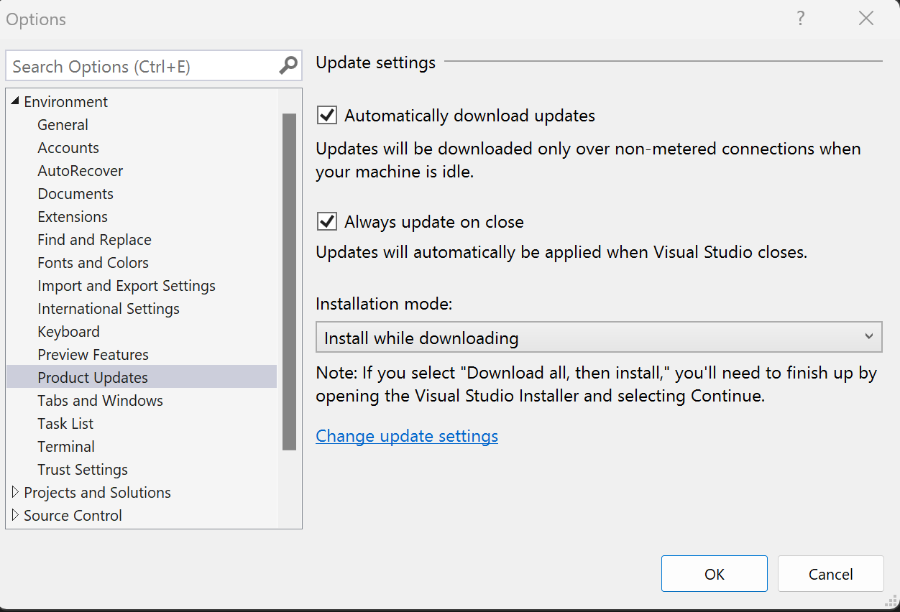

  - You can choose the **Automatically download updates** setting, which allows updates to download while your machine is idle.
  - You can configure Visual Studio to automatically apply the latest available update upon close. This setting is configurable on a per-instance basis of Visual Studio. For example, you can set your Preview instance to apply updates when Visual Studio closes, but your other Visual Studio instances can continue to be updated on demand. After you configure Visual Studio to **Always update on close**, Visual Studio updates begin once Visual Studio and all related processes are closed. If any extensions have been scheduled for install or update, the Visual Studio update will not start until the next time Visual Studio closes.
  - There are also two installation modes to choose from: **Install while downloading** and **Download all, then install**. 

### Configure source location of updates
With Visual Studio 2022, you can now configure where your clients will get their updates from. These update source locations are called *channels*, and you can find more information about channel purpose and availability in the [Visual Studio Release Rhythm](/visualstudio/productinfo/release-rhythm) documentation. Microsoft makes both the Current and the Preview channels available to everyone, and the [long term servicing channels (LTSCs) are available to Enterprise and Professional customers for about 18 months](/visualstudio/productinfo/vs-servicing#long-term-servicing-channel-ltsc-support). IT Administrators can also configure the update source locations, such as network layouts, that the clients should have access to. Refer to the [Visual Studio Administrators Guide](https://aka.ms/vs/admin/guide) for additional approach recommendations, and to the [modifySettings command documentation](/visualstudio/install/use-command-line-parameters-to-install-visual-studio#modifysettings-command-and-command-line-parameters) for how to access this functionality programmatically.  

There are two ways to bring up the Update Settings dialog, which allows you to manually change the channel that your Visual Studio instance should get its updates from. 

1. Open the Visual Studio installer, select the instance you want to configure, choose the **More button** and then choose the **Update settings** menu option. Refer to previous instructions for how to find the Visual Studio Installer.

  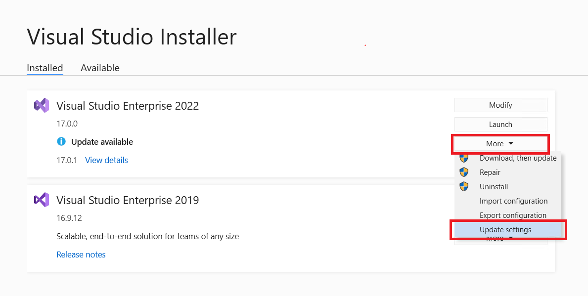

2. An alternative way to invoke the Update Settings dialog is to open the Visual Studio IDE, bring up the Update available dialog (either **View details** on an update notification or **Check for updates** on the Help menu) and click on the Change update settings link.   

  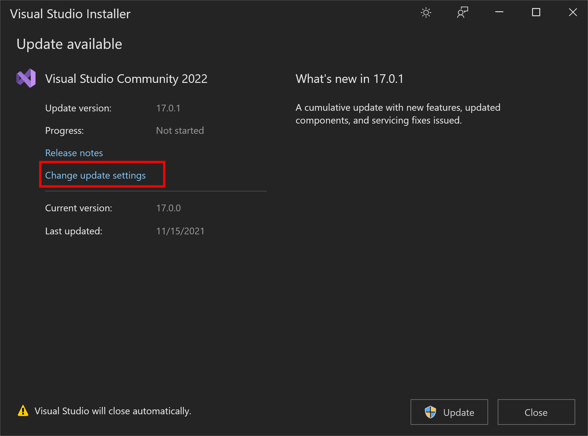
    
The **Update settings** dialog will look something like this. In this example, the Visual studio instance is using the LTSC 17.0 channel.

   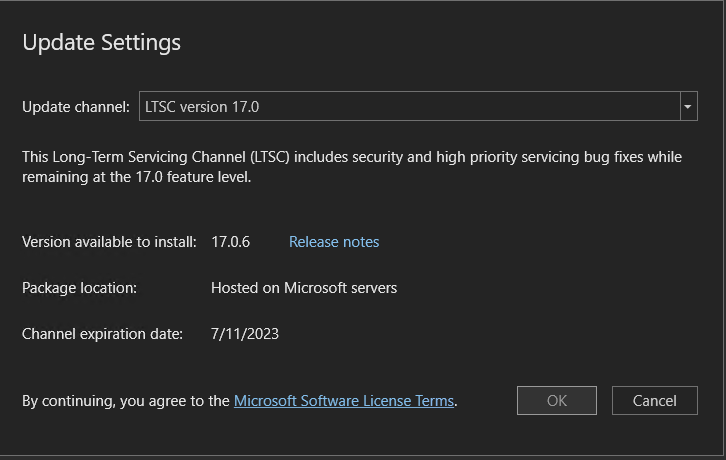

By choosing the correct value in the **Update channel** dropdown, you can control the source location of future updates for this instance of Visual Studio. Additional things to keep in mind are:
 * The Preview and Current channels are available for all editions of Visual Studio, and the LTSC channels are only available for Professional and Enterprise customers. 
 * You can choose to update your instance of Visual Studio immediately after you configure the **Update channel** location. Or you can defer the actual product update until some later time. The act of configuring the update channel and the act of updating the product are two independent events. For information on how to programmatically control the update channel, refer to [Use the modifySettings command](/visualstudio/install/use-command-line-parameters-to-install-visual-studio#modifysettings-command-and-command-line-parameters). 
 * You can only change the update channel if the version of the product that's available at the tip of that channel is **greater** than the version you have installed. For example, you can always transition from the Current channel to the Preview channel, but you can't transition from the Preview channel to the Current channel until the latest release on the Current channel surpasses the version of Preview that you have installed. 
* When you update to a new channel, you'll install the most recent release on that channel. If you are an enterprise customer and want to install a particular version of the product on that channel, then follow the [Run a specific bootstrapper instructions](#run-a-specific-bootstrapper-to-update-the-product-to-a-specific-version-1) described previously. 
 * LTSC channels all have expiration dates as illustrated in the picture above. Once the LTSC has expired, it cannot be used as a source of updates, and it'll disappear from this list.
 * All Microsoft channels are hosted on Microsoft servers and require access to the internet.
 * Each instance of Visual Studio has the ability to independently configure its source for updates. So, if you have two instances of Visual Studio 2022 installed, each can update from a different channel. 
 * IT Administrators can control the text in the **Update channel** dropdown. For example, they can add network layout locations as update sources. They can also suppress Microsoft hosted locations from being available as update source options. This functionality works for Visual Studio 2019 installs too. For information on how to configure these update locations, refer to the [Set defaults for enterprise deployments](/visualstudio/install/set-defaults-for-enterprise-deployments?#configuring-source-location-for-updates) page.

::: moniker-end

## Programmatically update Visual Studio

You can use either the bootstrapper or the installer to programmatically update Visual Studio. For more information, see the [online command line documentation](/visualstudio/install/use-command-line-parameters-to-install-visual-studio).

## Administrator updates

If you are part of an organization that centralizes management of software installations, then your enterprise administrator might control how Visual Studio updates your machine. For more about how to control or configure the types of updates your machine can accept, see [Using Configuration Manager to deploy Visual Studio updates](../install/applying-administrator-updates.md#configuring-the-client-machine-to-receive-administrator-updates).

## Remove out-of-support components

Using the [latest Visual Studio 2022 installer](#use-the-latest-and-greatest-installer), you can now bulk remove [components that have transitioned to an out-of-support state](/visualstudio/install/out-of-support-components). You can manually remove them by using the installer as described below, you can remove them [programmatically](./use-command-line-parameters-to-install-visual-studio.md), or you can have them removed via machine wide [policy](/visualstudio/install/set-defaults-for-enterprise-deployments). Learn more about [removing out-of-support components](https://aka.ms/vs/removeoos/blog) and how it can help keep your software environment secure.

To bulk remove out-of-support components manually through the UI you can 

1. Open the Visual Studio Installer, and then select **Modify**.
1. Select **Remove all out-of-support components**.
    
   :::image type="content" source="media/vs-2022/remove-out-of-support-components.png" alt-text="Screenshot of the Remove out-of-support components option.":::
   
All components with an out-of-support label will be deselected and get uninstalled.

You can also configure a specific Visual Studio instance to _persistently_ remove all components that transition to an out-of-support state by selecting the option **More**> **Update Settings**> **Remove all out-of-support components during future updates** in the Visual Studio Installer. Once this setting is configured, any component that transitions to an out-of-support state in the future will be removed during the next Visual Studio update for that instance of Visual Studio.

   :::image type="content" source="media/vs-2022/remove-all-out-support-components-during-future-updates.png" alt-text="Screenshot of Remove all out-of-state components during future updates option in the Update Settings dialog.":::
   
## Use the latest and greatest installer

The most current release of the installer in the latest version of Visual Studio typically has the most robust and reliable feature set. This functionality will often seamlessly work on lower versioned products. In order to manually acquire the latest version of the installer onto a client machine (like if you wanted the functionality of the latest Visual Studio 2022 installer to govern a Visual Studio 2019 installation), you can do one of the following: 

1. [Download any recent bootstrapper for the latest version of Visual Studio](/visualstudio/install/install-visual-studio#step-2---download-visual-studio) and then either

    - Double click on the bootstrapper to initiate the installation. The latest installer will get installed onto the machine first. Once the "Choose Workloads" screen pops up, simply cancel the installation.  

    - In a command window, use the bootstrapper to update the installer like this:

      ```shell
      vs_enterprise.exe --update --quiet
      ```

## Update from the Microsoft Catalog

You can download an Administrator Update from the [Microsoft Update Catalog](https://catalog.update.microsoft.com) into the installation directory on your machine, and use it to update your installation by just double-clicking on it to apply the update. 

[!INCLUDE[install_get_support_md](includes/install_get_support_md.md)]

## Related content

* [Install Visual Studio versions side-by-side](install-visual-studio-versions-side-by-side.md)
* [Update a network-based installation of Visual Studio](update-a-network-installation-of-visual-studio.md)
* [Visual Studio administrator guide](visual-studio-administrator-guide.md)
* [Control updates to network-based Visual Studio deployments](controlling-updates-to-visual-studio-deployments.md)
* [Modify Visual Studio](modify-visual-studio.md)
* [Uninstall Visual Studio](uninstall-visual-studio.md)
