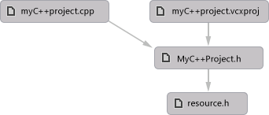

# Code maps for C++ projects

If you want to create more complete maps for C++ projects, set the browse information compiler option (**/FR**) on those projects. Otherwise, a message appears and prompts you to set this option. If you select **OK**, this sets the option for just the current map. You can choose to hide the message for all later maps.

When you open a solution that contains Visual C++ projects, it might take some time to update the IntelliSense database. During this time, you might not be able to create code maps for header (*.h* or `#include`) files until the IntelliSense database finishes updating. You can monitor the update progress in the Visual Studio status bar.

- To see dependencies between all source files and header files in your solution, select **Architecture** > **Generate Graph of Include Files**.

   

- To see dependencies between the currently open file and related source files and header files, open either the source file or the header file. Open the file shortcut menu anywhere inside the file. Choose **Generate Graph of Include Files**.

   

## Troubleshoot code maps for C and C++ code

These items aren't supported for C and C++ code:

- Base types don't appear on maps that include the parent hierarchy.

- Most **Show** menu items aren't available for C and C++ code.

These issues might occur when you create code maps for C and C++ code:

|**Issue**|**Possible cause**|**Resolution**|
|-|-|-|
|The code map failed to generate.|No projects in the solution were built successfully.|Fix the build errors that occurred and then regenerate the map.|
|Visual Studio becomes unresponsive when you try to generate a code map from the **Architecture** menu.|The program database (.pdb) file might be corrupted.   A .pdb file stores debugging information, such as type, method, and source file information.|Rebuild the solution and then try again.|
|Certain settings for the IntelliSense browsing database are disabled.|Certain IntelliSense settings might be disabled in the Visual Studio **Options** dialog box.|Turn on the settings to enable them.   See [Options, Text Editor, C/C++, Advanced](../ide/reference/options-text-editor-c-cpp-advanced.md).|
|The message **Unknown Methods** appears on a method node.   This issue occurs because the name of the method cannot be resolved.|The binary file might not have a base relocation table.|Turn on the **/FIXED:NO** option in the linker.|
||The program database (.pdb) file might not be built.   A .pdb file stores debugging information, such as type, method, and source file information.|Turn on the **/DEBUG** option in the linker.|
||Cannot open or find the .pdb file in the expected locations.|Make sure that the .pdb file exists in the expected locations.|
||Debug information has been stripped from the .pdb file.|If the **/PDBSTRIPPED** option was used in the linker, include the complete .pdb file instead.|
||The caller is not a function and is either a thunk in the binary file or a pointer in the data section.|When the caller is a thunk, try using `_declspec(dllimport)` to avoid the thunk.|

## Related content

- [Map dependencies with code maps](../modeling/map-dependencies-across-your-solutions.md)
