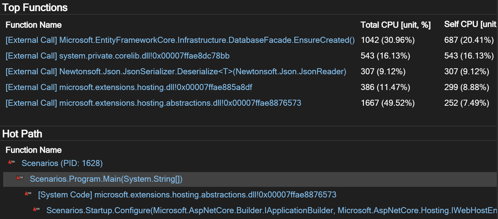

# Diagnose high latency with CPU Insights

CPU insights is a sub-feature of the CPU Usage tool that shows common potential latency issues like concatenating strings inefficiently.

## View Auto Insights

The **Top Insights** section in the CPU Usage tool shows quick CPU details, insights, and suggestions in the description so that you can continue diagnosing the issue. The **Learn more** link shows you in-depth documentation that explains your issue. If you need more information, **View source code** shows more details. Once selected, you can see the call tree view, showing the process, functions, and which callers use the most CPU.

## View top functions

On the summary page under **Top Functions**, you can find the top functions called with the time spent in descending order. **Total CPU** time is the amount of time spent inside a function, including any functions it calls, whereas **Self CPU** is time spent exclusively in the function.

## View the hot path

**Hot Path** shows where most of the CPU time was being spent in your application and helps focus investigation on the area that would have the most impact. Analyzing this code path by using other tools in the Performance Profiler can help identify ways to improve the code as well. For example, it may help identify how to minimize allocations on the hot path to reduce GC frequency and time spent in GC.

::: moniker range=">= vs-2022"
## Get AI assistance

If you have [Copilot](../ide/visual-studio-github-copilot-extension.md), you can get AI assistance while you're looking at CPU Auto Insights. Just look for the **Ask Copilot**  button. In these scenarios, Copilot already knows the context for your questions, so you don't need to provide context yourself in chat. For more information, see [Debug with Copilot](../debugger/debug-with-copilot.md).
::: moniker-end

## Related content

- [Analyze performance by using CPU profiling](../profiling/cpu-usage.md)
- [Identify hot paths with Flame Graph](../profiling/flame-graph.md)
- [Troubleshoot Profiler errors](../profiling/troubleshoot-profiler-errors.md)