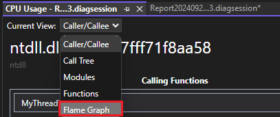

# Identify hot paths with a flame graph (C#, Visual Basic, C++, F#)

The **Flame Graph** in the CPU Usage and Instrumentation tools help you identify hot paths in your code by visualizing a call tree. Flame graphs are a visualization of categorized data, created to visualize stack traces of profiled software so that the most frequent code paths can be identified quickly and accurately. The graph gives a visual overview of where time is being spent in your application and you can click on specific nodes to dig into them further.

For a tutorial that shows how to improve performance using the flame graph, see [Beginner's guide to optimizing code](../profiling/optimize-code-using-profiling-tools.md). For information on the CPU profiler, see [Analyze performance by using CPU profiling](../profiling/cpu-usage.md).

## Investigate hot paths

1. The Flame Graph view is in the details view of the tool, above the source line highlighting view. After you've stopped your profiling session, you can view the Flame Graph by clicking **Open details**.

   

1. Select **Flame Graph** in the Current View dropdown selection.

   

   

1. By default, the flame graph in the tool is shown upside down or as an "icicle chart," where the y-axis is counting stack depth downwards from zero at the top. You can view the standard flame chart layout by clicking **Flip Flame Graph**.

   

## Navigate in the flame graph

For a complex flame graph, you can zoom the visualization by selecting specific elements.

In the Flame Graph view, you can navigate by clicking on a node with a mouse or using the keyboard. In addition, the following keyboard shortcuts are supported.

|Keyboard shortcut|Command|
|-|-|
|Tab|Go to any node|
|Up/Down arrow|Go to a node's parent or child|
|Right/left arrow|Go to a node's peer on the stack|
|Enter|Zoom in (select)|
|Escape|Zoom out|

## Related content

- [Diagnose high latency with CPU Insights](../profiling/cpu-insights.md)
- [Analyze CPU usage without debugging](../profiling/cpu-usage.md)