# Introduction to Azure Functions in Visual Studio for Mac

 [!INCLUDE [Retirement announcement for Visual Studio for Mac](includes/vsmac-retirement.md)]

Azure Functions is a way to create and run event-driven snippets of code –– functions –– in the cloud, without having to explicitly provision or manage infrastructure. For more information about Azure Functions, see the [Azure Functions documentation](/azure/azure-functions/).

## Requirements

Azure function tools are included in **Visual Studio for Mac 7.5** and newer.

To create and deploy functions you also need an Azure subscription. If you don't have an Azure account, you can sign up today for free and receive 12 months of free popular services, $200 free credit and 25+ always free services -> [https://azure.com/free](https://azure.com/free/dotnet).

## Creating your first Azure Functions project

1. In Visual Studio for Mac, select **File > New Solution**.
2. From the New Project dialog, select the Azure Functions template under **Cloud > General** and click **Next**:

    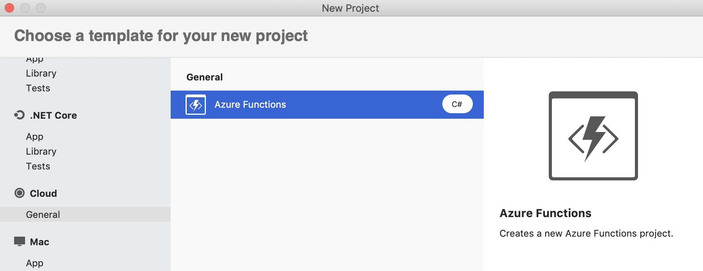

3. Select the initial Azure Functions template that you wish to use, enter your function name and click **Next**.

    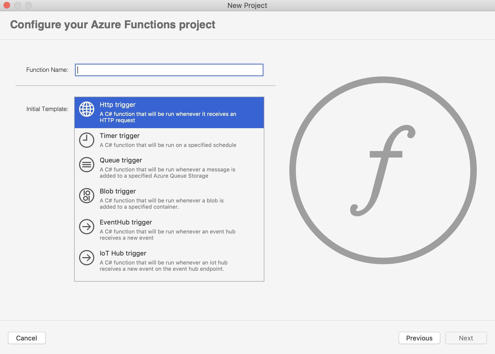

    > [!TIP]
    > While the bundled Azure Functions runtime and templates (CLI) are kept as to date as possible, they inevitably get outdated. When creating a new Functions project, Visual Studio for Mac will check for updates to the CLI and will notify you as shown in the following image. Simply click on the button to download the updated templates.
    > 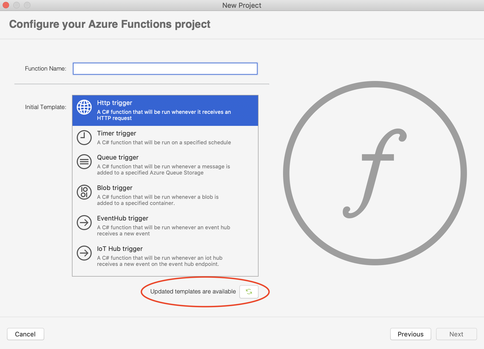

    Depending on the type of function you select, the next page will prompt you to enter details, such as access rights, as illustrated in the following image:

    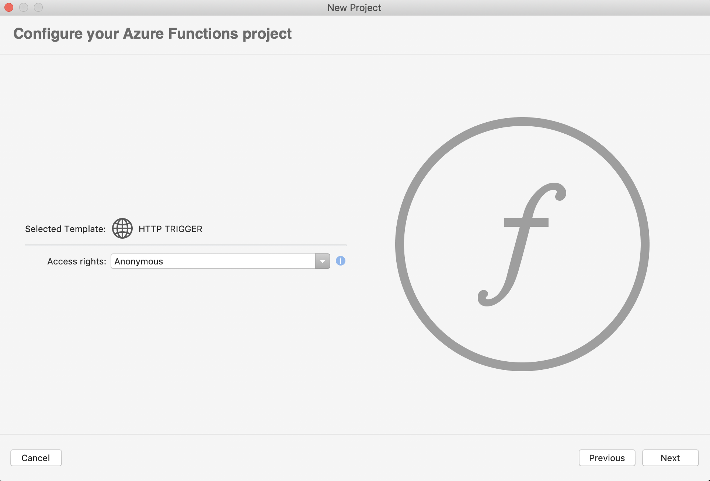

    For more information on the different types of Azure Functions templates and the binding properties required to configure each template, see the [Available function templates](#available-function-templates) section. For this example, we're using an HTTP trigger with access rights set to anonymous.

4. Once you've set the parameters, choose the location for the project and click **Create**.

Visual Studio for Mac creates a .NET Standard project with a default function included. It also includes NuGet references to a variety of **AzureWebJobs** packages, as well as the **Newtonsoft.Json** package.

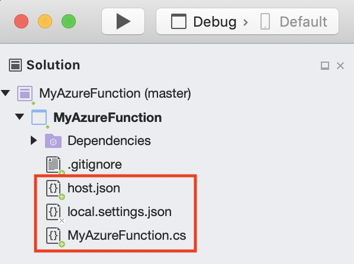

The new project contains the following files:

- **your-function-name.cs** – This class contains boilerplate code for the function that you selected. It contains a **FunctionName** attribute with the function name, and a trigger attribute that specifies what triggers the function (eg. an HTTP request). For more information on the function method, refer to the [Azure Functions C# developer reference](/azure/azure-functions/functions-dotnet-class-library) article.
- **host.json** – This file describes the global configuration options for Functions host. For an example file and information on the available settings for this file, see the [host.json reference for Azure Functions](/azure/azure-functions/functions-host-json).
- **local.settings.json** – This file contains all the settings for running functions locally. These settings are used by the Azure Functions Core Tools. For more information, see [Local settings file](/azure/azure-functions/functions-run-local#local-settings-file) in the Azure Functions Core Tools article.

Now that you've created a new Azure Functions project in Visual Studio for Mac, you can test out the default HTTP-triggered function from your local machine.

## Testing the function locally

With Azure Functions support in Visual Studio for Mac you can test and debug your function on your local development computer.

1. To test your function locally, press the **Run** button in Visual Studio for Mac:

    

1. Running the project starts local debugging on the Azure function and opens a new Terminal window, as illustrated in the following image:

    

    Copy the URL from the output.

3. Paste the URL for the HTTP request into your browser's address bar. Add the query string `?name=<yourname>` to the end of the URL and execute the request. The following image shows the response in the browser to the local GET request returned by the function:

    

## Adding another function to your project

Function Templates enable you to quickly create new functions using the most common triggers and templates. To create another type of function, do the following:

1. To add a new function, right-click on the project name and select **Add > Add Function...**:

    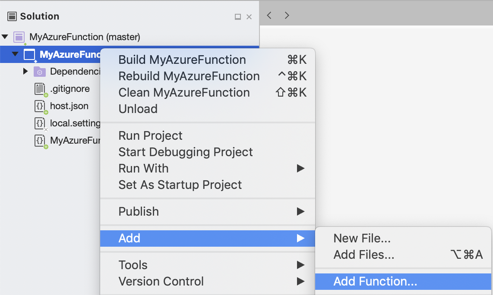

2. From the **New Azure Function** dialog, select the function you require:

    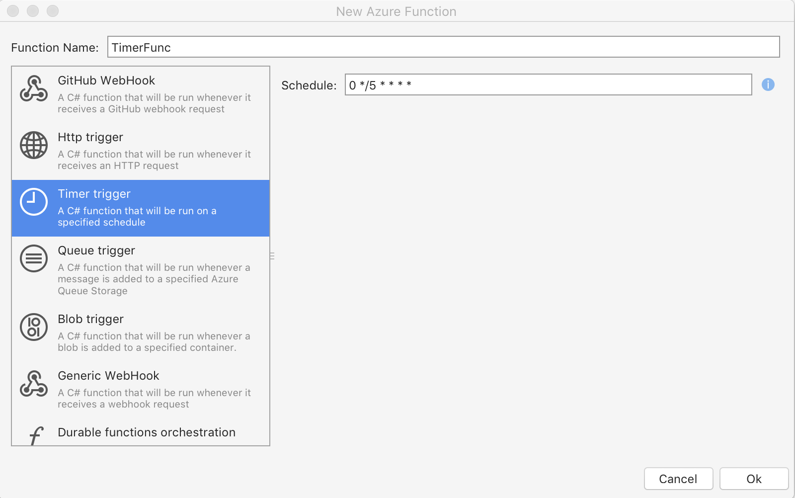

    A list of the Azure function templates are provided in the [Available function templates](#available-function-templates) section.

You can use the above procedure to add more functions to your function app project. Each function in the project can have a different trigger, but a function must have exactly one trigger. For more information, see [Azure Functions triggers and bindings concepts](/azure/azure-functions/functions-triggers-bindings).

## Publish to Azure

1. Right-click on the project name and select **Publish > Publish to Azure**:
    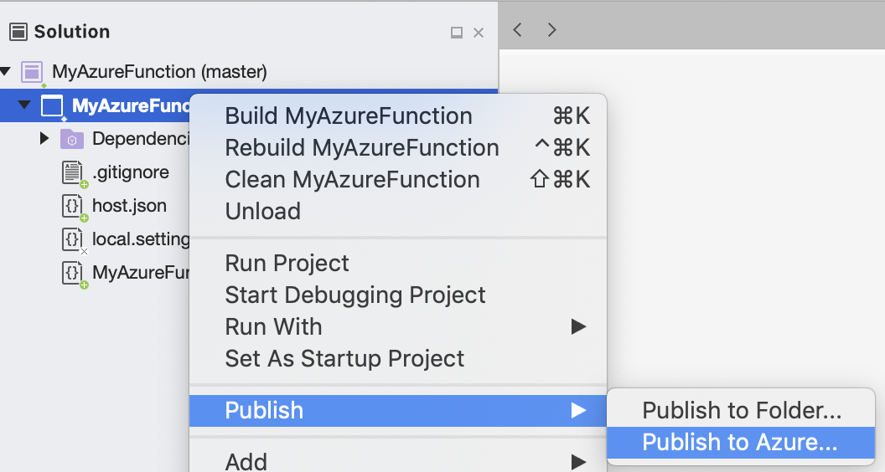
2. If you've already connected your Azure account to Visual Studio for Mac a list of available app services are displayed. If you haven't logged in, you'll be prompted to do so.
3. From the **Publish to Azure App Service** dialog, you can either select an existing app service or create a new one by clicking **New**.
4. In the **Create new App Service** dialog, enter your settings:
    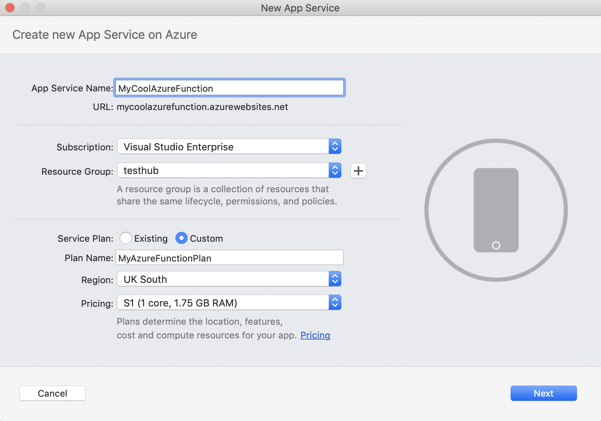

    |Setting  |Description  |
    |---------|---------|
    |**App Service Name**|A globally unique name that identifies your new function app.|
    |**Subscription**|The Azure subscription to use.|
    |**[Resource Group](/azure/azure-resource-manager/resource-group-overview)**|Name of the resource group in which to create your function app. Choose **+** to create a new resource group.|
    |**[Service Plan](/azure/azure-functions/functions-scale)**|Choose an existing plan or create a custom plan. Choose a Location in a region near you or near other services your functions access.|

5. Click **Next** to create a storage account. An Azure Storage account is required by the Functions runtime. Click **Custom** to create a general purpose storage account, or use an existing one:

    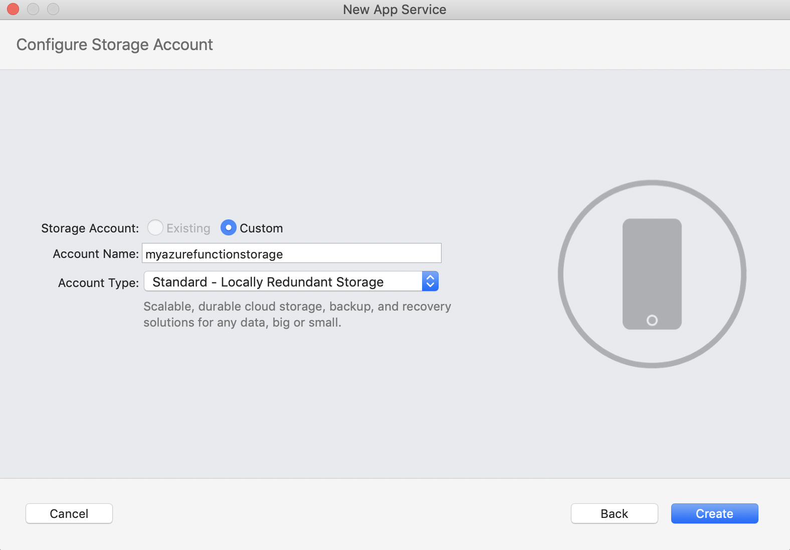

6. Click **Create** to create a function app and related resources in Azure with these settings and deploy your function project code.

7. You might be prompted with a dialog during publishing informing you to "Update Functions Version on Azure". Click **Yes**:

    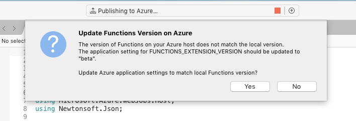

## Function app settings

Any settings you added in the local.settings.json must be also added to the function app in Azure. These settings are not uploaded automatically when you publish the project.

To access your app settings, go to the Azure portal at [https://ms.portal.azure.com/](https://ms.portal.azure.com/). Under **Functions Apps**, select **Function Apps** and highlight your function name:

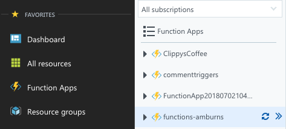

From the **Overview** tab select **Application settings** under **Configured features**:

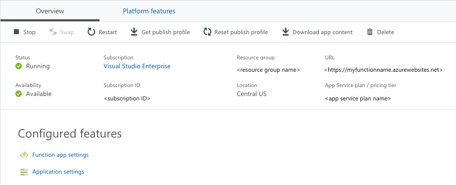

From here you can set Application Settings for the function app, where you can add new application settings or modify existing ones:

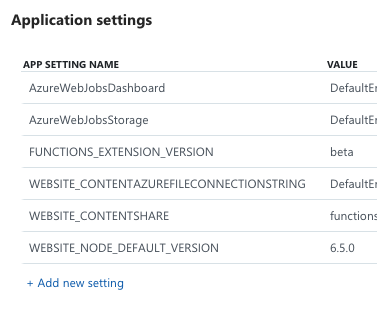

One important setting you might need to set is `FUNCTIONS_EXTENSION_VERSION`. When publishing from Visual Studio for Mac, this value should be set to **beta**.

## Available function templates

- **GitHub Trigger** – Respond to events that occur in your GitHub repositories. For more information, see the [Azure Functions article on GitHub](/azure/azure-functions/functions-create-github-webhook-triggered-function)
  - GitHub commenter – This function will be run when it receives a GitHub webhook for an issue or pull request and adds a comment.
  - GitHub WebHook – This function will be run when it receives a GitHub webhook.

- **HTTP** – Trigger the execution of your code by using an HTTP request. There are explicit templates for the following HTTP triggers:
  - HTTP Trigger
  - HTTP GET create, update, read, and delete (CRUD)
  - HTTP POST CRUD
  - HTTP Trigger with parameters

- **Timer** – Execute cleanup or other batch tasks on a predefined schedule. This template takes two fields: a Name and a schedule, which is a six field CRON expression. For more information, see the [Azure Functions article on Time](/azure/azure-functions/functions-create-scheduled-function)

- **Queue Trigger** – This is a function that will respond to messages as they arrive in the Azure Queue Storage queue. In addition to the function name, this template takes a **Path** (the name of the queue from which the message will be read) and storage account **Connection** (the name of the app setting containing your storage account connection string). For more information, see the [Azure Functions article on Queue Storage](/azure/azure-functions/functions-create-storage-queue-triggered-function).

- **Blob Trigger** – Process Azure Storage blobs when they are added to a container. In addition to the function name, this template also takes a path and connection property. The path property is the path within your storage account that the trigger will monitor. The connection account is the name of the app setting containing your storage account connection string. For more information, see the [Azure Functions Blob Storage article](/azure/azure-functions/functions-create-storage-blob-triggered-function).

- **Generic WebHook** – This is a simple function that will run whenever it receives a request from any service that supports webhooks. For more information, see the [Azure Functions article on generic webhooks](/azure/azure-functions/functions-create-generic-webhook-triggered-function).

- **Durable functions orchestration** – Durable functions let you write stateful functions in a serverless environment. The extension manages state, checkpoints, and restarts for you. For more information, see the guides on [Durable functions](/azure/azure-functions/durable-functions-overview).

- **Image Resizer** – This function creates resized images whenever a blob is added to a container. The template takes path and connection string for the trigger, a small image output, and a medium image output.

- **SAS token** – This function generates a SAS token for a given Azure Storage container and blob name. In addition to the function name, this template also takes a path and connection property. The path property is the path within your storage account that the trigger will monitor. The connection account is the name of the app setting containing your storage account connection string. The **Access rights** also need to be set. Authorization level controls whether the function requires an API key and which key to use; Function uses a function key; Admin uses your account access key. For more information, see the [C# Azure function for generating SAS tokens](https://github.com/Azure-Samples/functions-dotnet-sas-token/) sample.
