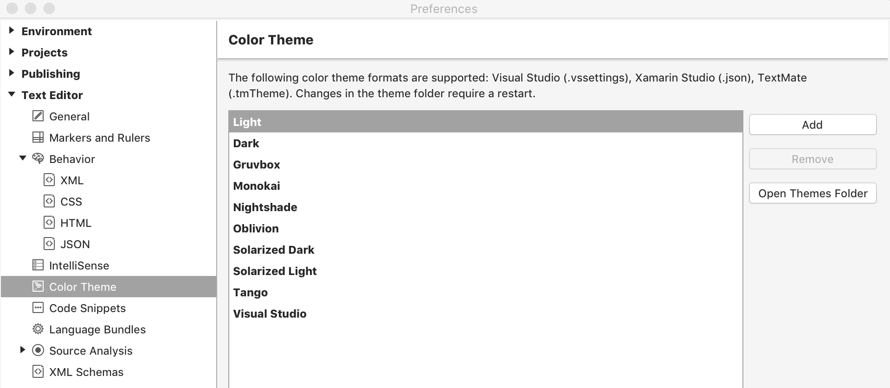

# Editor themes in Visual Studio for Mac

 [!INCLUDE [Retirement announcement for Visual Studio for Mac](includes/vsmac-retirement.md)]

Editor themes can be changed to any of the 10 color schemes provided by default in Visual Studio for Mac via the **Visual Studio > Preferences > Text Editor > Color Themes** menu options:

In box themes are not user accessible at this time as they're embedded within the IDE as resources. You can definitely add themes or use themes you find elsewhere as a scaffold to make your own theme. There's no UI to create new or edit existing themes.
The default editor theme is tied to whether the user picked the dark or light IDE theme. You can't change the colors without using themes. You can take a [theme file](https://github.com/mono/monodevelop/tree/master/main/src/core/MonoDevelop.Ide/MonoDevelop.Ide.Editor.Highlighting/themes) and modify it or create a brand new one.

## Adding new themes

New color themes can be added, provided they are in one of the supported formats:

* Visual Studio (`.vssettings`)
* Xamarin Studio (`.json`)
* TextMate (`.tmTheme`)

Once you have found or created a new theme and downloaded it to your local machine, add it by doing the following steps:

1. Select the **Add** button on the Color Themes Option dialog:
    
2. Browse for the theme on your local machine and press **Open**.
3. The theme is added to the bottom of the pre-installed list of themes. To preview the theme, select it:
    
4. To apply the theme, press the **Okay** button.
