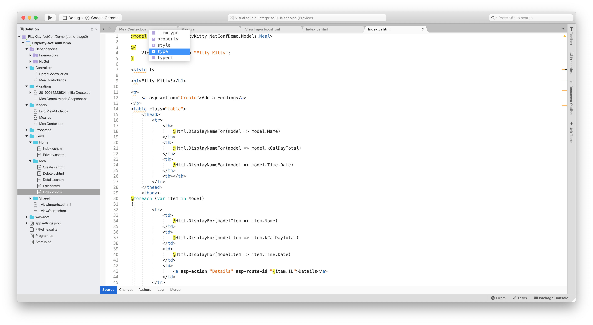
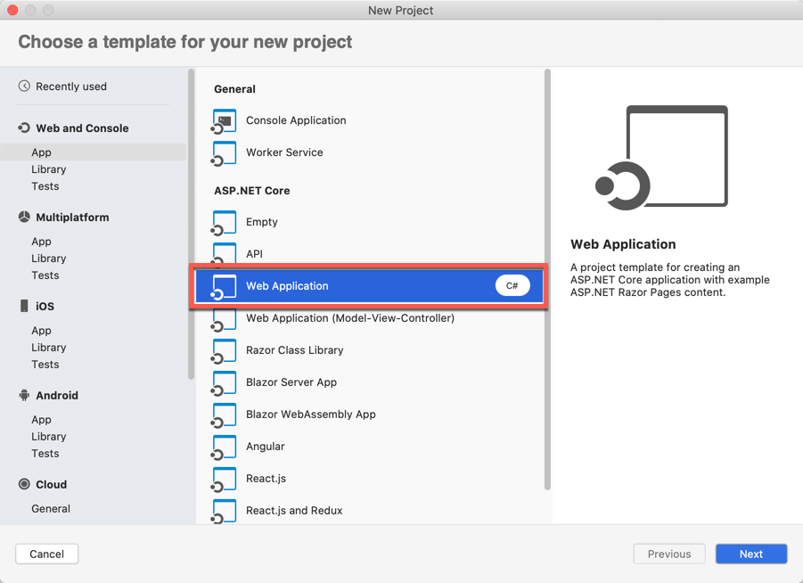

# Create Razor web apps in Visual Studio for Mac

 [!INCLUDE [Retirement announcement for Visual Studio for Mac](includes/vsmac-retirement.md)]

This guide offers an introduction to creating your first Razor web app. For more in-depth guidance, see [Introduction to Razor Pages in ASP.NET Core](/aspnet/core/razor-pages/index).

Visual Studio for Mac provides support for Razor editing, including IntelliSense and syntax highlighting in *.cshtml* files. New in Visual Studio 2019 for Mac 8.3+ is the ability to have context aware IntelliSense within a Razor file, so that you receive IntelliSense that matches the language you are currently editing within a document.

## Creating a new Razor project

1. On the welcome screen, select **New** to create a new project:

   
1. In the **New Project** dialog box, go to **.NET Core** > **App** > **Web Application** and select **Next**:

   
1. Select your .NET Core target framework (we recommend version 2.2 or later), and then select **Next**. Choose a name for your project, and add Git support if necessary. Select **Create** to create the project.

   

   Visual Studio for Mac opens your project in the Code layout window.
1. Run the project without debugging by using **Command+Option+F5**.

   Visual Studio starts [Kestrel](/aspnet/core/fundamentals/servers/kestrel), opens a browser to `https://localhost:5001`, and displays your first Razor web app.

   

## Project anatomy

Razor web apps include the following components.

### Pages folder

This folder contains a project's webpages, along with the code-behind for each:
- A *\*.cshtml* file for the HTML markup and Razor syntax.
- A *\*.cshtml.cs* file for your C# code-behind for handling page events.

Supporting files have names that begin with an underscore. For example, the *\_Layout.cshtml* file configures UI elements common to all pages. This file sets up the navigation menu at the top of the page and the copyright notice at the bottom. For more information, see [Layout in ASP.NET Core](/aspnet/core/mvc/views/layout).

### Launch settings

The *launchSettings.json* file contains the IIS settings, the application URL, and other related settings.

### App settings

The *appSettings.json* file contains configuration data such as connection strings.

For more information about configuration, see the [Configuration in ASP.NET guide](/aspnet/core/fundamentals/configuration/index).

### wwwroot folder

This folder contains static files, such as HTML, JavaScript, and CSS files. For more information, see [Static files in ASP.NET Core](/aspnet/core/fundamentals/static-files).

### Program.cs

This file contains the entry point for the program. For more information, see [ASP.NET Core Web Host](/aspnet/core/fundamentals/host/web-host).

### Startup.cs

This file contains code that configures app behavior, such as whether the app requires consent for cookies. For more information, see [App startup in ASP.NET Core](/aspnet/core/fundamentals/startup).

## See also

For a more comprehensive guide to creating Razor web apps, see [Introduction to Razor Pages in ASP.NET Core](/aspnet/core/razor-pages/index).
