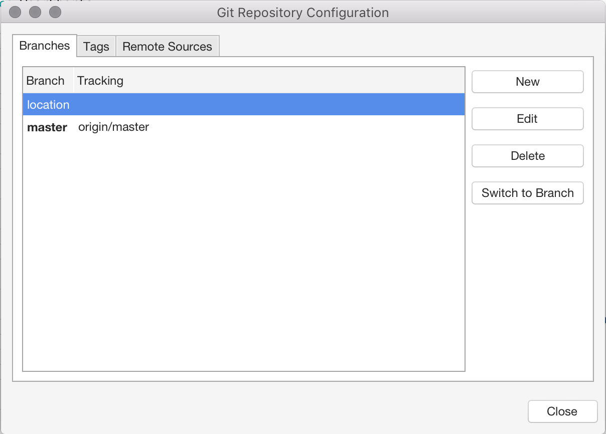
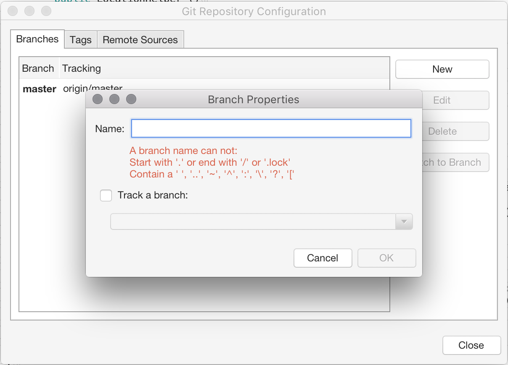
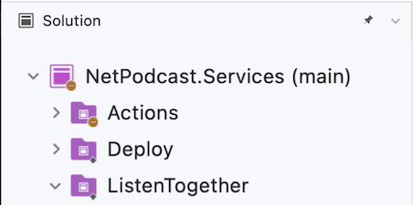

# Working with Git in Visual Studio for Mac

 [!INCLUDE [Retirement announcement for Visual Studio for Mac](includes/vsmac-retirement.md)]

Git is a distributed version control system that allows teams to work on the same documents simultaneously. This means that there is a central server that contains all the files, but when a repository is checked out from this central source, the entire repository is cloned to the local machine.

The sections below will explore how Git can be used for version control in Visual Studio for Mac.

## Git version control menu
The image below illustrates the options provided by Visual Studio for Mac by the Git menu:

:::image type="content" source="media/working-with-git/version-control-git-version-control-menu-2022.png" alt-text="Screenshot of the Git menu in Visual Studio for Mac, showing options for Clone Repository, Pull, Commit or Stash, Push, Switch to branch, Merge, Rebase, Manage branches and remotes, Stash, pop stash, manage stashes, and branch history.":::

## Make a Git commit in Visual Studio for Mac

The core part of any Git workflow is modifying files and committing the changes in those files.  While this article references GitHub repositories, you can work remotely with the Git provider of your choice, such as GitHub or Azure DevOps. Or, you can work locally with no provider at all.  

Git tracks file changes in your repo as you work, and separates the files in your repo into three categories. These changes are equivalent to what you would see when you enter the `git status` command in the command line:

- **Unmodified files**: These files haven't changed since your last commit.
- **Modified files**: These files have changes since your last commit, but you haven't yet staged them for the next commit.
- **Staged files**: These files have changes that will be added to the next commit.

As you do your work, Visual Studio for Mac keeps track of the file changes to your project in the **Changes** section of the **Git Changes** window.

:::image type="content" source="media/working-with-git/version-control-git-changes-window.png" alt-text="Screenshot of the Git Changes window in Visual Studio for Mac, with a launchSettings.json file displayed in the list of Staged files.":::

To stage changes when you're ready, select each file you want to stage and click the **Stage** button, or right-click a file and then select **Stage**.

When you stage a change, Visual Studio creates a **Staged Changes** section. Only changes in the **Staged Changes** section are added to the next commit, which you can do by selecting **Commit Staged**. The equivalent command for this action is `git commit -m "Your commit message"`.

:::image type="content" source="media/working-with-git/version-control-git-commit-message.png" alt-text="Screenshot of the Git changes dialog, with a launchSettings.json file in the list of Changes, and a SubscriptionService.cs file in the list of staged changes. The current branch name is shown at the top of the window, along with Push, Pull, and Commit Staged buttons.":::

Changes can also be unstaged by selecting all staged changes and clicking the **Unstage** button. The equivalent command for this action is `git reset <file_path>` to unstage a single file or `git reset <directory_path>` to unstage all the files in a directory.

You can also choose not to stage your modified files by skipping the staging area. In this case, Visual Studio allows you to commit your changes directly without having to stage them. Just enter your commit message and then select **Commit All**. The equivalent command for this action is `git commit -a`.

Visual Studio also makes it easy to commit and sync with one click by using the **Commit All and Push** and **Commit All and Sync** shortcuts under the "..." button. When you double-click any file in the **Changes** and the **Staged changes** sections, you can see a line-by-line comparison with the unmodified version of the file.

:::image type="content" source="media/working-with-git/version-control-git-file-version-compare.png" alt-text="A screenshot of the comparison view, showing line-by-line differences in changed files.":::

## Push and Pull changes
Pushing and Pulling are two of the most commonly used actions within Git. To synchronize changes that other people have made to the remote repository, you must **Pull** from there. This is done in Visual Studio for Mac by selecting the **Git > Pull** menu.

Once you have updated your files, reviewed and committed them, you must then **Push** them to the remote repository to allow others to access your changes. This is done in Visual Studio for Mac by selecting the **Git > Push** menu.

You can also Commit and Push your changes at the same time, via the **Git Changes** window:

## Using the Blame, Log, and Merge views

At the top of the editor window, there is a drop down with version control options as shown below:

These allow the following actions:

* **Source** - Displays your source code file.
* **Changes** - Displays the change in code between your local file and the base file. You can also compare different versions of the file from different hashes:
* **Blame** - Displays the username of the user associated with each section of code.
* **Log** - Displays all the commits, times, dates, messages, and users that are responsible for the file:
* **Merge** - This can be used if you have a merge conflict when committing your work. It shows a visual representation of the changes made by you and the other developer, allowing you to combine both sections of code cleanly.

## Switching branches

By default, the first branch created in a repository is known as the **main** branch. There isn't technically anything different between the main branch and any other, but the main branch is the one that is most often thought of in development teams as the 'live' or 'production' branch.

An independent line of development can be created by branching off main (or any other branch, for that matter). This provides a new version of the main branch at a point in time, allowing for development independently of what is 'live.' Using branches in this way is often used for features in software development

Users can create as many branches as they like for each repository, but it is recommended that once they have finished using a branch, it is deleted it to keep the repository organized.

Branches are viewed in Visual Studio for Mac by browsing to **Git > Manage Branches and Remotes...**:

Switch to another branch by selecting it in the list and pressing the **Switch to Branch** button.

To create a new branch select the **New** button in the Git repository configuration dialog. Enter the new branch name:

You can also set a remote branch to your _tracking_ branch. Read more about tracking branches in the [Git documentation](https://git-scm.com/book/en/v2/Git-Branching-Remote-Branches#Tracking-Branches).

See the current branch in the Solution Window, next to the project name:

 

## See also

* [Share your code with Visual Studio 2017 and Azure Repos Git](/azure/devops/repos/git/share-your-code-in-git-vs-2017)
