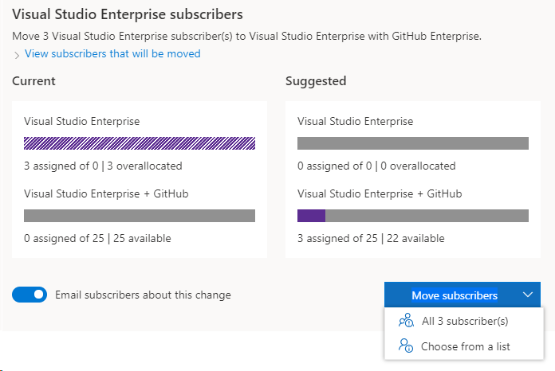
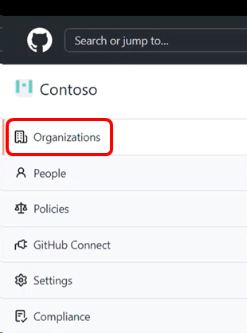

# Set up GitHub Enterprise licenses with Visual Studio subscriptions

Customers who have Enterprise Agreements (EA) with Microsoft are eligible to purchase a subscription offer that brings together Visual Studio standard subscriptions and GitHub Enterprise. It's the easy and economical way for Visual Studio subscribers to acquire GitHub Enterprise. 

Check out this video for steps to set up your organization and invite new members, or follow the step-by-step instructions below the video.

> [!VIDEO https://www.microsoft.com/videoplayer/embed/RWVcut]

Now that you purchased Visual Studio subscriptions with GitHub Enterprise, let’s get your organization set up. We begin with instructions for new GitHub Enterprise customers. If you’re an existing GitHub Enterprise customer, skip ahead to [Assigning Visual Studio subscriptions to organization members](#assign-visual-studio-subscriptions-to-organization-members).

> [!IMPORTANT]
> If Visual Studio subscriptions with GitHub Enterprise are assigned by Visual Studio subscription admins without purchasing first, GitHub won't be notified that you wish to create a GitHub Enterprise account. **A purchase of at least one** Visual Studio subscription with GitHub Enterprise should be made before subscriptions are assigned. If you've purchased Visual Studio subscriptions with GitHub Enterprise already, it is not necessary to wait for the GitHub setup process to be completed before you assign subscriptions.

## Create your organization

As a new GitHub Enterprise customer, you and your team need to get access to your GitHub Enterprise account. As soon as GitHub processes your order, an Enterprise account is created with your allocated license count. At this time, you - the Enterprise Admin - are added to the account and you receive an email invitation. 

1. Select the **Become an owner...** button in this email to go to your GitHub Enterprise account, and then select **Accept invitation**.
   > [!div class="mx-imgBorder"]
   > 

0. To add users, you need to have an organization to invite them to. To create an organization, select the **New Organization** button. 

0. Enter a name for your new organization. This name is the name that appears on https://github.com/. Select **Create organization**.

0. Next, you add users that should have Organization Owner permissions, allowing them to add members and manage organization level settings. Be sure to select **Finish** when you’re done adding Organization Owners. Now your new organization is ready for members to be added.

## Assign Visual Studio subscriptions to organization members

In the Visual Studio subscriptions admin portal, the Visual Studio subscriptions admin can assign a subscription to a user. If you’re new to Visual Studio subscription administration, you received an invitation to the Visual Studio Subscriptions admin portal to begin assigning subscriptions. After you select the link to sign into the [admin portal](https://manage.visualstudio.com), you’ll be able to use the **Add** dropdown to add Visual Studio subscribers individually, or in bulk using Microsoft Excel, or Microsoft Entra groups. Just follow the prompts for adding subscribers, making sure to use email domains that can receive email and choose subscription levels that contain GitHub Enterprise.

For more information about assigning subscriptions, see our articles with specific steps to:
+ [Add single users](assign-license.md)
+ [Add multiple users](assign-license-bulk.md)

> [!NOTE]
> If you don't have existing subscribers to move, you still need to invite your subscribers to your GitHub organization. For more information, see [Invite subscribers to your organization](#invite-subscribers-to-your-organization).

## Move existing subscribers to subscriptions with GitHub

For those subscribers that renewed from regular Visual Studio subscriptions to Visual Studio subscriptions with GitHub Enterprise, you need to move your subscribers to the new level so they can be eligible to use GitHub. 

1. Choose the **Overview** icon in the left nav pane. 
   > [!div class="mx-imgBorder"]
   > 
0. Select **Move now**, and follow the prompts to complete the transition. 
   > [!div class="mx-imgBorder"]
   > 
0. When you select the **Move Now** button, a fly-out panel presents you with recommendations on moving your Enterprise and/or Professional subscriptions:
   > [!div class="mx-imgBorder"]
   > 

You can review the impacted subscribers and specify whether you would like to notify them to receive an email notification after the move is complete. This email informs subscribers that their benefits remain unchanged and encourages them to begin setting up a presence in GitHub. 

Selecting the **Move subscribers** button allows you to move all recommended subscribers or choose individuals from a list. After you confirm your selections, it takes a few seconds for the subscription moves to complete. If applicable, perform these steps for Professional and Enterprise separately. 

## Invite subscribers to your organization

After a subscriber is assigned a subscription in the Visual Studio subscriptions admin portal, GitHub will be updated with these users and will reflect them as **Pending Members**. An organization owner needs to invite pending members to an organization to access their GitHub Enterprise benefits. 

To add a user to your organization in GitHub:
1. Select **Organizations** in the left nav pane.
0. Choose the organization to which you want to add subscribers. 
   > [!div class="mx-imgBorder"]
   > 
0. Select the **People** tab.
0. If you're an owner of the organization, you see an **Invite member** button. Select it. 
0. Enter the email address you used to assign a subscription to the new member, and select **Invite**.
   > [!div class="mx-imgBorder"]
   > 
0. Select **Send invitation**. The user appears in the list of pending invitations. 
0. After a user receives an invitation to GitHub, they need to select the button in the email, which will take them to your organization and grant them member access. 

> [!IMPORTANT]
> User invitations are valid for 7 days before a new invite will need to be sent. If your enterprise uses enterprise-managed users, you may need to inform your users of their access to GitHub.

If you have questions, contact your GitHub or Microsoft account manager. You can also visit https://aka.ms/GHEandVSS for more information.

## Support resources

+ Learn more about GitHub assignment at [GitHub Docs](https://docs.github.com/en/enterprise-cloud@latest/billing/managing-licenses-for-visual-studio-subscriptions-with-github-enterprise/about-visual-studio-subscriptions-with-github-enterprise)
+ Find answers to questions on a wide array of GitHub articles at [GitHub Help](https://help.github.com/en).
+ Get help from other GitHub users in the [GitHub Community Forum](https://github.community/).
+ For assistance with administration of Visual Studio Subscriptions, contact [Visual Studio subscriptions support](https://aka.ms/vsadminhelp).
+ Have a question about Visual Studio IDE, Azure DevOps Services or other Visual Studio products or services? Visit [Visual Studio Support](https://visualstudio.microsoft.com/support/).
+ Get [technical support](https://support.microsoft.com/supportforbusiness/productselection?sapId=b77fe80f-5417-80bd-4b2a-275cf0018c24) for GitHub Enterprise. 

## See also

+ [Visual Studio documentation](/visualstudio/)
+ [Azure DevOps documentation](/azure/devops/)
+ [Azure documentation](/azure/)
+ [Microsoft 365 documentation](/microsoft-365/)

## Next steps

Learn more about managing Visual Studio subscriptions.
+ [Assign individual subscriptions](assign-license.md)
+ [Assign multiple subscriptions](assign-license-bulk.md)
+ [Edit subscriptions](edit-license.md)
+ [Delete subscriptions](delete-license.md)
+ [Determine maximum usage](maximum-usage.md)

For more information about managing Visual Studio subscriptions with GitHub Enterprise, check out the Visual Studio [subscriptions admin portal](https://visualstudio.microsoft.com/subscriptions-administration/).
