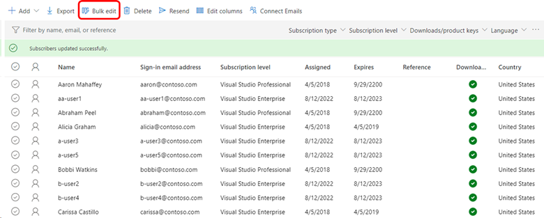
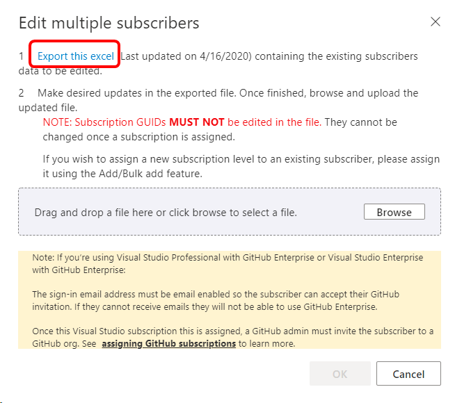

# Delete assignments in Visual Studio subscriptions

When a subscriber no longer requires a Visual Studio subscription, you can remove their subscription and assign it to someone else. When you reassign a subscription, not all the subscriber benefits are reset. The new user is able to claim any unclaimed keys and view previously claimed keys but claim limits are **not** reset. For organizations that have Enterprise Agreements (EA), any benefits that were used by the original user, such as Pluralsight training, are reset. 

> [!IMPORTANT]
> Subscriptions can only be assigned to different users if a minimum of 90 days have passed since the subscription was last assigned. For example, if a subscription was assigned to a subscriber on June 1, it can't be assigned to a new subscriber until at least August 30. 

Watch this video or read on to learn how to delete assignments. 

> [!VIDEO https://www.microsoft.com/videoplayer/embed/RE4yG2q]

## Delete a subscription assignment

1. Select the name of the subscriber you want to remove. To select multiple subscribers for removal, you can select the circle to the left of the subscriber name to select each one. Or you can hold down the **CTRL** key and select each subscriber you wish to remove. To remove a range of subscribers, select the first one, press the **Shift** key, and select the last one. Press **CTRL + A** to select and remove all subscribers. In this example, three subscribers - Amber, Kai, and Madison - will be deleted. 
2. To delete the selected subscriber(s), select **Delete**.
3. When the message appears asking you to confirm the deletion, select **OK**.
   > [!div class="mx-imgBorder"]
   > 

   > [!NOTE]
   > If you added subscription assignments through Microsoft Entra groups, it may take up to 24 hours for the deletion to be updated in the admin portal. For more information about using Microsoft Entra groups to manage subscriptions, see [this topic](assign-license-bulk.md#use-entra-id-groups-to-assign-subscriptions) in the **Add multiple users** article. 

## Delete larger numbers of subscriptions

If you need to delete a large number of subscription assignments, you can use a "bulk edit" to accomplish it. 

  > [!IMPORTANT]
  > Before making large changes to your subscriber list, we recommend creating a backup of your current list. This can be done very easily by selecting the **Export** option. This will place an Excel copy of your current list in your downloads folder. 

  > [!IMPORTANT]
  > Don't use this approach to manage cloud subscriptions. While you can download and complete the bulk edit template, you won't be able to upload the template with your changes. 

1. Sign in to <https://manage.visualstudio.com> using an email address that is an 
admin on the agreement used to purchase the subscriptions.
0. Select the **Bulk edit** option. 
   > [!div class="mx-imgBorder"]
   > 

0. The **Edit Multiple Subscribers** dialog appears. 
0. Select the **Export this excel** link in step 1. 
   > [!div class="mx-imgBorder"]
   > 
   
0. Your subscriber list downloads as an Excel file. Locate the file in your downloads folder, and open it. The file name contains the name of your agreement and the current date.
0. In a column to the right of the template, paste the email addresses of the subscribers you want to remove. (In the current template, column "V" is the first one available. Don't unhide any hidden columns and use them.) For this example, we're removing these users:
    + `aa-user1@contoso.com`
    + `a-user3@contoso.com`
    + `a-user5@contoso.com`
    + `b-user2@contoso.com`
    + `b-user4@contoso.com`

   > [!div class="mx-imgBorder"]
   > 

0. Now we need to select both the column with the users we want to delete, and the column that contains the email addresses of all the users. In this case, that's column "B" and column "V." To select the columns, select the first column heading, and then CTRL+select the second column heading. The template should now look like this:
   > [!div class="mx-imgBorder"]
   > 

0. On the **Home** tab in Excel, select **Conditional Formatting**, choose **Highlight Cells Rules**, and then select **Duplicate Values**.
0. Select **OK** to accept the default color choice. The users you want to delete should be highlighted in both columns. 
   > [!div class="mx-imgBorder"]
   > 

0. Select a cell in the spreadsheet to deselect the two columns. 
0. On the **Data** tab, choose **Filter**.
0. Select the filter drop-down in column "B", choose **Sort by color**, and select the color that was applied to the duplicate cells. You should now see only the users you want to delete. 
0. In the **Reference** column for each user, enter a word or phrase that you can use to filter on to find only the users you want to delete. Use the same term for all of the users. In our example, we use "DELETE USER." You can use the "fill down" feature in Excel to replicate the phrase for all of the users. Your template show now look like this:
   > [!div class="mx-imgBorder"]
   > 

0. Save the template. 
0. Switch back to the admin portal. The **Edit multiple subscribers** dialog should still be open. (If it's not, just select the **Bulk edit** option again.) 
0. Select the **Browse** button, select the file you saved, and select **Open**. The name of your file is displayed in the dialog.
0. Select **OK**.
0. You should now see your subscriber list. The subscribers you want to delete should have the phrase you defined listed in the **Reference** column. If it's not visible and you want to display it, select the **Edit columns** menu option and add the column.
   > [!div class="mx-imgBorder"]
   > 

0. In the **Filter by name, email or reference** field, enter the word or phrase you used to mark the users to be deleted. The filter is applied even if the **Reference** column isn't displayed.
0. You should now see only the users you need to delete. You can select one user, then use CTRL+A to select them all, and choose **Delete**.
0. Clear the filter field to display your updated subscriber list. 

## Resources

[Subscriptions Support](https://aka.ms/vsadminhelp)

## See also

+ [Visual Studio documentation](/visualstudio/)
+ [Azure DevOps documentation](/azure/devops/)
+ [Azure documentation](/azure/)
+ [Microsoft 365 documentation](/microsoft-365/)

## Next steps

+ Need to change a subscription without deleting it? Learn how to [edit subscriptions](edit-license.md).
+ To find a particular subscription, check out [search for a subscription](search-license.md).
+ Need to create a list of all your subscriptions? See [export subscriptions](exporting-subscriptions.md).
